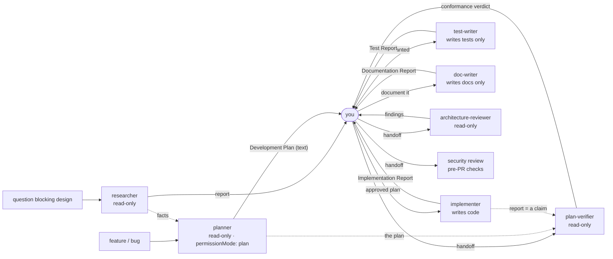

# Agents

Project-scoped subagents for this repo. One file per agent, loaded from
`.claude/agents/*.md`; each file's body **is** that agent's entire system prompt
— they do not inherit the main session's. This README is the map: what exists,
who owns what, what goes in and what comes out. The rules themselves live in the
agent files; nothing here restates them.

Invoke with the `Agent` tool (`subagent_type: planner`), or let automatic
delegation pick one — that routing is driven **only** by each file's
`description`, which is why every description ends with an explicit
`Do NOT use for:` naming its siblings.

## The set

| Agent | Owns | Writes? | Model | In → Out |
|---|---|---|---|---|
| [`researcher`](researcher.md) | Answering a question before code is written — internal (how this repo works) or external (library/API/spec behaviour) | no | `sonnet` | a concrete question → research report with `path:line` / URL evidence and an explicit *Not established* list |
| [`planner`](planner.md) | Turning a request into an executable Development Plan for this codebase | no | `opus` · `effort: high` | a feature/bug + optional research → **Development Plan** (Markdown, returned as text) |
| [`implementer`](implementer.md) | Building an approved plan in `server/` and `client/`, then running the existing suites | **yes** | `opus` · `effort: high` | an approved Development Plan → code changes + **Implementation Report** |
| [`test-writer`](test-writer.md) | Writing tests into the four existing suites, then running the lane and reporting what each test actually asserts | **yes — tests only** | `opus` · `effort: high` | behaviour needing coverage → test files + **Test Report** |
| [`architecture-reviewer`](architecture-reviewer.md) | Judging the boundaries a deterministic rule cannot decide, on a change set | no | `opus` · `effort: high` | a diff or ref range → **Architecture Review** (`file:line` · severity · consequence · confidence) |
| [`plan-verifier`](plan-verifier.md) | Checking delivered code against every item of a Development Plan | no | `opus` · `effort: high` | a plan (+ optional Implementation Report) → **Plan Conformance Report** with a traceability matrix |
| [`doc-writer`](doc-writer.md) | Documenting shipped behaviour in the right place under `docs/`, with the folder index updated | **yes — docs only** | `opus` | shipped behaviour → doc pages + **Documentation Report** |

Not in this set, deliberately: **security review** and the **pre-PR contract
checks**. Those are skills — `security`, `api-breaking-changes`,
`api-response-changes`, `response-schema`, `pr-self-review` — invoked from the
main thread, not agents. Architecture review *is* in the set now
([`architecture-reviewer`](architecture-reviewer.md)); `implementer` still names
what every review should look at in its `Handoff` section and never runs any of
them on its own work. That rule generalises: **no agent here reviews or verifies
its own output.**

## Flow

**Handoff is manual by design (variant A).** `planner` has no write tool, so the
plan comes back as text; you approve or amend it, then hand it to `implementer`.
Nothing is persisted to disk in between. This mirrors native Plan Mode, which
also does not write the plan out
([permission-modes](https://code.claude.com/docs/en/permission-modes)), and it
keeps the approval gate with a human — subagents cannot ask a question
mid-task, so they must not own an approval step.

## `researcher`

- **Responsibility:** reports, never patches. Two modes — internal repo
  investigation and external web/doc research — with a separate report skeleton
  for each.
- **Permissions:** `Read, Grep, Glob, Bash, WebSearch, WebFetch`. `Bash` is
  constrained by its prompt to read-only inspection (`git log/show/diff/blame`,
  `ls`, `rg`, `wc`, `head`).
- **Input:** one concrete question. If the task is ambiguous enough that two
  readings would produce different reports, its entire output is 2–4 clarifying
  questions instead of a report.
- **Output:** report with per-claim evidence (`path:line` or a full URL),
  confidence labels, and *Not established*.

## `planner`

- **Responsibility:** produce a plan `implementer` can execute end to end
  without making an architectural decision the plan should have made. Every step
  carries the files it touches, the project skills that step must be implemented
  with, its dependency, and a checkable *Done when*.
- **Not its job:** implementing, reviewing, or going to the web (that is
  `researcher`) — missing external facts become *Open questions*.
- **Permissions:** `tools: Read, Grep, Glob, Bash, Skill` ·
  `disallowedTools: Edit, Write, NotebookEdit, Agent, WebSearch, WebFetch` ·
  `permissionMode: plan`. Read-only is enforced twice on purpose: a parent
  session in `bypassPermissions`/`acceptEdits`/`auto` overrides a subagent's
  `permissionMode`, so the tool allowlist is the barrier that always holds.
- **Model:** `opus`, `effort: high` — plan quality is what the whole chain
  inherits.
- **Input:** a feature request or bug, plus any research already done.
- **Output artifact:** a **Development Plan** — `Goal & scope` ·
  `Context read` · `Impact map` · `Steps` · `Verification` ·
  `Constraints & invariants` · `Open questions` ·
  `Out of scope / follow-ups`. Its final message *is* the plan.
- **Owns the skill routing table.** Which project skill applies to which layer
  is decided here and stamped onto each step, so implementation cannot
  contradict the rules the work was planned against.

## `implementer`

- **Responsibility:** execute an approved plan across `server/` (Fastify ·
  Drizzle · shared Zod contracts) and `client/` (Next.js studio), applying the
  skills the plan assigned per step, then run the **existing** typecheck,
  `lint:arch` and test suites and report honestly what passed.
- **Not its job:** architecture review, security review, the pre-PR contract
  checks, commits, PRs, scope expansion, delegation, or web research.
- **Permissions:** `tools: Read, Write, Edit, Grep, Glob, Bash, Skill, TodoWrite`
  · `disallowedTools: Agent, WebSearch, WebFetch`. **No `permissionMode`** — it
  inherits the session's, so you stay the gate on writes; hard-coding
  `acceptEdits` into a code-writing agent is exactly the anti-pattern to avoid.
- **Model:** `opus`, `effort: high`.
- **Input:** an approved Development Plan (or a single unambiguous task).
- **Output artifact:** code changes plus an **Implementation Report** —
  `Status` · `Changes` · `Verification` · `Deviations from the plan` ·
  `Blocked / not done` · `Handoff` · `Follow-ups`. Verification quotes real
  command output; a suite it could not run makes the status `Partial`, never
  `Completed`.

## `test-writer`

- **Responsibility:** write tests into the suites that already exist — server
  unit (hermetic), server integration (`*.it.test.ts`, real Postgres via
  testcontainers), client (jsdom + RTL, colocated with the component),
  `reviewer-core` (pure engine) — then run the lane and state, per test, which
  mutation it would catch.
- **Not its job:** production code of any kind, review, the `e2e/` browser
  flows, installing a dependency. If a seam cannot be tested as it stands, that
  is a *Blocked / needs a production change* entry, not a small refactor.
- **Permissions:** `tools: Read, Write, Edit, Grep, Glob, Bash, Skill, TodoWrite`
  · `disallowedTools: Agent, WebSearch, WebFetch, NotebookEdit`. **No
  `permissionMode`** — it writes files, so it inherits the session's mode and you
  stay the gate. Its real boundary is a **prose path allowlist** in the body; the
  frontmatter cannot express "tests only" (see *Boundaries* below).
- **Model:** `opus`, `effort: high`.
- **Input:** behaviour to cover, a bug to pin, or an untested shipped feature.
- **Output artifact:** test files plus a **Test Report** — `Status` ·
  `Tests added` · `Suite membership` · `Verification` · `Failures classified` ·
  `Coverage gaps left` · `Blocked / needs a production change` · `Handoff` ·
  `Follow-ups`. Every red is classified `mine, correct` | `environment` |
  `pre-existing` | `regression` against a baseline recorded **before** the first
  edit; a new `*.it.test.ts` it could not execute makes the status `Partial`.

## `architecture-reviewer`

- **Responsibility:** judge what a deterministic rule cannot. It runs
  `pnpm lint:arch` and `./scripts/check-contracts.sh` first, quotes them, and
  then reports only the boundary crossings no rule has a signature for — a fat
  route, a repository leaking row types as DTOs, a newly added `pathNot`
  exemption, an inline `queryKey`, `fetch` in a component.
- **Not its job:** security, breaking-change / response-shape analysis, plan
  conformance, test quality, performance, or restating a linter in prose.
- **Permissions:** `tools: Read, Grep, Glob, Bash, Skill` ·
  `disallowedTools: Edit, Write, NotebookEdit, Agent, WebSearch, WebFetch`.
  **No `permissionMode`, deliberately:** it must actually execute `depcruise` and
  the contract script, and whether `plan` mode permits those is unconfirmed — so
  read-only rests on the write-free allowlist, which is the barrier that always
  holds. `check-contracts.sh --fix` is forbidden **in prose only**; `Bash` cannot
  distinguish it.
- **Model:** `opus`, `effort: high`.
- **Input:** by default the unmerged change set (`git diff`, `git diff --cached`,
  `main..HEAD`); a whole-tree audit only on request.
- **Output artifact:** an **Architecture Review** — `Verdict` · `Coverage` ·
  `Deterministic checks` · `Findings` · `Exemptions reviewed` · `Not reported` ·
  `Open questions`. Severity is a fixed three-value enum
  (`blocking` | `nit` | `pre-existing`), confidence below **0.7** is not
  reported, nits are capped at five, and "no issues found" is an explicit valid
  verdict.

## `plan-verifier`

- **Responsibility:** decompose a Development Plan into a numbered checklist
  **before** reading any code, then judge each row in isolation against an
  artifact — a line it opened, or output it ran and quoted.
- **Not its job:** producing or amending the plan, fixing anything, structural
  critique, security. It never recommends work the plan did not ask for; a
  structural or security concern is one handoff line in `Out of scope`.
- **Permissions:** `tools: Read, Grep, Glob, Bash, Skill` ·
  `disallowedTools: Edit, Write, NotebookEdit, Agent, WebSearch, WebFetch`.
  **No `permissionMode`, deliberately** — it has to run `pnpm typecheck`,
  `pnpm lint:arch` and `pnpm exec vitest run …` for real. `--fix`, `db:generate`,
  `db:migrate`, `db:seed` and every git mutation are forbidden in prose.
- **Model:** `opus`, `effort: high`.
- **Input:** the plan (text or path), optionally an Implementation Report.
  **With no plan, its entire output is a request for the plan** — conformance
  without a contract is not conformance.
- **Output artifact:** a **Plan Conformance Report** — `Verdict` ·
  `Traceability matrix` · `Evidence log` · `Contradicted` ·
  `Unknown / unverifiable` · `Requirements the plan never served` ·
  `Code-vs-plan disagreements` · `Out of scope`. Per item:
  `Verified` | `Partial` | `Not implemented` | `Contradicted` | `Unknown`;
  overall `Verified success` | `Partial success` | `Not verified`, unrounded. An
  Implementation Report is treated as a **claim, not evidence**, and a skipped
  suite is `Unknown`, never `Verified`.

## `doc-writer`

- **Responsibility:** document behaviour that already ships, in the location this
  repo's own `docs/` and `specs/` READMEs dictate, with every non-obvious claim
  grounded at `path:line` in code or a test, and the folder index updated (the
  `_(none yet)_` literal removed).
- **Not its job:** code, tests, review, `insights.md` (that is the
  `/engineering-insights` skill — append-only and guarded), the rules in
  `AGENTS.md` / `CLAUDE.md`, or creating a `docs/adr/` tree on its own
  initiative. Those are recommendations in its report.
- **Permissions:** `tools: Read, Write, Edit, Grep, Glob, Bash, Skill` — seven,
  with `Bash` for `test -e` / `rg` verification of its own references ·
  `disallowedTools: Agent, WebSearch, WebFetch, NotebookEdit`. No `TodoWrite`:
  one or two pages does not need a task list, and tool-set bloat is its own
  anti-pattern. **No `permissionMode`** — it writes files, so you stay the gate.
- **Model:** `opus`. No `effort` field, following `researcher`'s precedent.
- **Input:** a plan, an Implementation Report, or the code itself.
- **Output artifact:** doc pages plus a **Documentation Report** — `Status` ·
  `Pages written` · `Grounding` · `Diagrams` · `Index updates` · `Verification` ·
  `Not documented` · `Placement decisions deferred` · `Follow-ups`. Each page
  declares one Diátaxis mode; a diagram must justify its place, and the house
  pattern is exactly one Mermaid block near the top of a package or subsystem
  README.

## Boundaries — who may write what

Automatic delegation is driven by `description` alone, so the ownership of files
has to be stated somewhere a human can check. This is that table.

| Agent | May write | May never write |
|---|---|---|
| `implementer` | production code in `server/`, `client/`, `reviewer-core/`; tests the plan explicitly ordered; generated migrations via `pnpm db:generate` | `server/src/db/migrations/**` by hand, `client/src/vendor/**` (change the canonical source), locked skills, generated output |
| `test-writer` | **test files only** — `server/test/**`, `server/src/**/*.test.ts`, `client/src/**/*.test.{ts,tsx}`, `reviewer-core/test/*.test.ts`, and `server/test/helpers/**` on request | every production path, including `client/messages/en/**` (product strings) and `server/src/adapters/mocks.ts` (a shipped adapter, not test infrastructure); `e2e/specs/*.flow.json`; and **any existing test, to make a new one pass** |
| `doc-writer` | `docs/**`, `<pkg>/docs/**`, the `README.md` files, `TESTING.md`, `<pkg>/specs/**` (only when asked) | `insights.md` (any of them), `AGENTS.md` / `CLAUDE.md`, code, tests, a new `docs/adr/` tree |
| `architecture-reviewer` | nothing | everything — including `check-contracts.sh --fix` |
| `plan-verifier` | nothing | everything — including `--fix`, `db:migrate`, `db:seed` |
| `planner`, `researcher` | nothing | everything |

Two distinctions worth stating flatly, because the names alone do not carry them:

- **`architecture-reviewer` = structural quality; `plan-verifier` = conformance
  to a plan.** The reviewer does not read the plan and does not care whether the
  work was ordered; the verifier does not critique structure even when it sees
  something. Each hands the other's concern over in a single line.
- **`test-writer` vs `implementer` = a path boundary, not a judgement call.**
  `implementer` writes tests when a plan step orders them, as part of that
  change. `test-writer` is for coverage as the task itself, and it may not touch
  a production file to get there — which is exactly why the two are separate
  agents and why the boundary is written down here.

For `test-writer` and `doc-writer` those allowlists live **in the prompt body**,
not the frontmatter, which cannot express them. That is prose, and prose is not
enforcement — see checklist item 12.

## Disambiguations

Three name collisions in this repo that cost time if you meet them cold:

- **`docs/agent-prompts/*.md` are not subagents.** They are the system prompts of
  the **product's** review agents, stored on `agents.system_prompt` in the
  database (`docs/agent-prompts/README.md:6-8`). `test-quality-reviewer.md`
  there is a product reviewer, not this set's `test-writer`. Documentation about
  *subagents* lives in this file.
- **"Plan Verifier" in the lesson roadmap is a product feature**, not this
  agent — L06, alongside the eval pipeline and the secret/phantom gates
  (`README.md:87`, `server/specs/README.md:54`). The agent
  [`plan-verifier`](plan-verifier.md) is harness tooling and ships nothing to
  users.
- **`docs/skills/test-flake-signals.md` is an importable product skill**, kept so
  the studio's skill-import path can be demoed end to end. `test-writer` reads it
  as a checklist and applies its three questions; it is not part of
  `.claude/skills/`.

## Sources behind the agent rules

Design practice (primary):

- [Create custom subagents](https://code.claude.com/docs/en/sub-agents) —
  frontmatter reference; **omitting `tools` inherits the full pool** (hence both
  allowlists); `disallowedTools` layers on top; `description` is the sole
  delegation signal; the body replaces the system prompt; only a condensed
  summary returns to the caller, with no built-in output schema — so the prompt
  defines one; `AskUserQuestion`/`ExitPlanMode` are stripped from every
  subagent; `Agent` withheld to stop fan-out; `skills:` preloads *full* skill
  text, which is why neither agent preloads any.
- [Choose a permission mode](https://code.claude.com/docs/en/permission-modes) —
  `plan` is read-only, but the parent session's mode wins; plan approval is a
  same-session mode switch, not a file.
- [Extend Claude with skills](https://code.claude.com/docs/en/skills) ·
  [Agent Skills](https://platform.claude.com/docs/en/agents-and-tools/agent-skills/overview)
  · [Skill authoring best practices](https://platform.claude.com/docs/en/agents-and-tools/agent-skills/best-practices)
  — progressive disclosure, description quality and trigger failures, and the
  conciseness discipline that keeps both bodies short and pushes detail into
  `AGENTS.md` / `insights.md` / skills.
- [Orchestrate teams of Claude Code sessions](https://code.claude.com/docs/en/agent-teams)
  — two agents editing one file overwrite each other; here only one agent can
  write at all.
- [How we built our multi-agent research system](https://www.anthropic.com/engineering/multi-agent-research-system)
  — every worker needs objective, output format, tool guidance and **explicit
  task boundaries**, or workers duplicate each other; verification is
  end-state-based. This is the shape of a plan `Step`.
- [Effective context engineering for AI agents](https://www.anthropic.com/engineering/effective-context-engineering-for-ai-agents)
  — the "Goldilocks zone", section-structured prompts, and tool-set bloat as an
  anti-pattern (5 tools for `planner`, 8 for `implementer`).
- [Best practices for Claude Code sub-agents (PubNub)](https://www.pubnub.com/blog/best-practices-for-claude-code-sub-agents/)
  *(secondary)* — over-broad tool grants, and **an agent must not review or
  certify its own work**; that is why review is split out of `implementer`.
- [Claude Code extension-layer decision guide](https://hidekazu-konishi.com/entry/claude_code_extension_layers_decision_guide.html)
  *(secondary)* — hooks vs skills vs subagents, and why approval-gated work
  stays in the main thread.

Per agent, on top of the shared sources above:

- **`test-writer`** — [Claude Code best practices](https://www.anthropic.com/engineering/claude-code-best-practices)
  (verify your work; the specificity example "write a test for foo.py covering
  the edge case where the user is logged out. avoid mocks"; the Writer/Reviewer
  split; "a reviewer prompted to find gaps will usually report some");
  *Software Engineering at Google* ch. 12 (state over interaction testing) and
  ch. 14 (unfaithful test doubles); Kent C. Dodds — *Testing implementation
  details*, *Common mistakes with React Testing Library*, *Effective snapshot
  testing*, *Write tests. Not too many. Mostly integration*;
  [Testing Library guiding principles](https://testing-library.com/docs/guiding-principles);
  Fowler, *TestCoverage*; the Google Testing Blog on flakiness; and
  *(secondary)* pyor.review, dev.to and getautonoma on tests that are green and
  worthless.
- **`architecture-reviewer`** — `claude-code-security-review`'s
  `security-review.md` (the finding schema, the 0.7 confidence floor, the
  exclusion list, the signal-quality gate); the Claude Security plugin
  (independent verifier agents, a mandatory coverage section, "complements the
  deterministic checks those tools provide"); the Code Review docs
  (detect → verify → dedupe → rank, the severity enum, "no issues found" as an
  explicit state, the `REVIEW.md` policy that a claim needs `file:line`, nit
  caps, do-not-report lists); agent-sdk / subagents (a read-only allowlist as a
  security boundary); Thoughtworks on architecture fitness functions;
  dependency-cruiser · `eslint-plugin-boundaries` · ArchUnit · import-linter as
  the rule half of the split; arXiv 2604.19049 *(preprint)* on unanimous
  reviewers confirming a fictitious vulnerability and refutation gates cutting
  ~79% of candidates.
- **`plan-verifier`** — arXiv 2606.09863 (FAGEN@ICML 2026) on false success:
  45–48% of τ²-bench failures and 75.8% of AppWorld coding-agent failures are
  claimed completion, judges anchor on confident closing language, and a
  standard LLM judge detects it at AUROC ≤ 0.65 against 0.83–0.95 for
  trace-feature detectors; Anthropic's *demystifying evals* (isolated
  per-dimension judgement, two-experts-agree task quality, an explicit `Unknown`
  escape hatch); the multi-agent research write-up (per-dimension rubric
  scoring); arXiv 2606.29920 *(preprint, abstract only)* on rubric-verification
  noise and diminishing returns from majority voting; Claude Code skills
  (`/verify` is manual-invocation-only and deliberately narrow;
  `disable-model-invocation`); spec-kit plus its open issue #1745, and GitHub's
  blog on spec-driven development for the spec-as-contract resolution pair.
- **`doc-writer`** — [Diátaxis](https://diataxis.fr/) (the compass, the map, and
  the four mode pages — including the documented collapse of tutorials and
  how-to guides into each other); Nygard 2011 and adr.github.io (ADR form,
  one file per decision, immutability by supersession); docs-as-code (Write the
  Docs); *Building effective agents* (gain ground truth from the environment at
  each step); the C4 component page (each level has its own audience; the
  component level only "if you feel they add value"); the Mermaid introduction
  (`maxTextSize` 50,000); Google's style highlights, prescriptive-documentation
  guidance and technical-writing course (calibrated modals, condition before
  instruction, curse of knowledge); Microsoft's top-10 style tips
  (front-loading); mintlify *(secondary, vendor)* on fabrication, lost nuance
  and robotic prose. **Verified absence:** Anthropic's `doc-coauthoring` skill
  contains neither a claim-verification step nor a file-selection procedure.

**Documented gaps — four rules in this set are our design decisions, not
citations, and each body says so in words:** the
`pre-existing` / `environment` / `regression` classification protocol
(`test-writer`); mapping a security-review finding schema onto architectural
boundaries (`architecture-reviewer`); the ban on recommending anything outside
the plan (`plan-verifier`); and the edit-versus-create rule for documentation
pages (`doc-writer`).

Repo rules the agents encode (these files are the authority; the agents only
point at them):

- [`AGENTS.md`](../../AGENTS.md) — four standalone packages, two package
  managers, `@devdigest/shared` canonical on the server with a hand-synced
  client mirror, migrations never hand-edited, `workspace_id` on every domain
  table, `allowBuilds:` for native deps, the do-not-touch list, "unused ≠ dead",
  and "if `insights.md` contradicts the code, the code wins".
- [`server/AGENTS.md`](../../server/AGENTS.md) — the Onion dependency rule is
  **lint-enforced** (`pnpm lint:arch`): `routes → service → repository`,
  third-party I/O only in `adapters/`, static module registry, `container` DI,
  `AppError` envelope, `JobRunner` for slow work, `RepoIntel` degrades instead
  of throwing, `*.it.test.ts` = Docker-backed.
- [`client/AGENTS.md`](../../client/AGENTS.md) — the studio is a
  client-rendered SPA **by design**: no Server Actions, no DAL, no RSC
  fetching; `lib/api.ts` is the only HTTP boundary; cache keys come from
  `lib/hooks/keys.ts`. Both agents therefore carry an explicit caveat that the
  `frontend-ui-architecture` skill's RSC/Server-Actions/DAL guidance does not
  apply here.
- [`insights.md`](../../insights.md) — notably `check-contracts.sh --fix` also
  lands pre-existing mirror drift (don't revert it), and the 2026-08-02 entry on
  configured skills being skipped, which the skill routing table exists to fix.
- [`TESTING.md`](../../TESTING.md) — suite map and what each command proves,
  suite membership by filename (`*.it.test.ts` = Docker-backed, and it self-skips
  without Docker, so a green run can mean "collected nothing").
- **There is no ESLint in this repository at all** — no `.eslintrc*`, no
  `eslint.config.*`, and `client/package.json:5-11` defines only `dev`, `build`,
  `start`, `typecheck` and `test`. `pnpm lint:arch` (eleven
  `dependency-cruiser` rules in
  [`server/.dependency-cruiser.cjs`](../../server/.dependency-cruiser.cjs)) is
  the only architectural enforcement, and it is **server-only**. Every rule in
  `client/AGENTS.md` is prose — which is why `architecture-reviewer` is the
  client's only enforcement, and why nothing here watches `.claude/**` either
  (no workflow and no vitest `include` covers it).
- [`docs/skills/test-flake-signals.md`](../../docs/skills/test-flake-signals.md)
  — an existing catalogue of flake constructs with three method questions and its
  own severity scale. `test-writer` applies it rather than restating it.

## Adding an agent

Checklist distilled from the sources above:

1. One responsibility. If it needs two, it is two agents.
2. Write `description` for the router, not for a human: what it does, `Use
   when`, and `Do NOT use for:` naming the agents it could be confused with.
3. Declare `tools` explicitly. Never omit it. Add `disallowedTools` for anything
   destructive you want denied even if the allowlist is later widened.
4. Withhold `Agent` unless the agent genuinely needs to fan out.
5. Do not set `permissionMode: acceptEdits`/`bypassPermissions` on anything that
   writes code.
6. Never rely on `permissionMode` alone for read-only — pair it with a
   write-free allowlist.
7. Give it an explicit output skeleton and an *Output discipline* line; the
   caller sees only its final message.
8. Assume it cannot ask a question. Say what it should do with ambiguity —
   proceed and record the assumption, or return questions instead of an answer.
9. Inline the repo rules it must not break, or point it at the `AGENTS.md` /
   `insights.md` that hold them. It gets no other context.
10. Keep the body short enough to stay read; push detail into skills and docs.
11. Do not let it review or verify its own work beyond its own scope — that is
    another agent's job.
12. Read-only is a **boundary** only when the tool allowlist enforces it.
    **Prose in a prompt is not enforcement.** If a constraint genuinely must
    hold, it needs a tool boundary or a hook; if it lives in prose, say so out
    loud (as the *Boundaries* table above does for `test-writer` and
    `doc-writer`) rather than assuming it holds.
13. A reviewing agent must be told, explicitly, to report **only** what affects
    correctness or an explicitly stated requirement. Asked to find problems, a
    model will find some — give it a confidence floor, a severity enum, a
    do-not-report list and a nit cap.
14. A verdict rests on an artifact the reader can re-check — a line, or quoted
    command output — **never on another agent's narrative**. Give every judging
    agent an explicit `Unknown` verdict so abstaining is cheaper than inventing.
15. A writing agent needs a **prose path allowlist in its body**, because the
    frontmatter cannot express "tests only" or "docs only" — plus a row in the
    *Boundaries* table here, so the limit is checkable outside the prompt.

> `README.md` has no YAML frontmatter, so it is documentation rather than an
> agent definition. If it ever shows up as a selectable `subagent_type`, move it
> to `docs/` and leave a pointer here.
