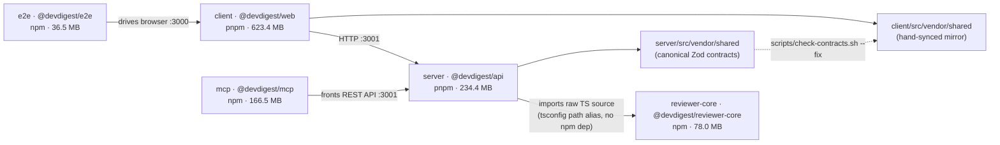

# Dependency Report — DevDigest

_Generated 2026-09-01. 5/5 packages measured — усі мають встановлений `node_modules`, `npm outdated` / `pnpm outdated` відпрацювали без помилок для всіх п'яти._

## 1. Dependency graph

Разом по репозиторію: **≈ 1.14 GB** у п'яти окремих `node_modules` (1 166 136 KB), без жодної дедуплікації між пакетами — очікувано для non-workspace архітектури, задокументованої в root `AGENTS.md`.

## 2. Per-package inventory

### client (@devdigest/web) — pnpm — 623.4 MB total, 320.7 MB attributed to direct deps

| Dependency | Type | Declared range | Installed version | Size |
|---|---|---|---|---|
| next | prod | ^15.1.3 | 15.5.19 | 152.3 MB |
| mermaid | prod | ^11.15.0 | 11.15.0 | 75.3 MB |
| lucide-react | prod | ^0.469.0 | 0.469.0 | 36.2 MB |
| typescript | dev | ^5.7.2 | 5.9.3 | 22.8 MB |
| react-dom | prod | ^19.0.0 | 19.2.7 | 7.1 MB |
| recharts | prod | ^2.15.0 | 2.15.4 | 5.2 MB |
| zod | prod | ^3.24.1 | 3.25.76 | 5.0 MB |
| jsdom | dev | ^25.0.1 | 25.0.1 | 4.1 MB |
| @types/node | dev | ^22.10.0 | 22.19.19 | 2.5 MB |
| vitest | dev | ^2.1.8 | 2.1.9 | 1.9 MB |
| @tanstack/react-query | prod | ^5.62.8 | 5.101.0 | 1.7 MB |
| @testing-library/user-event | dev | ^14.6.3 | 14.6.3 | 1.3 MB |
| next-intl | prod | ^3.26.0 | 3.26.5 | 1.4 MB |
| tailwindcss | dev | ^4.0.0 | 4.3.0 | 0.8 MB |
| jszip | prod | ^3.10.1 | 3.10.1 | 0.9 MB |
| @types/react | dev | ^19.0.2 | 19.2.16 | 0.4 MB |
| @testing-library/jest-dom | dev | ^6.6.3 | 6.9.1 | 0.4 MB |
| @testing-library/react | dev | ^16.1.0 | 16.3.2 | 0.4 MB |
| postcss | dev | ^8.4.49 | 8.5.15 | 0.3 MB |
| react | prod | ^19.0.0 | 19.2.7 | 0.2 MB |
| @tailwindcss/postcss | dev | ^4.0.0 | 4.3.0 | 0.1 MB |
| @vitejs/plugin-react | dev | ^4.3.4 | 4.7.0 | 0.1 MB |
| react-markdown | prod | ^9.0.3 | 9.1.0 | 0.1 MB |
| @types/react-dom | dev | ^19.0.2 | 19.2.3 | 0.1 MB |
| remark-gfm | prod | ^4.0.0 | 4.0.1 | 0.04 MB |

Гап 623.4 − 320.7 = **+ 302.8 MB shared/transitive**, не приписаних жодній конкретній прямій залежності (next тягне за собою величезне транзитивне дерево — webpack/SWC тощо — це нормально для Next.js).

### server (@devdigest/api) — pnpm — 234.4 MB total, 97.9 MB attributed to direct deps

| Dependency | Type | Declared range | Installed version | Size |
|---|---|---|---|---|
| typescript | dev | ^5.7.2 | 5.9.3 | 22.8 MB |
| js-tiktoken | prod | ^1.0.21 | 1.0.21 | 21.5 MB |
| drizzle-orm | prod | ^0.38.3 | 0.38.4 | 13.2 MB |
| drizzle-kit | dev | ^0.30.1 | 0.30.6 | 7.4 MB |
| openai | prod | ^4.77.0 | 4.104.0 | 7.4 MB |
| zod | prod | ^3.24.1 | 3.25.76 | 5.0 MB |
| fastify | prod | ^5.2.0 | 5.8.5 | 3.5 MB |
| graphology | prod | ^0.26.0 | 0.26.0 | 2.7 MB |
| @types/node | dev | ^22.10.0 | 22.19.19 | 2.5 MB |
| vitest | dev | ^2.1.8 | 2.1.9 | 1.9 MB |
| @anthropic-ai/sdk | prod | ^0.33.1 | 0.33.1 | 1.8 MB |
| dependency-cruiser | prod | ^17.4.3 | 17.4.3 | 1.5 MB |
| simple-git | prod | ^3.27.0 | 3.36.0 | 1.3 MB |
| testcontainers | dev | ^10.16.0 | 10.28.0 | 1.2 MB |
| @fastify/autoload | prod | ^6.0.3 | 6.3.1 | 1.2 MB |
| graphology-metrics | prod | ^2.4.0 | 2.4.0 | 0.3 MB |
| @fastify/rate-limit | prod | ^11.0.0 | 11.0.0 | 0.3 MB |
| postgres | prod | ^3.4.5 | 3.4.9 | 0.4 MB |
| pino-pretty | dev | ^13.0.0 | 13.1.3 | 0.4 MB |
| @ast-grep/napi | prod | 0.43.0 | 0.43.0 | 0.4 MB |
| tsx | dev | ^4.19.2 | 4.22.4 | 0.7 MB |
| @fastify/cors | prod | ^10.0.2 | 10.1.0 | 0.2 MB |
| fastify-sse-v2 | prod | ^4.2.1 | 4.2.2 | 0.1 MB |
| octokit | prod | ^4.0.3 | 4.1.4 | 0.1 MB |
| @fastify/helmet | prod | ^13.0.2 | 13.0.2 | 0.1 MB |
| fastify-type-provider-zod | prod | ^4.0.2 | 4.0.2 | 0.05 MB |
| p-queue | prod | ^8.0.1 | 8.1.1 | 0.1 MB |
| dotenv | prod | ^16.4.7 | 16.6.1 | 0.1 MB |
| @vscode/ripgrep | prod | ^1.15.9 | 1.18.0 | 0.02 MB |
| @testcontainers/postgresql | dev | ^10.16.0 | 10.28.0 | 0.04 MB |

Гап 234.4 − 97.9 = **+ 136.5 MB shared/transitive** (переважно транзитивні пакети `fastify`, `drizzle-kit`, `testcontainers`).

### mcp (@devdigest/mcp) — npm — 166.5 MB total, 39.2 MB attributed to direct deps

| Dependency | Type | Declared range | Installed version | Size |
|---|---|---|---|---|
| typescript | dev | ^5.7.2 | 5.9.3 | 22.8 MB |
| @modelcontextprotocol/sdk | prod | ^1.30.0 | 1.30.0 | 5.9 MB |
| zod | prod | ^3.25.0 | 3.25.76 | 5.0 MB |
| vitest | dev | ^2.1.8 | 2.1.9 | 1.9 MB |
| @types/node | dev | ^22.10.0 | 22.20.1 | 2.5 MB |
| tsx | dev | ^4.19.2 | 4.23.12 | 0.7 MB |
| inspector | prod | ^0.5.0 | 0.5.0 | 0.4 MB |

Гап 166.5 − 39.2 = **+ 127.3 MB shared/transitive** — верифіковано вручну (`du -sk -L` по `mcp/node_modules/*`): найбільші неатрибутовані шматки — `vite` (22.7 MB), `@esbuild` (10.3 MB), `rollup` (2.8 MB, все транзитивне від `vitest`), плюс `hono` (2.8 MB) + `zod-to-json-schema` (0.6 MB) — транзитивні від `@modelcontextprotocol/sdk`. npm хоїстить їх на верхній рівень, тому вони реальні на диску, але не "належать" жодному рядку таблиці.

### reviewer-core (@devdigest/reviewer-core) — npm — 78.0 MB total, 42.5 MB attributed to direct deps

| Dependency | Type | Declared range | Installed version | Size |
|---|---|---|---|---|
| typescript | dev | ^5.7.2 | 5.9.3 | 22.8 MB |
| openai | prod | ^4.77.0 | 4.104.0 | 9.6 MB |
| zod | prod | ^3.24.1 | 3.25.76 | 5.0 MB |
| @types/node | dev | ^22.10.0 | 22.19.20 | 2.5 MB |
| vitest | dev | ^2.1.8 | 2.1.9 | 1.9 MB |
| tsx | dev | ^4.19.2 | 4.22.4 | 0.6 MB |

Гап 78.0 − 42.5 = **+ 35.5 MB shared/transitive**.

### e2e (@devdigest/e2e) — npm — 36.5 MB total, 26.0 MB attributed to direct deps

| Dependency | Type | Declared range | Installed version | Size |
|---|---|---|---|---|
| typescript | dev | ^5.7.2 | 5.9.3 | 22.8 MB |
| @types/node | dev | ^22.10.0 | 22.19.21 | 2.5 MB |
| tsx | dev | ^4.19.2 | 4.22.4 | 0.6 MB |

Немає жодної prod-залежності — очікувано для чисто browser-driving пакета. Гап 36.5 − 26.0 = **+ 10.6 MB shared/transitive**.

## 3. Cross-repo findings

### Largest dependencies (top 10 across репозиторію)

| Package | Dependency | Version | Size |
|---|---|---|---|
| client | next | 15.5.19 | 152.3 MB |
| client | mermaid | 11.15.0 | 75.3 MB |
| client | lucide-react | 0.469.0 | 36.2 MB |
| mcp / server / client / reviewer-core / e2e | typescript | 5.9.3 | 22.8 MB кожен |
| server | js-tiktoken | 1.0.21 | 21.5 MB |
| server | drizzle-orm | 0.38.4 | 13.2 MB |

`typescript` виглядає як п'ять окремих великих залежностей, але це одна й та сама devDependency, встановлена паралельно в кожному пакеті — неминуче за архітектурою "5 окремих package.json без workspace".

### Version drift (installed major differs across packages)

**Не знайдено жодного випадку.** `crossPackage[].majorDrift` = `false` для всіх шести спільних залежностей (`@types/node`, `typescript`, `zod`, `tsx`, `vitest`, `openai`) — усі встановлені версії збігаються по major-у скрізь, де ця залежність присутня.

### Declared-range differences (same installed major, ranges diverging — lower priority)

- `zod`: `server`/`client`/`reviewer-core` декларують `^3.24.1`, `mcp` — `^3.25.0`. Обидва резолвляться в ідентичну `3.25.76` сьогодні (не drift), але сигналізує, що хтось підняв нижню межу лише в `mcp`.
- Решта спільних залежностей мають однакові declared ranges скрізь.

### Outdated majors

| Package(s) | Dependency | Current | Latest | Note |
|---|---|---|---|---|
| server, client, reviewer-core, mcp | zod | 3.25.76 | 4.5.4 | Спільний контракт-валідатор (`@devdigest/shared`) — 1 major позаду **скрізь однаково**, без drift. Найважливіший запис у цій таблиці. |
| server, client, reviewer-core, mcp | typescript | 5.9.3 | 7.0.2 | 2 majors позаду, однаково скрізь. |
| server, client, reviewer-core, mcp | vitest | 2.1.9 | 4.1.11 | 2 majors позаду, однаково скрізь. |
| server, reviewer-core | openai | 4.104.0 | 7.8.0 | 3 majors позаду, однаково в обох. |
| усі 5 | @types/node | 22.x | 26.4.0 | Types-only, низький ризик. |
| server | fastify-type-provider-zod | 4.0.2 | 7.0.0 | 3 majors позаду; версія жорстко зв'язана з major-ом `zod`. |
| server | @fastify/cors | 10.1.0 | 11.3.0 | 1 major позаду. |
| server | octokit | 4.1.4 | 5.0.5 | 1 major позаду. |
| server | dependency-cruiser | 17.4.3 | 18.2.0 | 1 major позаду. |
| server | dotenv | 16.6.1 | 17.4.2 | 1 major позаду. |
| server | p-queue | 8.1.1 | 9.3.3 | 1 major позаду. |
| server | @testcontainers/postgresql, testcontainers | 10.28.0 | 12.1.0 | 2 majors позаду, парою. |
| client | next | 15.5.19 | 16.3.3 | 1 major позаду. |
| client | next-intl | 3.26.5 | 4.14.1 | 1 major позаду. |
| client | recharts | 2.15.4 | 3.10.1 | 1 major позаду. |
| client | react-markdown | 9.1.0 | 10.1.0 | 1 major позаду. |
| client | jsdom | 25.0.1 | 30.0.1 | 5 majors позаду (dev-only). |
| client | @vitejs/plugin-react | 4.7.0 | 6.1.1 | 2 majors позаду. |
| client | @testing-library/jest-dom | 6.9.1 | 7.0.1 | 1 major позаду. |
| client | lucide-react | 0.469.0 | 1.38.0 | Перехід з 0.x на першу стабільну 1.x. |

### Coverage / caveats

- `npm outdated`/`pnpm outdated` відпрацювали без помилок для всіх п'яти пакетів.
- Security advisories/CVE тут **не збирались** — `scan.mjs` свідомо не викликає `npm audit`/`pnpm audit`. Перед реальним апгрейдом мажорів варто окремо перевірити advisories.
- `inspector` в `mcp` підозрілий не через розмір чи версію, а через відсутність використання — див. Section 4, пункт 1.

## 4. Prioritized recommendations

| Priority | Finding | Impact | Effort | Suggested action |
|---|---|---|---|---|
| P0 | `mcp/package.json` тримає `inspector` (`^0.5.0`, 0.4 MB) у prod-deps, але жодного `import`/`require` немає в `mcp/src/**` (перевірено грепом — 0 збігів), і скрипта, що б його викликав, також немає. Схоже на плутанину з `@modelcontextprotocol/inspector` (офіційний дебаг-тул MCP) — назва схожа, пакет інший. | Низький, але реальна невикористана залежність. | 5 хв: видалити з `mcp/package.json`, `npm install`, прогнати typecheck+test в `mcp/`. | Same-day win. |
| P1 | `zod` — 1 major позаду (`3.25.76` → `4.5.4`) одночасно в `server`, `client`, `reviewer-core`, `mcp` — канонічний валідатор `@devdigest/shared`. | Високий ризик: підняти лише в одному пакеті = миттєвий drift між canonical shared-контрактами і mirror. Zod v4 має breaking changes у формі помилок. | Середній: один скоординований апгрейд у всіх чотирьох package.json разом, з повним прогоном `check-contracts.sh` і тестів. | Найважливіший пункт — через ризик поведінкового drift-у, а не розмір. |
| P2 | `fastify-type-provider-zod` (`server`) — 3 majors позаду, compatibility matrix прив'язана до major-у `zod`. | Апгрейд `zod` без цього пакета розсинхронізує типізацію Fastify-роутів. | Малий, але має йти разом з P1. | Робити в тій самій PR, що й P1. |
| P3 | `openai` — 3 majors позаду (`4.104.0` → `7.8.0`), однаково в `server` і `reviewer-core`. | Великий SDK, стрибок 4→7 майже напевно breaking. | Великий — читання migration guide, ретест усього review-пайплайну. | Заплановано, не терміново; перевірити advisories перед стартом. |
| P4 | `typescript`/`vitest` — по 2 majors позаду скрізь, консистентно, без drift. | Низький зараз, накопичується борг тулінгу. | Великий (повний ретест усіх п'яти suite). | Робити разом по всіх п'яти package.json, коли з'явиться вікно. |
| P5 | Вирівняти declared range `zod` в `mcp` (`^3.25.0`) з рештою (`^3.24.1`). | Низький — гігієна. | Тривіальний. | В тій самій PR, що й P1/P2. |
| — | `js-tiktoken`, `lucide-react`, `mermaid`, `dependency-cruiser`/`@ast-grep/napi`/`graphology`+`graphology-metrics`, `jszip`/`next-intl`, `p-queue` — усі перевірено грепом і реально імпортуються. | — | — | **Не фаходить для видалення**, попри великий розмір — важкі навмисно, за фічами. |

### Підсумок

Головна знахідка — не розмір (~1.14 GB по 5 `node_modules` це норма для non-workspace репо з Next.js), а те, що **cross-package drift на installed-major рівні відсутній повністю**. Реальний ризик — `zod` (і `fastify-type-provider-zod`) стоять на порозі мажорного апгрейду, який легко зробити частково і drift таки створити. Єдина конкретна "прибрати зараз" знахідка — невикористаний `inspector` в `mcp`.
