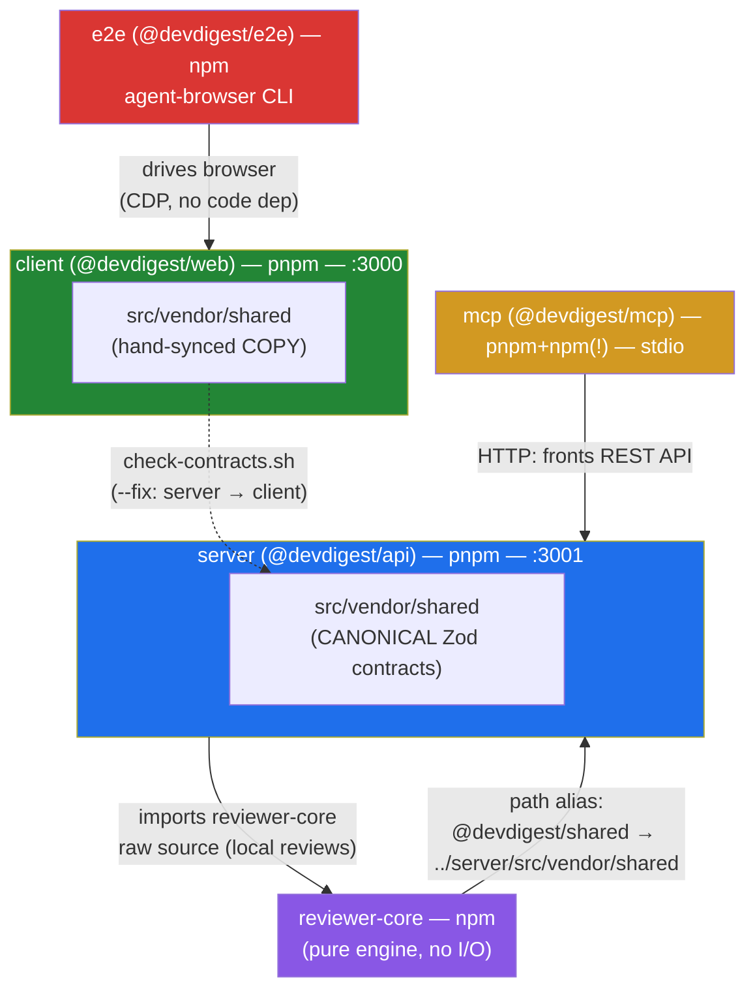

# Dependency Audit — dev-digest-kyrmyr (5 packages)

Дата: 2026-09-01. Виміряно реально (`du`, `pnpm outdated`, `npm outdated`, `pnpm audit`,
`npm audit`, читання `package.json`/`node_modules/*/package.json`) на поточному чекауті
(гілка `Lab6`). Мова: мікс UA/EN, як в запиті.

## 1. Схема залежностей

П'ять пакетів — **не** pnpm-workspace, кожен зі своїм `package.json` і lockfile'ом.
Зв'язок між ними — або TS path-alias на сирці (compile-time), або мережа/браузер
(runtime).

Ключове: `reviewer-core` — єдиний пакет, чий path-alias дивиться **назад** у нижчий
за рангом (impure) пакет `server` (`@devdigest/shared` резолвиться в
`../server/src/vendor/shared`). Це задокументована, свідома залежність
(`reviewer-core/AGENTS.md`), не помилка — але вона означає, що `reviewer-core`
неможливо винести з монорепо, поки `shared` не переїде першим.

## 2. Скільки кожен пакет важить на диску

| Пакет | `node_modules` | Директорія пакета цілком | Коментар |
|---|---:|---:|---|
| **client** | **623 MB** | 1.2 GB | + `.next/` build cache = 629 MB (генерується, не залежність, але роздуває "вагу" директорії вдвічі) |
| **server** | 234 MB | 257 MB | + `clones/` (16 MB, gitignored scratch-клони, do-not-touch) |
| **mcp** | 166 MB | 167 MB | |
| **reviewer-core** | 78 MB | 78 MB | найлегший з реальним рантаймом |
| **e2e** | 37 MB | 37 MB | найлегший загалом (без agent-browser CLI, це окремий бінарник, не в node_modules) |
| **Разом** | **≈1.11 GB** (5 незалежних дерев) | **2.1 GB репо цілком** | `.git/` = 14 MB |

Топ важкі залежності по пакету:

- **client**: `next` 152 MB, `mermaid` 75 MB, `lucide-react` 36 MB, `typescript` 23 MB, `react-dom` 7.1 MB
- **server**: `typescript` 23 MB, `js-tiktoken` 21 MB, `drizzle-orm` 13 MB, `openai` 7.4 MB, `drizzle-kit` 7.4 MB
- **mcp**: `typescript` 23 MB, `vite` 13 MB (тягне vitest), `@esbuild` 10 MB, `zod` 5 MB, `hono` 2.7 MB
- **reviewer-core**: `typescript` 23 MB, `vite` 13 MB, `@esbuild` 10 MB, `openai` 9.6 MB (лише типи використовуються!)
- **e2e**: `typescript` 23 MB, `@esbuild` 10 MB — по суті лише dev-тулінг, продакшн-залежностей нуль

`client` важить у 2.7× більше за `server` — головно через Next.js runtime + Mermaid
(використовується в studio для рендеру діаграм) + повний набір іконок lucide-react.

## 3. Версії — де що встановлено

### 3.1 Спільні dev-залежності по пакетах (реально встановлені версії)

| Пакет | zod | typescript | vitest | tsx | @types/node |
|---|---|---|---|---|---|
| server | 3.25.76 | 5.9.3 | 2.1.9 | 4.22.4 | 22.19.19 |
| client | 3.25.76 | 5.9.3 | 2.1.9 | — (не використ.) | 22.19.19 |
| reviewer-core | 3.25.76 | 5.9.3 | 2.1.9 | 4.22.4 | 22.19.20 |
| mcp | 3.25.76 | 5.9.3 | 2.1.9 | **4.23.12** | **22.20.1** |
| e2e | — (не використ.) | 5.9.3 | — (не використ.) | 4.22.4 | 22.19.21 |

**Дрейф версій, реально виявлений:**
- `tsx`: mcp сидить на 4.23.12, решта (server/reviewer-core/e2e) на 4.22.4 — той самий
  діапазон `^4.19.2` у package.json, але різні lockfile'и резолвнули по-різному.
- `@types/node`: 4 різні патч-версії (22.19.19 / 22.19.20 / 22.20.1 / 22.19.21) для
  одного й того ж діапазону `^22.10.0` — очікувано при 5 незалежних lockfile'ах без
  спільного workspace, але варто мати на увазі, коли шукаєш "чому в мене типи
  Node трохи інші, ніж у колеги".
- `zod`: **діапазон** у package.json теж розходиться — server/client/reviewer-core
  задекларували `^3.24.1`, а mcp — `^3.25.0`. Зараз обидва резолвляться в той самий
  `3.25.76` (пощастило), але це не гарантовано на майбутнє — наступний `install`
  може розійтися.

### 3.2 Версія vs останній реліз (`pnpm outdated` / `npm outdated`, живий реєстр)

**server** — найбільше відставання серед усіх п'яти:

| Пакет | Встановлено | Останній | Різниця |
|---|---|---|---|
| openai | 4.104.0 | 7.8.0 | **3 мажори** |
| fastify-type-provider-zod | 4.0.2 | 7.0.2 | **3 мажори** |
| vitest | 2.1.9 | 4.1.11 | 2 мажори |
| testcontainers / @testcontainers/postgresql | 10.28.0 | 12.1.0 | 2 мажори |
| zod | 3.25.76 | 4.5.4 | 1 мажор |
| octokit | 4.1.4 | 5.0.5 | 1 мажор |
| p-queue | 8.1.1 | 9.3.3 | 1 мажор |
| drizzle-orm / drizzle-kit | 0.38.4 / 0.30.6 | 0.45.2 / 0.31.10 | мінор, суттєвий gap |
| fastify | 5.8.5 | 5.12.1 | патч/мінор, безпечно |
| @anthropic-ai/sdk | 0.33.1 | 0.122.0 | pre-1.0, великий gap |
| typescript | 5.9.3 | 7.0.2 | 2 мажори |

**client**:

| Пакет | Встановлено | Останній |
|---|---|---|
| next | 15.5.19 | 16.3.3 (1 мажор) |
| next-intl | 3.26.5 | 4.14.1 (1 мажор) |
| recharts | 2.15.4 | 3.10.1 (1 мажор) |
| lucide-react | 0.469.0 | 1.38.0 |
| react-markdown | 9.1.0 | 10.1.0 |
| zod | 3.25.76 | 4.5.4 |
| vitest | 2.1.9 | 4.1.11 |
| jsdom | 25.0.1 | 30.0.1 |
| react/react-dom | 19.2.7 | 19.2.8 (безпечно) |

**reviewer-core / mcp / e2e** — переважно синхронні між собою, головне відставання
типове для всіх: `vitest` 2.1.9→4.1.11, `typescript` 5.9.3→7.0.2, `zod` 3.25.76→4.5.4,
`tsx` →4.23.13. `@modelcontextprotocol/sdk` в mcp — **актуальний** (1.30.0 = latest).

### 3.3 `npm/pnpm audit` — вразливості (реально проскановано)

| Пакет | Всього | critical | high | moderate | low |
|---|---:|---:|---:|---:|---:|
| server | 35 | 1 | 17 | 14 | 3 |
| client | 34 | 1 | 12 | 18 | 3 |
| reviewer-core | 8 | 1 | 4 | 3 | 0 |
| mcp | 5 | 1 | 1 | 3 | 0 |
| e2e | 1 | 0 | 0 | 0 | 1 |

Всі "critical" в server/client/reviewer-core/mcp — **один і той самий ланцюжок**:
застарілий `vitest` 2.1.x → `vite`/`vite-node` → повідомлення "Vitest UI server —
arbitrary file read/execute". Це **dev-only** (актуально лише якщо хтось реально
піднімає `vitest --ui` і відкриває порт назовні), не продакшн-ризик — але один
апгрейд `vitest` до v3/v4 закриє переважну більшість high/critical записів одразу
в 4 пакетах. У `client` додатково є 2 непов'язані записи через `mermaid → dompurify`
(XSS-суміжні) і прототип-полюшн у самому mermaid (`<11.16.1`).

## 4. Реальні знахідки-аномалії (не з package.json, а з фактичного стану диска)

1. **`mcp/` має ДВА lockfile'и одночасно**: `package-lock.json` (задокументований
   спосіб, npm) **і** `pnpm-lock.yaml` — обидва закомічені в git (commit "Lab4 done.",
   `mcp/pnpm-lock.yaml`). Це суперечить власному правилу репо ("два пакетні
   менеджери навмисно": mcp/reviewer-core/e2e = npm). Хтось одного разу запустив
   `pnpm install` в `mcp/` — файл згенерувався і потрапив у git. Ризик: наступний
   контрибʼютор випадково зробить `pnpm install` замість `npm ci` і отримає реальний
   розсинхрон дерева залежностей.
2. **`mcp/package.json` містить залежність `"inspector": "^0.5.0"`** — це **не**
   вбудований Node `inspector` і не офіційний `@modelcontextprotocol/inspector`.
   Це давно закинутий сторонній npm-пакет "Node.js binding for WebKit Inspector
   API" (останній реліз — 2022-06-19), і `grep -rn "inspector" mcp/src` не знаходить
   **жодного** використання в коді. Схоже на випадкове/помилкове додавання
   (можливо, замість `@modelcontextprotocol/inspector`). Чистий мертвий вантаж.
3. **Жоден з 5 `package.json` не має поля `engines`**, хоча `AGENTS.md` явно
   вимагає `Node ≥ 22`. Ніщо технічно не заблокує install на старішому Node.
4. **`client/.next`** (629 MB) важить більше за `client/node_modules` (623 MB) —
   якщо хтось міряє "вагу пакета" через `du -sh client/`, отримає перекручене
   враження, що клієнт більше про build-артефакти, ніж про залежності.
5. **`mcp/pnpm-workspace.yaml`** явно забороняє build-скрипти для
   `esbuild/bufferutil/utf-8-validate` (`false`), тоді як `server`/`client` їх
   дозволяють. У поточному стані це не ламає нічого (esbuild підтягнувся як
   готовий бінарник через `@esbuild/darwin-arm64` optional-dep), але це
   неконсистентно з рештою репо і варте вирівнювання, якщо колись знадобиться
   build-скрипт, якого немає готового бінарника.

## 5. Пріоритизований список дій

**P0 — зробити найближчим часом (дешево, реальний ризик):**
1. Видалити з `mcp/package.json` зайву залежність `inspector` (`^0.5.0`) — не
   використовується, застаріла, заплутує. `npm uninstall inspector` в `mcp/`.
2. Видалити `mcp/pnpm-lock.yaml` з git і з диска — mcp живе на npm, другий lockfile
   лише плутає інсталяцію. Перевірити `.gitignore` в mcp, щоб не з'явився знову.
3. Підняти `vitest` до v3/v4 у server, client, reviewer-core, mcp одним заходом —
   закриває critical+більшість high в audit одразу в 4 пакетах (vite/esbuild/vite-node
   ланцюжок). Це dev-залежність, ризик регресії продакшена мінімальний, але тести
   треба прогнати після апгрейду (breaking changes в конфігах vitest 2→4 бувають).

**P1 — варто запланувати (реальна користь, потребує тестування):**
4. `openai` в server і reviewer-core: 4.104.0 → мажорний апгрейд (зараз latest 7.x).
   Це основний LLM SDK продукту — вартий окремого спрінту з регресійним тестуванням
   review-пайплайну, не робити "заодно".
5. `fastify-type-provider-zod` 4.0.2 → 7.x — 3 мажори позаду, критичний для всієї
   Zod-based response-serialization схеми в server; перевірити changelog на breaking
   changes перед апгрейдом.
6. `next` 15→16 в client — мажорний апгрейд App Router фреймворку, планувати окремо
   з повним прогоном e2e.
7. Додати поле `engines.node` (`>=22`) у всі 5 `package.json`, щоб AGENTS.md-вимога
   була enforced, а не лише задокументована.

**P2 — гігієна, не термінова:**
8. Вирівняти задекларований діапазон `zod` між пакетами (`^3.24.1` vs `^3.25.0`
   в mcp) — дрібниця, але легко усунути дрейф на майбутнє.
9. Оновити дрібні патчі без ризику: `fastify` 5.8.5→5.12.1, `@fastify/*` пакети,
   `react`/`react-dom` 19.2.7→19.2.8, `@tanstack/react-query`, `@types/*`.
10. Вирівняти `mcp/pnpm-workspace.yaml` allowBuilds з server/client (наразі
    esbuild/bufferutil/utf-8-validate стоять `false`, працює лише завдяки
    готовим optional-dep бінарникам).
11. `drizzle-orm`/`drizzle-kit`, `dependency-cruiser`, `octokit`, `p-queue`,
    `testcontainers`, `recharts`, `next-intl`, `react-markdown`, `lucide-react` —
    мажорні апгрейди без термінового тиску; тримати в бэклозі, робити по одному з
    changelog-рев'ю (особливо `recharts` 2→3, `next-intl` 3→4 — обидва впливають на
    UI-рендер напряму).

## Джерела вимірювань

Всі числа отримані наживо в цій сесії: `du -sh` по `node_modules`/директоріях
пакетів; `grep`/`node -e` по `node_modules/*/package.json` для встановлених версій;
`pnpm outdated` (server, client) і `npm outdated` (reviewer-core, mcp, e2e) проти
живого реєстру npm; `pnpm audit` / `npm audit` per пакет; `find ... -name
node_modules` для підрахунку вкладених дерев; `git log --oneline -- mcp/pnpm-lock.yaml`
для підтвердження, що стрей-lockfile закомічений.
