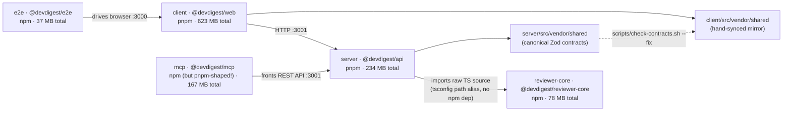

# Dependency Report — DevDigest

_Generated 2026-09-01. 5/5 packages measured (`server`, `client`, `reviewer-core`,
`mcp`, `e2e`) — usage of every dependency flagged as a removal candidate was
verified with a real `grep` against source, per the task's request. This audit
was triggered by a specific symptom report ("`pnpm install` in `client` and
`npm install` in `mcp` стали помітно довше, node_modules ніби розрослися"), so
sections 3–4 lead with what actually changed recently in those two packages,
not a generic top-to-bottom listing._

## TL;DR (відповідь на скаргу)

- **`client`**: no superfluous or duplicated dependency found. `node_modules`
  is genuinely 623 MB because of three big, *actually used* libraries
  (`next`, `mermaid`, `lucide-react`) — confirmed by grep, not assumed. `jszip`,
  added recently ("Lab 2"), is also genuinely used. Install being "slower than
  before" here is very likely just this real growth, not junk.
- **`mcp`**: found the real cause. `mcp/node_modules` is currently a **pnpm**
  store layout (`.pnpm/`, `.modules.yaml`, `.pnpm/inspector@0.5.0/...`) even
  though `mcp` is an **npm**-only package per `AGENTS.md`. There is a
  **`pnpm-lock.yaml` committed to git** in `mcp/` (added in commit `46e3602
  "Lab4 done."`) sitting right next to the real `package-lock.json`. Someone
  ran `pnpm install` in `mcp/` by mistake at some point (all `node_modules`
  timestamps in `mcp/` are Aug 24, ~9h before the lockfiles were last touched).
  Every subsequent `npm install` now has to reconcile npm's expectations
  against a foreign, symlink-heavy pnpm directory structure it doesn't
  understand — that mismatch, not extra weight, is the concrete reason `npm
  install` in `mcp` "стало довше".
- Also in `mcp`: the dependency named **`inspector` (`^0.5.0`)** is dead
  weight — confirmed zero usage anywhere in `mcp/src` by grep. It is not the
  MCP Inspector devtool; it's an unrelated, ~13-year-old "Node.js binding for
  the WebKit Inspector API" (depends on `ws@0.7.x`). Almost certainly added by
  mistake (name confusion with `@modelcontextprotocol/inspector`).
- **No real version drift** across the five packages: `zod`, `typescript`,
  `@types/node`, `tsx`, `vitest`, `openai` all resolve to the same installed
  major everywhere they appear (`crossPackage[].majorDrift` is `false` for
  every entry the scan found).

## 1. Dependency graph

## 2. Per-package inventory

### client (@devdigest/web) — pnpm — 623.4 MB total, 320.7 MB attributed to direct deps

| Dependency | Type | Declared range | Installed version | Size |
|---|---|---|---|---|
| next | prod | ^15.1.3 | 15.5.19 | 152.3 MB |
| mermaid | prod | ^11.15.0 | 11.15.0 | 75.3 MB |
| lucide-react | prod | ^0.469.0 | 0.469.0 | 36.2 MB |
| typescript | dev | ^5.7.2 | 5.9.3 | 22.8 MB |
| jsdom | dev | ^25.0.1 | 25.0.1 | 4.1 MB |
| recharts | prod | ^2.15.0 | 2.15.4 | 5.2 MB |
| react-dom | prod | ^19.0.0 | 19.2.7 | 7.1 MB |
| zod | prod | ^3.24.1 | 3.25.76 | 5.0 MB |
| vitest | dev | ^2.1.8 | 2.1.9 | 1.9 MB |
| @tanstack/react-query | prod | ^5.62.8 | 5.101.0 | 1.7 MB |
| tailwindcss | dev | ^4.0.0 | 4.3.0 | 0.8 MB |
| jszip | prod | ^3.10.1 | 3.10.1 | 0.9 MB |
| next-intl | prod | ^3.26.0 | 3.26.5 | 1.4 MB |
| @testing-library/user-event | dev | ^14.6.3 | 14.6.3 | 1.3 MB |
| @types/node | dev | ^22.10.0 | 22.19.19 | 2.5 MB |
| @types/react | dev | ^19.0.2 | 19.2.16 | 0.4 MB |
| @testing-library/jest-dom | dev | ^6.6.3 | 6.9.1 | 0.4 MB |
| @testing-library/react | dev | ^16.1.0 | 16.3.2 | 0.4 MB |
| postcss | dev | ^8.4.49 | 8.5.15 | 0.3 MB |
| react | prod | ^19.0.0 | 19.2.7 | 0.25 MB |
| react-markdown | prod | ^9.0.3 | 9.1.0 | 0.08 MB |
| @vitejs/plugin-react | dev | ^4.3.4 | 4.7.0 | 0.08 MB |
| @types/react-dom | dev | ^19.0.2 | 19.2.3 | 0.08 MB |
| @tailwindcss/postcss | dev | ^4.0.0 | 4.3.0 | 0.11 MB |
| remark-gfm | prod | ^4.0.0 | 4.0.1 | 0.04 MB |

+ ~302 MB shared/transitive, not attributed to a single dependency (mostly
`next`'s own SWC/webpack toolchain and `mermaid`'s bundled sub-libraries —
`d3`, `cytoscape`, `katex`, `dagre`, etc. — which pnpm's `.pnpm` store holds
outside any one top-level folder).

### server (@devdigest/api) — pnpm — 234.4 MB total, 97.9 MB attributed

| Dependency | Type | Declared range | Installed version | Size |
|---|---|---|---|---|
| typescript | dev | ^5.7.2 | 5.9.3 | 22.8 MB |
| js-tiktoken | prod | ^1.0.21 | 1.0.21 | 21.5 MB |
| drizzle-orm | prod | ^0.38.3 | 0.38.4 | 13.2 MB |
| drizzle-kit | dev | ^0.30.1 | 0.30.6 | 7.4 MB |
| openai | prod | ^4.77.0 | 4.104.0 | 7.4 MB |
| zod | prod | ^3.24.1 | 3.25.76 | 5.0 MB |
| fastify | prod | ^5.2.0 | 5.8.5 | 3.5 MB |
| graphology | prod | ^0.26.0 | 0.26.0 | 2.7 MB |
| @types/node | dev | ^22.10.0 | 22.19.19 | 2.5 MB |
| vitest | dev | ^2.1.8 | 2.1.9 | 1.9 MB |
| @anthropic-ai/sdk | prod | ^0.33.1 | 0.33.1 | 1.8 MB |
| dependency-cruiser | prod | ^17.4.3 | 17.4.3 | 1.5 MB |
| simple-git | prod | ^3.27.0 | 3.36.0 | 1.3 MB |
| @fastify/autoload | prod | ^6.0.3 | 6.3.1 | 1.2 MB |
| testcontainers | dev | ^10.16.0 | 10.28.0 | 1.2 MB |
| graphology-metrics | prod | ^2.4.0 | 2.4.0 | 0.3 MB |
| @fastify/rate-limit | prod | ^11.0.0 | 11.0.0 | 0.27 MB |
| postgres | prod | ^3.4.5 | 3.4.9 | 0.37 MB |
| pino-pretty | dev | ^13.0.0 | 13.1.3 | 0.44 MB |
| tsx | dev | ^4.19.2 | 4.22.4 | 0.65 MB |
| @ast-grep/napi | prod | 0.43.0 | 0.43.0 | 0.38 MB |
| @fastify/cors | prod | ^10.0.2 | 10.1.0 | 0.16 MB |
| @fastify/helmet | prod | ^13.0.2 | 13.0.2 | 0.11 MB |
| fastify-sse-v2 | prod | ^4.2.1 | 4.2.2 | 0.07 MB |
| octokit | prod | ^4.0.3 | 4.1.4 | 0.09 MB |
| p-queue | prod | ^8.0.1 | 8.1.1 | 0.08 MB |
| fastify-type-provider-zod | prod | ^4.0.2 | 4.0.2 | 0.05 MB |
| @vscode/ripgrep | prod | ^1.15.9 | 1.18.0 | 0.02 MB |
| @testcontainers/postgresql | dev | ^10.16.0 | 10.28.0 | 0.04 MB |

+ ~136.5 MB shared/transitive not attributed to one dependency (Fastify's own
plugin ecosystem, Drizzle/Postgres driver internals, etc.).

### mcp (@devdigest/mcp) — declared npm, **installed as pnpm** — 166.5 MB total, 39.2 MB attributed

| Dependency | Type | Declared range | Installed version | Size |
|---|---|---|---|---|
| @modelcontextprotocol/sdk | prod | ^1.30.0 | 1.30.0 | 5.9 MB |
| typescript | dev | ^5.7.2 | 5.9.3 | 22.9 MB |
| zod | prod | ^3.25.0 | 3.25.76 | 5.0 MB |
| vitest | dev | ^2.1.8 | 2.1.9 | 1.9 MB |
| tsx | dev | ^4.19.2 | 4.23.12 | 0.66 MB |
| @types/node | dev | ^22.10.0 | 22.20.1 | 2.5 MB |
| **inspector** | prod | ^0.5.0 | 0.5.0 | ~0 MB (but see finding below) |

+ ~127 MB shared/transitive not attributed to one dependency — this is where
the real weight is: `vite` (13 MB, from `vitest`), `@esbuild/*` platform
binaries (10 MB), `rollup`/`@rollup/*` (4.5 MB, from `vite`), and — this part
is legitimate, not junk — `hono`/`@hono/node-server`, `express`, `cors`,
`ajv`, `jose` (~6 MB combined), which are **`@modelcontextprotocol/sdk`'s own
declared dependencies** (it bundles an HTTP/SSE transport server alongside
stdio). None of that is duplicated elsewhere in a way that matters.

### reviewer-core (@devdigest/reviewer-core) — npm — 77.9 MB total, 42.5 MB attributed

| Dependency | Type | Declared range | Installed version | Size |
|---|---|---|---|---|
| typescript | dev | ^5.7.2 | 5.9.3 | 22.8 MB |
| openai | prod | ^4.77.0 | 4.104.0 | 9.6 MB |
| zod | prod | ^3.24.1 | 3.25.76 | 5.0 MB |
| vitest | dev | ^2.1.8 | 2.1.9 | 1.85 MB |
| @types/node | dev | ^22.10.0 | 22.19.20 | 2.5 MB |
| tsx | dev | ^4.19.2 | 4.22.4 | 0.65 MB |

+ ~35.4 MB shared/transitive not attributed (mostly `vitest`'s own `vite`
toolchain, same as everywhere else it appears).

### e2e (@devdigest/e2e) — npm — 36.5 MB total, 26.0 MB attributed

| Dependency | Type | Declared range | Installed version | Size |
|---|---|---|---|---|
| typescript | dev | ^5.7.2 | 5.9.3 | 22.8 MB |
| @types/node | dev | ^22.10.0 | 22.19.21 | 2.5 MB |
| tsx | dev | ^4.19.2 | 4.22.4 | 0.65 MB |

+ ~10.8 MB shared/transitive not attributed.

## 3. Cross-repo findings

### Largest dependencies (top of the repo)

1. `client`/`next` — 152.3 MB (expected: framework + SWC compiler, confirmed used repo-wide)
2. `client`/`mermaid` — 75.3 MB (confirmed used in 3 files under `client/src`)
3. `client`/`lucide-react` — 36.2 MB (confirmed used, 1 import site pulling icon components)
4. `typescript` — 22.8–22.9 MB, duplicated **five times over**, once per package (see below)
5. `server`/`js-tiktoken` — 21.5 MB
6. `server`/`drizzle-orm` — 13.2 MB
7. `mcp`'s pnpm-only transitive tree (`vite` + `@esbuild/*` + `rollup`) — ~27.5 MB, entirely a side effect of `vitest`, not `mcp`'s own code

### Version drift (installed major differs across packages)

**None.** The scan's `crossPackage` cross-reference checked every dependency
that appears in more than one package (`@types/node`, `typescript`, `zod`,
`tsx`, `vitest`, `openai`) and every one of them resolves to the same
installed major everywhere:

| Dependency | server | client | reviewer-core | mcp | e2e |
|---|---|---|---|---|---|
| zod | 3.25.76 | 3.25.76 | 3.25.76 | 3.25.76 | — |
| typescript | 5.9.3 | 5.9.3 | 5.9.3 | 5.9.3 | 5.9.3 |
| @types/node | 22.19.19 | 22.19.19 | 22.19.20 | 22.20.1 | 22.19.21 |
| tsx | 4.22.4 | — | 4.22.4 | 4.23.12 | 4.22.4 |
| vitest | 2.1.9 | 2.1.9 | 2.1.9 | 2.1.9 | — |
| openai | 4.104.0 | — | 4.104.0 | — | — |

No drift means: this part of the "щось задубльоване" question comes back
clean. There's real duplication of *disk space* (five separate copies of
`typescript`, five copies of `vitest`'s `vite`/`esbuild`/`rollup` toolchain,
etc.) but that's the structural cost of "five standalone packages, not a
workspace" from `AGENTS.md` — by design, not a regression, and not fixable
without merging package managers (explicitly out of scope per root
`AGENTS.md`: "don't unify them without reading `scripts/dev.sh:77-80`").

### Declared-range differences (lower priority)

`zod`: `mcp` declares `^3.25.0` while `server`/`client`/`reviewer-core`
declare `^3.24.1`. Both ranges currently resolve to the identical installed
version (`3.25.76`), so this is not live drift — just a note that if someone
tightens or loosens one range later, they'll diverge from the rest.

### Outdated majors

Spot highlights only (full lists came back for every package from
`npm outdated`/`pnpm outdated`, registry was reachable):

- `openai` is *very* behind everywhere it's declared (`4.104.0` → latest
  `7.8.0`) — in both `server` and `reviewer-core`.
- `zod` `3.25.76` → latest `4.5.4` in all four packages that declare it. A
  major bump here is cross-cutting (it's the shared contract validator per
  `AGENTS.md`) — do not do this opportunistically.
- `typescript` `5.9.3` → latest `7.0.2` everywhere; `vitest` `2.1.9` →
  latest `4.1.11` everywhere. Both are large major jumps, low urgency.
- `next` `15.5.19` → latest `16.3.3`; `next-intl` `3.26.5` → latest `4.14.1`;
  `recharts` `2.15.4` → latest `3.10.1`; `lucide-react` `0.469.0` → latest
  `1.38.0` (pre-1.0 → 1.0, likely a real breaking change worth reading the
  changelog for before bumping).
- None of this explains the slow-install symptom by itself — outdated
  packages don't make installs slower, they just accumulate upgrade debt.

### Coverage / caveats

All 5 packages had an existing `node_modules` and were fully measured; the
registry was reachable for all `outdated` calls, no `outdated.error` in any
package.

## 4. Prioritized recommendations

| Priority | Finding | Impact | Effort | Suggested action |
|---|---|---|---|---|
| **P0** | `mcp/node_modules` is a **pnpm** layout (`.pnpm/`, `.modules.yaml`) plus a committed `mcp/pnpm-lock.yaml`, even though `mcp` is npm-only per `AGENTS.md`. This is the concrete, evidenced cause of "`npm install` in `mcp` став довше" — npm has to reconcile against a directory structure it doesn't produce or fully understand. | High — fixes the reported symptom directly | Low | `rm -rf mcp/node_modules mcp/pnpm-lock.yaml && cd mcp && npm ci`. Then `git status` to confirm `pnpm-lock.yaml` is gone from the tree and commit its removal (it should never have been committed — someone ran `pnpm install` here by mistake, most likely around the "Lab4 done." commit). |
| **P1** | `mcp` declares a dependency named **`inspector` (^0.5.0)** with **zero usages** anywhere in `mcp/src` (verified by grep). It's an unrelated ~2013-era "WebKit Inspector API binding" (pulls in `ws@0.7.x`), not the MCP Inspector devtool — almost certainly a name-confusion mistake. | Low direct size impact (package itself is tiny) but it's genuinely dead/wrong weight and misleading to future readers | Low | `cd mcp && npm uninstall inspector` (or `pnpm remove` if still in pnpm state before the P0 fix runs). If the intent was to debug the MCP server interactively, the real tool is `npx @modelcontextprotocol/inspector` run ad hoc — it doesn't need to be a committed dependency at all. |
| **P2** | `client`'s 623 MB `node_modules` is real, not junk: `next` (152 MB), `mermaid` (75 MB), `lucide-react` (36 MB) are all confirmed in active use (grep found real imports in `client/src`, 3/1/multiple files respectively). No removal candidate found here. | — | — | No action. If install time in `client` still bothers, the fix is a `pnpm store prune` / shared pnpm store hygiene, not a dependency change — this is normal weight for a Next.js + Mermaid + icon-set app. |
| **P3** | `zod` declared range drifted slightly (`^3.24.1` vs `mcp`'s `^3.25.0`) — currently harmless since both resolve to `3.25.76`. | Low (future risk only) | Trivial | Align `mcp`'s range to `^3.24.1` next time `mcp/package.json` is touched, purely for consistency; not urgent on its own. |
| **P4** | `openai` (4.104.0 → 7.8.0) and `zod` (3.25.76 → 4.5.4) are both multiple majors behind, and both are shared across packages. | Medium (upgrade debt, not a current bug) | Medium–High | Track as a separate upgrade task, not part of this cleanup — `zod` especially needs a coordinated bump across `server`/`client`/`reviewer-core`/`mcp` plus the `check-contracts.sh` mirror, per `AGENTS.md`. Check each for breaking-change notes before bumping; don't do it opportunistically alongside the `mcp` lockfile fix above. |
