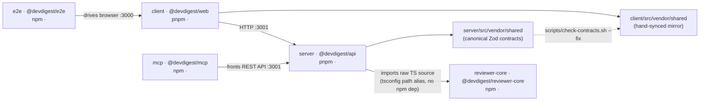

# Dependencies checker

Answers one question with hard numbers instead of impressions: **what do our
dependencies actually cost us, and what should we do about it?** It covers
disk size, version drift, and staleness across all five packages — not code
quality or architecture (see `onion-architecture` / `architecture-reviewer`
for that).

This repo is **five standalone packages, not a pnpm workspace** — each has its
own `package.json` and lockfile, `server`/`client` on pnpm, `reviewer-core`/
`mcp`/`e2e` on npm, and nothing is deduplicated across them (see root
`AGENTS.md`). That's exactly what makes this worth checking by hand instead of
trusting one lockfile: the same dependency can silently diverge to different
installed versions in different packages, and nothing catches that but this
kind of audit.

## Run it

```sh
node .claude/skills/dependencies-checker/scan.mjs > /tmp/deps-scan.json
```

Takes a few seconds and touches nothing. Run from the repo root. Add
`--skip-outdated` to skip the `npm outdated` / `pnpm outdated` calls (they hit
the registry — slower, and the only step that needs network; useful offline
or for a quick recheck of sizes alone).

If a package's `node_modules` doesn't exist, its entry comes back with
`nodeModulesExists: false` and every size as `null` — say so in the report
rather than silently omitting the package. (`reviewer-core/node_modules`
missing is the specific failure mode `AGENTS.md` already warns about: the API
imports that package's raw source at runtime, so a missing install there
breaks `server`, not `reviewer-core`.)

`scan.mjs` only gathers data — it emits JSON, no prose. Writing the report is
your job, using the template below.

## How sizing works — read before trusting a number

- **Per-dependency size** (`deps[].sizeKb`) is measured with `du -sk -L` on
  that one top-level `node_modules/<name>` directory. `-L` resolves a pnpm
  top-level symlink to its real content, but — this is a BSD `du` quirk, not a
  bug — `-L` only follows the symlink named on the command line, not the
  symlinks *inside* it. So this number is that dependency's **own installed
  footprint**, not its transitive closure. Good: sizes across sibling
  dependencies don't double-count shared sub-dependencies. Bad: it
  undercounts what actually disappears if you remove that dependency.
- **Total size** (`totalNodeModulesKb`) is `du -sk` (no `-L`) on the whole
  `node_modules` — the true, non-inflated disk cost of that package.
- **`attributedDepsKb` (sum of the per-dependency sizes) will always be
  smaller than `totalNodeModulesKb`.** The gap is real disk space, spent on
  transitive dependencies that aren't nested under any single direct
  dependency's own folder (npm hoists them, pnpm keeps them in its own
  `.pnpm` store) — so it isn't owned by any one row in the table. Report the
  gap as its own line (`"+ N MB shared/transitive, not attributed to a single
  dependency"`); do not silently reconcile it or imply the per-row numbers sum
  to the total.
- **Declared range vs. installed version are different questions.** Two
  packages can declare different semver ranges for the same dependency
  (`^3.24.1` vs `^3.25.0`) and still resolve to the *identical* installed
  version once npm/pnpm satisfy both — that isn't drift, it's normal semver
  range overlap. Real drift is when `crossPackage[].majorDrift` is `true` —
  different **installed majors** across packages. Lead with that; mention
  declared-range differences only as a secondary, lower-priority note (they
  hint at *future* drift risk once someone bumps one range but not the
  other).
- **This script does not check whether a dependency is actually imported
  anywhere.** Before recommending removal of anything for size, grep that
  package's `src/` for the import (`grep -rl "from '<name>'" server/src`, or
  the equivalent for the package in question). A large, unused dependency is a
  strong removal candidate; a large, heavily-imported one is not — no matter
  how big it looks in the table.
- `outdated[].data` uses `{current, wanted, latest}` for both npm and pnpm —
  a **major** bump is `latest`'s leading version number differing from
  `current`'s. If `outdated.error` is set (registry unreachable, etc.), say so
  in the Coverage note instead of omitting the row.

## Report structure

ALWAYS use this exact structure. Fill every section — if a section would be
empty (no drift found, nothing outdated), say so explicitly rather than
omitting the heading; an audit that finds nothing wrong is still a result.

```markdown
# Dependency Report — DevDigest

_Generated <date>. <N>/5 packages measured — <name the ones skipped, if any,
and why>._

## 1. Dependency graph

<mermaid diagram — see template below, sizes as edge/node labels>

## 2. Per-package inventory

### <package> (<npm name>) — <pnpm|npm> — <total> total, <attributed> attributed to direct deps

| Dependency | Type | Declared range | Installed version | Size |
|---|---|---|---|---|
| ... | prod/dev/peer | ^x.y.z | x.y.z | N MB |

(repeat per package, largest-package-first)

## 3. Cross-repo findings

### Largest dependencies (top N across the repo)
### Version drift (installed major differs across packages)
### Declared-range differences (same installed major, ranges diverging — lower priority)
### Outdated majors
### Coverage / caveats

## 4. Prioritized recommendations

| Priority | Finding | Impact | Effort | Suggested action |
|---|---|---|---|---|
```

### Section 4 is the point — spend real effort here

The tables in sections 2–3 are inputs; a developer reading only section 4
should know exactly what to do next. Rank by **impact ÷ effort**, not by
severity of the finding alone:

- A confirmed major-version drift on a dependency imported in both packages
  (real behavioral risk, e.g. a shared contract validator like `zod`) usually
  outranks a large-but-single-package dependency that's simply feature-heavy
  by design (e.g. `next`, `mermaid` — expected to be big, nothing to do).
- An outdated major with a known security advisory outranks an outdated major
  that's purely feature churn — you don't have a live vulnerability feed
  here, so flag it as "check for advisories" rather than asserting one
  exists.
- A large dependency confirmed unused (via the grep check above) is a
  same-day win; a large dependency confirmed in heavy use is not a finding at
  all, even if it tops the size table — say so, don't pad the list.
- Prefer few high-confidence recommendations over an exhaustive list of every
  row that looks big. This is a developer-facing report, not a dump of the
  JSON with commentary.

## Mermaid diagram template

The architecture is fixed and documented in root `AGENTS.md` — adapt this,
don't reinvent it. Annotate nodes with each package's total size from the
scan so the diagram carries the same numbers as section 2.



## Files

| File | Does |
|---|---|
| `scan.mjs` | Reads each package's `package.json`, measures installed sizes via `du`, cross-references versions across packages, optionally calls `npm outdated`/`pnpm outdated`. Emits JSON only. |

## Extending it

- **A sixth package ever appears** (this repo is explicitly a "not a
  workspace" course starter, so this is plausible) → add it to the `PACKAGES`
  array in `scan.mjs` with its manager; everything else picks it up
  automatically.
- **Want a real vulnerability feed, not just "outdated majors"** → that needs
  `npm audit` / `pnpm audit`, which `scan.mjs` deliberately doesn't call today
  (different exit-code/JSON conventions per manager, and audit databases go
  stale fast — don't bolt it on without checking both managers' current JSON
  shape the way the size logic here already does for `outdated`).
- **A number looks wrong** → re-read "How sizing works" above before assuming
  a bug; the attributed-vs-total gap and range-vs-installed distinction are
  the two things that surprise people first.
