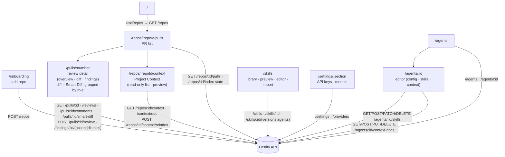

# `@devdigest/web` — the studio (Next.js 15)

The DevDigest UI: import repos, browse pull requests, run and read AI reviews,
and author agents. App Router + React Server/Client components, data via
**TanStack Query** hooks over the Fastify API. (This is the starter surface;
course lessons add the Skills, Memory, Eval, Blast/Brief, multi-agent, CI, and
dashboard screens.)

- **Stack:** Next.js 15 (App Router), React 19, TanStack Query, `next-intl`
  (messages in `messages/<locale>/*.json`), `recharts`, `mermaid`,
  `react-markdown`. UI primitives are vendored under `src/vendor/ui`
  (`@devdigest/ui`) and shared Zod contracts under `src/vendor/shared`
  (`@devdigest/shared`).
- **API base:** `NEXT_PUBLIC_API_BASE` (default `http://localhost:3001`), used by
  `src/lib/api.ts`. Every data hook lives in `src/lib/hooks/*`.
- **Run:** `pnpm dev` (`:3000`). **Test:** `pnpm test` (vitest + jsdom, fetch
  mocked — no API needed). **Typecheck:** `pnpm typecheck`.

## UI route map

Routes (`src/app/**/page.tsx`) and the API surface each leans on (via
`src/lib/hooks/*` → `src/lib/api.ts`):

Cross-cutting chrome lives in `src/components/app-shell` (nav, breadcrumbs,
`g`-then-key shortcuts). Pages are thin; feature logic sits in colocated
`_components/<Name>/` folders, each with its own `*.test.tsx`.

**Files changed tab (L03 · Smart Diff).** A toggle in the tab header switches
between the Standard flat file list and the Smart view; Smart is the default and
the choice persists per PR (`localStorage`, `DiffTab/viewMode.ts`). The Smart
view renders three collapsible groups — `core` (business logic), `wiring`
(configs, barrels, docs) and `boilerplate` (lock files, build output,
snapshots) — with boilerplate shut by default, a group tag and severity badge on
each file header, the finding's own lines highlighted in the diff, and a
split suggestion when the PR is too big to review in one sitting. Manual
fold/unfolds (files and groups) are remembered for the browser session only
(`DiffTab/foldStore.ts` — a module-level map, deliberately not persisted), after
which the role defaults apply again. The header also carries the PR's findings
badge, which renders an explicit `0` and shows loading/failure as their own
states. From the Agent-runs tab, "View in diff" on a finding jumps here without
leaving the page: it expands whatever hides the target (group, file), scrolls
the line to the vertical centre and pulses it (`ddFlash`); a finding whose line
isn't in the diff carries an attention mark on its card instead. The grouping
comes from `GET /pulls/:id/smart-diff` (deterministic and free server-side — no
model call); the severities come from the reviews the page has already loaded,
narrowed to each agent's current review so they always describe the same set of
reviews the highlighted lines do. (The Findings tab shows more on purpose — it is
the run history, superseded passes included.) If that call has not
landed the tab renders the plain flat viewer, so the grouping is an enhancement
and never a dependency. The overlay itself is a prop of the shared
`src/components/diff-viewer` (`DiffAnnotations`), which stays unaware of where
the annotations came from.

**Project Context (SPEC-01).** `/repos/:repoId/context` lists the Markdown a
repository already contains (`specs/`, `docs/`, `insights/` at any depth), each row
tagged with the root it came from and carrying its token cost (or a pending marker
when the scan has not counted it yet), and previews any one document as rendered
Markdown next to the number of agents attaching it. It is **read-only**: there is
no create, edit, upload or delete control, because an edit written into the
server's clone is destroyed by the next `git reset --hard` resync. Six states are distinct — loading,
error + retry, empty (which names the three roots), still-cloning (`409
repo_not_cloned`, handled in `ProjectContextView.tsx`, not in the list), populated,
and a preview error that leaves the list interactive. The preview renders through the kit's
`Markdown` primitive **as installed** and `rehype-raw` is absent from
`package.json` on purpose — `DocPreview.tsx` explains why adding it would remove
the control this pane depends on for repository-authored text.
Attaching happens on two other surfaces: the agent editor's **Context** tab
(`AgentEditor/_components/ContextTab/`), which also shows rows inherited from the
agent's skills and rows whose file no longer resolves, and the skill editor modal,
for a saved skill only. Hooks live in `src/lib/hooks/project-context.ts`; the four
cache keys are separate roots in `keys.ts`, so every mutation invalidates each
affected key **by name** — a prefix sweep would silently refresh nothing. The
sidebar entry and the `g x` chord come from one `vendor/ui/nav.ts` row, proven by
`src/components/app-shell/hooks/useGlobalShortcuts.test.ts`. Two honest gaps: the
seeded demo repository has no clone, so the seeded studio always shows the
still-cloning state, and the Context tab's reorder is drag-only, which its own
comment records as an accepted WCAG 2.2 SC 2.1.1 conflict. Server behaviour,
limits and the trust story:
[`../server/src/modules/project-context/README.md`](../server/src/modules/project-context/README.md).

## Testing

Component/interaction tests (`*.test.tsx`) run under vitest + jsdom with `fetch`
mocked, so they need neither the API nor a browser. The real browser journeys
(client + API + seeded DB) are covered by the deterministic agent-browser suite
in [`../e2e`](../e2e/README.md) and the `e2e-web.yml` workflow. See
[`../TESTING.md`](../TESTING.md).
