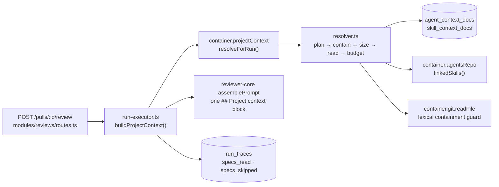

# `project-context` — the repository's own Markdown, in the prompt

`project-context` discovers the Markdown documents a cloned repository already
contains, lets a user attach specific documents to an agent and to a skill in an
order they control, and feeds the resolved bodies to `reviewer-core` as its
`specs` input on every review run. Read this if you are changing the discovery
walk, the attachment API, or the run-start read path.

Two facts to hold on to before you read the code:

- **The prompt slot is older than this module.** `reviewer-core/src/prompt.ts`
  has declared a `specs` slot and emitted a `## Project context` section since
  before this feature; `run-executor` simply never set the slot and hardcoded
  `specs_read: []`. Checkable at the commit before the feature landed
  (`b509971`): `git show b509971:reviewer-core/src/prompt.ts` declares
  `specs?: string[]` and pushes `## Project context`, and
  `git show b509971:server/src/modules/reviews/run-executor.ts` assigns
  `specs_read: []` twice and passes no `specs`. What this feature added is mostly
  wiring, plus one engine line — the fence label.
- **The page is read-only, on purpose.** There is no create, edit, upload or
  delete anywhere in this feature. See [Known limits](#known-limits).

## The run-start path

`run-executor` reaches this module only through `container.projectContext`
(`server/src/platform/container.ts:158-162`) and codes against the interface in
[`types.ts`](types.ts) rather than the concrete service, which is what lets a
test replace the whole facade (`server/test/reviews.it.test.ts:445-450`).

## Discovery: a dedicated walk, not `repo-intel`'s

[`walk.ts`](walk.ts) walks the clone itself. A file is a candidate when its
extension is `.md` **and** some *directory* segment of its clone-relative path is
one of `specs`, `docs`, `insights`, at any depth (`walk.ts:79-86`,
`constants.ts:34`). The **leftmost** matching segment supplies the source tag, so
`docs/specs/x.md` is tagged `docs` (`walk.ts:81-84`).

| Rule | Where | How it differs from `repo-intel/pipeline/walk.ts` |
|---|---|---|
| No size filter | `walk.ts:135-143` | A 400 KB document must still be listed and previewable, so the cap moves to read time (`constants.ts:40-46`) |
| Cap 500, overflow reported | `walk.ts:103-105`, `constants.ts:37` | `total` is captured before truncation, so the response states what the cap cut |
| Symlinks never emitted | `walk.ts:118` | Loops and performance — and it is the first of three containment layers |
| Alphabetical sort before the cap | `walk.ts:99-104` | "The first 500" has to be reproducible across runs |
| `EXCLUDED_DIRS` reused, `.gitignore` ignored | `walk.ts:47,122` | The two walks agree on what is skipped. It prunes `vendor`, so documents under a `vendor/` directory are out of scope by inheritance |

**`.md` was deliberately not added to `repo-intel`'s `SUPPORTED_EXT`.** That one
set (`../repo-intel/constants.ts:14`) gates the indexer's walk, whose output then
feeds symbol parsing, the import graph and the PageRank computation
(`../repo-intel/pipeline/full.ts:128,216,228`) — so widening it would push
Markdown into all of them and force `INDEXER_VERSION`
(`../repo-intel/constants.ts:39`) up, which means a full reindex of every
repository. A module-local walk costs one traversal per request instead;
`walk.ts:12-41` records the same reasoning next to the code.

## Token counts: persisted, and computed in a job

`GET /repos/:id/context` never tokenizes. It serves `tokens` from
`context_doc_tokens` and returns `null` for a path with no cached row
(`service.ts:93-104`), which the studio renders as a pending indicator.

Counting happens in the `project-context-token-count` job (`constants.ts:19`,
`service.ts:157-231`), enqueued on clone completion
(`server/src/modules/repos/service.ts:88-92`) and by
`POST /repos/:id/context/reindex` (`routes.ts:108-129`). A document whose stored
`content_hash` still matches its freshly hashed body is skipped
(`service.ts:213-217`), which is what makes a re-scan cheap, and the job stops
between documents once `TOKEN_JOB_BUDGET_MS` is spent, keeping whatever it has
already persisted (`service.ts:193-199`).

Why a job and not the request: `js-tiktoken` (`server/package.json:33`) is pure
JavaScript and CPU-bound. SPEC-01 records a single measurement — ~36 ms to encode
a 400 KB document, ~1 798 ms for 50 of them, on one machine and on a Node version
above this repo's floor (`specs/SPEC-01-project-context.md:686-694`; that number
is second-hand, from the spec, not re-measured here). The trade is freshness: a
count can be stale between scans (`service.ts:96-100`).

## Resolution order, and the trust boundary

`planContextDocs` (`resolver.ts:147-170`) builds the candidate list:

1. the agent's own attachments, in persisted order;
2. then, per enabled skill in skill order, that skill's attachments — a skill
   contributes only when **both** switches are on, `agent_skills.enabled` and
   `skills.enabled` (`resolver.ts:155`);
3. de-duplicated by path, first occurrence winning, so a direct attachment
   outranks the same path inherited from a skill (`resolver.ts:168-169`).

The agent Context tab lists its rows through the same function
(`service.ts:272-283`), so the studio cannot show an order a run would not
reproduce.

**A skill-inherited document does not inherit the skill's trusted, un-fenced
treatment.** Every project-context document, however it got into the list, goes
into the one `## Project context` block, `<untrusted>`-fenced, with the
document's **path** as the fence label (`reviewer-core/src/prompt.ts:183-193`;
asserted in `reviewer-core/test/prompt.test.ts:206-226`). The path label is what
makes the prompt text and the trace's `specs_read` name the same documents. The
longer argument is in
[`../../../docs/project-context-injection.md`](../../../docs/project-context-injection.md).

## The layer may never fail a review

Three wrappers, each degrading rather than throwing:

- `resolveContextForRun` races the whole pass against
  `PROJECT_CONTEXT_RESOLVE_TIMEOUT_MS` and returns an empty result on a throw or
  an expiry (`resolver.ts:195-213`).
- `ProjectContextService.resolveForRun` catches a failure while assembling the
  resolver's dependencies (`service.ts:402-419`).
- `run-executor.buildProjectContext` catches the facade
  (`run-executor.ts:452-475`). That third one is load-bearing, not decoration:
  the AC-47 test replaces the entire facade with a throwing object and still
  expects a completed run (`server/test/reviews.it.test.ts:445-476`).

When nothing resolved, `run-executor` **omits** the `specs` key rather than
sending an empty array (`run-executor.ts:275-280`), so the prompt stays
byte-identical to the no-context baseline
(`reviewer-core/test/prompt.test.ts:272-280`).

A document that does not make it is skipped, named in the Live Log, and recorded
in `RunTrace.specs_skipped`:

| Reason | Cause | Recorded at |
|---|---|---|
| `unread` | the read failed, the entry is a symlink, or the path resolves outside the clone | `resolver.ts:253,271,282,298` |
| `oversize` | larger than `MAX_CONTEXT_DOCUMENT_BYTES`, checked before the read | `resolver.ts:286-289` |
| `budget` | `PROJECT_CONTEXT_TOKEN_BUDGET` was already full | `resolver.ts:243-246,303-307` |

The Live Log lines are emitted by the caller, one per reason, naming paths and
counts only (`run-executor.ts:476-497`).

## Three layers keep a user-controlled path inside the clone

Each layer covers what the previous one cannot:

1. **The walk never emits a symlink** (`walk.ts:118`), so anything attachable is
   a real file at discovery time.
2. **The attach routes validate the submitted path against the discovered set**
   before persisting it (`service.ts:478-497`, called from `attachAgentDoc`,
   `setAgentDocs` and `attachSkillDoc`). This layer exists because the resolver
   reads *persisted* paths, so layer 1 is not in the loop at run time.
3. **The resolver `realpath`s each document and asserts containment** against a
   `realpath`'d clone root before reading (`resolver.ts:269-273`). Layer 2 is a
   time-of-check and the read is the time-of-use: a repository owner can attach a
   real file and then replace it — or a directory above it — with a symlink.
   `lstat` alone was tried and is insufficient, because it does not follow the
   final path component but does follow every intermediate one
   (`resolver.ts:30-44`). Both vectors are covered in
   `resolver.test.ts:298-339`.

Underneath all three, `SimpleGitClient.readFile` resolves the joined path and
asserts containment *lexically* before any fs call
(`server/src/adapters/git/simple-git.ts:148-171`) — the choke point every caller
already passes through, and lexical-only, which is precisely why layers 2 and 3
are there.

## Routes

Route prefixes are not module-owned here (`repo-intel` already serves
`/repos/:id/index-state`), so this module owns all of these
([`routes.ts`](routes.ts)):

| Method and path | Response | Notes |
|---|---|---|
| `GET /repos/:id/context` | `ContextDocList` | one live walk plus three set-based queries (`service.ts:85-91`); `409 repo_not_cloned` when the clone is not on disk (`service.ts:526-540`) |
| `GET /repos/:id/context/doc?path=…` | `ContextDocContent` | membership checked against the walk; `404 doc_not_found`, `413 doc_too_large` (`service.ts:121-148`) |
| `POST /repos/:id/context/reindex` | `IndexStatus`, `202` | enqueues the token job, and still answers `202` if the enqueue fails (`routes.ts:112-127`) |
| `GET/POST/PUT/DELETE /agents/:id/context-docs` | `AgentContextDoc[]` | `PUT` carries the full ordered list; `GET` includes inherited rows |
| `GET/POST/DELETE /skills/:id/context-docs` | `SkillContextDoc[]` | no inheritance — a skill is where inheritance starts |

Every write also checks that the parent agent or skill belongs to the caller's
workspace (`service.ts:442-461`); both link tables cascade on the parent id
(`../../db/schema/project-context.ts:56-58,81-83`), which is what makes that
check more than cosmetic. Contracts live in
[`../../vendor/shared/contracts/project-context.ts`](../../vendor/shared/contracts/project-context.ts)
and are mirrored into the client — change the canonical copy, then run
`./scripts/check-contracts.sh`.

## Limits, all in `constants.ts`

| Constant | Value | Enforced at |
|---|---|---|
| `MAX_CONTEXT_DOCUMENTS` | 500 | `walk.ts:104` |
| `MAX_CONTEXT_DOCUMENT_BYTES` | 400 KB | `service.ts:134`, `resolver.ts:286` |
| `PROJECT_CONTEXT_TOKEN_BUDGET` | 8 000 tokens | `resolver.ts:303` |
| `PROJECT_CONTEXT_RESOLVE_TIMEOUT_MS` | 5 000 ms | `resolver.ts:186-193` |
| `TOKEN_JOB_BUDGET_MS` | 110 000 ms | `service.ts:196` |

A document past the 500 cap cannot be attached either, because the attach check
reads the same capped list (`service.ts:473-476`).

## Known limits

- **No writing.** Create, edit, upload and delete are drawn in the design and
  deliberately not built: `sync()` runs `git reset --hard origin/<branch>`
  (`server/src/adapters/git/simple-git.ts:78-89`), so an edit written into the
  clone is destroyed silently on the next resync.
- **The seeded demo repository has `clone_path: null`**
  (`server/src/db/seed.ts:95-104`), so `/repos/:repoId/context` shows the
  "still cloning" state in every seeded stack and a populated document list has
  no seeded or e2e route. Accepted gap, not a bug: the e2e flow asserts the
  cloning state on purpose (`e2e/specs/11-project-context.flow.json`).
- **`RunTrace.specs_skipped` is persisted and rendered nowhere.** The field
  exists (`../../vendor/shared/contracts/trace.ts:103-110`) and `run-executor`
  writes it (`run-executor.ts:392`); no studio surface reads it. The Live Log
  lines are the only user-facing signal today.
- **The `insights` root matches nothing in this repository.** Insights here are
  `insights.md` *files* at package roots, and the walk matches directory segments
  only (`walk.ts:79-86`, `constants.ts:27-33`). A root that matches nothing
  *here* is not a dead tag — a user repository with an `insights/` directory is
  the case it was written for.
- **The agent Context tab's reorder is drag-only**, recorded in the component as
  an accepted WCAG 2.2 SC 2.1.1 conflict
  (`client/src/app/agents/[id]/_components/AgentEditor/_components/ContextTab/ContextTab.tsx:176-183`).
- **An attachment carries no repository.** `agent_context_docs.path` is
  repo-agnostic (`../../db/schema/project-context.ts:46-48`), so a path attached
  while viewing one repository is resolved at run time against whichever
  repository the reviewed PR belongs to, and renders as an unresolved row when it
  does not resolve there.

## Tests

| Suite | File | What it pins |
|---|---|---|
| `server-unit` | [`walk.test.ts`](walk.test.ts) | any-depth roots, the leftmost tie-break, the cap, symlinks |
| `server-unit` | [`resolver.test.ts`](resolver.test.ts) | order, dedupe, both containment vectors, the two ceilings, the timeout |
| `server-unit` | [`token-count.test.ts`](token-count.test.ts) | the hash skip, the tokenizer fallback, the time budget |
| `server-unit` | [`project-context.test.ts`](project-context.test.ts) | listing and content against a mock `GitClient` |
| `server-integration` | [`../../../test/project-context.it.test.ts`](../../../test/project-context.it.test.ts) | tenancy, attach counts, all six attach endpoints, the seed fixture |
| `server-integration` | [`../../../test/reviews.it.test.ts`](../../../test/reviews.it.test.ts) | the injected block in a persisted trace, and survival when the facade throws |
