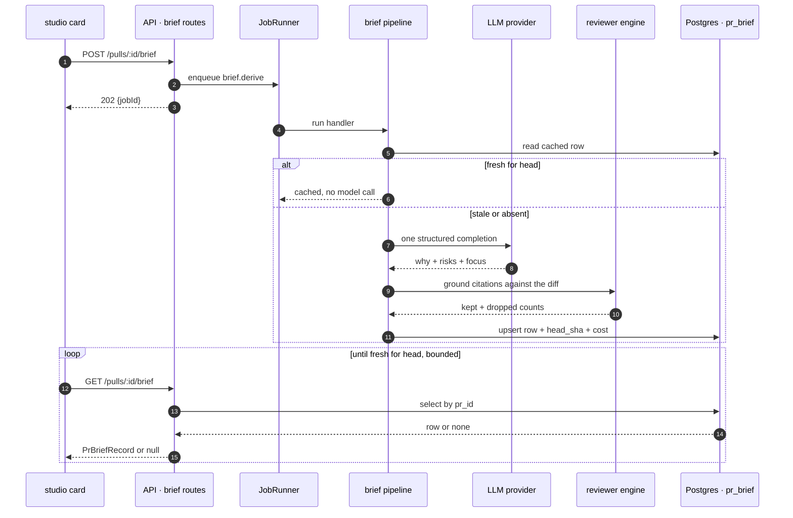

# Spec: PR Brief

Spec ID: SPEC-02
Status: draft
Supersedes: —

*Amended 2026-08-28 to describe what was actually decided and built.* The build is
complete and graded **`Partial success`**. The authority for every amendment is
[`specs/plans/SPEC-02-pr-brief.plan.md`](plans/SPEC-02-pr-brief.plan.md) — its
*Decisions taken* table (D-1…D-13) and its author-approved *Amendments* log
(A-1, A-2, A-3). **Two requirements are not verified by this build and say so
where they live:** **NFR-1**'s 150 ms p95 (plan A-2) and **NFR-5**'s
2.4.3 / 2.4.7 / 2.4.11 rows. `Status` stays `draft` — promoting it is the
author's call.

## Problem & user

A reviewer opens PR #482 ("Add rate limiting to public API endpoints") on the
Overview tab and gets three things: the author's title, the author's description,
and a derived one-paragraph intent (`client/src/app/repos/[repoId]/pulls/[number]/_components/IntentCard/IntentCard.tsx:146`).
Nothing on that screen tells them what is *risky* about the change, and nothing
tells them where to begin. To find out, they must spend a paid review run, wait
for it, then read a flat list of findings on another tab — and even then the
answer arrives as twenty equally-weighted items with no statement of which two
matter. A reviewer with twenty minutes and a 40-file diff currently has no way to
spend those minutes well except by guessing which file to open first.

The second half of the cost is that risk, once found, is not *reachable*. A
reviewer who reads "the retry loop can spin forever" still has to find the retry
loop by hand: the only surface that links a claim to a line of the diff today is
the finding card, and it exists only after a review run
(`client/src/app/repos/[repoId]/pulls/[number]/page.tsx:102-106`). The judgement
and the code sit on two different tabs with no path between them.

## Goals / Non-goals

### Goals

1. A reviewer arriving cold at a PR can read, without running a review, why the
   change exists and what is risky about it.
2. Each stated risk carries a severity from the same vocabulary the rest of the
   product uses, so it can be triaged against findings the reviewer already knows
   how to read.
3. A reviewer can get from a stated risk to the exact line of the diff it is
   about, in one activation.
4. A reviewer is told where to start reading, in an order, with a reason per
   entry.
5. Every location the brief points at is a location that actually exists in the
   diff.

### Non-goals

- **Replacing, removing or folding in the shipped `IntentCard`.** The author
  chose Q-1c: the brief derives its own "why" and the intent card stays exactly
  where it is on the Overview grid
  (`.../OverviewTab/OverviewTab.tsx:19-48`). The consequences are accepted, not
  unnoticed, and are recorded in full under *Module interactions →
  Accepted consequence of Q-1c*.
- **PR history / prior overlapping PRs.** The pre-shipped `PrHistory` shape
  (`server/src/vendor/shared/contracts/brief.ts:66-79`) has no faithful source in
  this codebase: `pull_requests` carries `opened_at` and `updated_at` and **no
  merge timestamp** (`server/src/db/schema/pulls.ts:27-28`), the GitHub adapter
  never maps one even though the payload carries it
  (`server/src/adapters/github/octokit.ts:103-104`), and `pr_files` is written
  only by a per-PR detail fetch (`server/src/modules/pulls/repository.ts:114-123`)
  — so a merged PR nobody ever opened locally has zero file rows and is invisible
  to any overlap query. `PrHistoryItem.merged_at` could only be filled with the
  proxy `updated_at`, which moves on any post-merge comment. Building it would
  mean shipping a section that is silently wrong.
- **Absorbing the Blast Radius card.** It ships as its own card and its own
  contract, which says in its own header why it is deliberately separate from
  `brief.ts`'s `BlastRadius` (`server/src/vendor/shared/contracts/blast.ts:5-11`).
  Two blast shapes in one payload would be two truths.
- **Review-run data on the brief surface** — a verdict, a findings count, a
  blocker count, a PR score. The design at
  [`specs/assets/SPEC-02/01-overview-pr-brief.png`](assets/SPEC-02/01-overview-pr-brief.png)
  draws all four in a banner at the top of the brief; **none of them is in this
  spec's payload and none was built.** They are properties of a *review run*, and
  the whole point of the brief is to be readable **before** one is paid for
  (Goal 1). Stated here because a reader who has seen the mockup will look for
  them; the full list is *Design review → What the mockup shows and the build
  does not*.
- **Reading `file_rank` or any other repo-intel index data.** A per-file rank
  exists and is facade-reachable (`server/src/modules/repo-intel/service.ts:499-503`),
  but `file_rank`'s primary key is `(repo_id, file_path)` with **no commit
  column** (`server/src/db/schema/repo-intel.ts:105-121`), so "rank at this PR's
  head" is not an askable question — a read always answers as of whatever
  `repo_index_state.lastIndexedSha` currently is, and the resulting drift is
  already recorded as a latent bug for the sibling blast methods
  (`server/insights.md:117-123`). Everything this feature ranks or truncates is
  therefore derived from the PR's own diff. This is why *UX improvements* P-4 is
  moot under this design.
- **URL-addressable jumps.** The reveal state deliberately never reaches the URL
  (`.../page.tsx:80-84`), so a risk's location cannot be shared or survive a
  reload. Proposed as P-3 and left out: it reopens a decision the diff viewer
  made for stated reasons, and it is not needed for any goal above. *This was one
  of two sub-questions the author did not answer; the assumption stands and is
  recorded here.*
- **Changing the PR-list cost badge.** The badge reads
  `agent_runs.cost_usd` for settled runs
  (`server/src/modules/pulls/repository.ts:203-215`, rendered at
  `client/src/app/repos/[repoId]/pulls/_components/PRRow/PRRow.tsx:69-71`), so a
  brief's cost will not appear there merely because it is persisted. The brief's
  cost is shown **on the brief card only** (AC-44).
- **Adding a prompt slot for the brief.** Because the derivation is triggered
  explicitly and never as review pre-work (Q-5a), the brief never enters a review
  prompt, so `PromptAssembly` (`server/src/vendor/shared/contracts/trace.ts:39-54`)
  needs no `brief` field and neither mirror changes. Stated because it is the
  first thing a reader will assume.
- **Deriving on read, or as review pre-work.** A `GET` must not spend a model
  call — the intent route refuses this explicitly
  (`server/src/modules/reviews/routes.ts:143-144`) and this spec follows it.
- **An eval harness.** The `eval` tables stay empty. How a quality regression
  would be noticed is answered in *Model & prompt → Eval*, as a stated gap rather
  than an implied plan.
- **A browser e2e flow.** Verified in `client`, `server-unit`,
  `server-integration` and the `mcp` package suite, matching how the intent card
  and the blast card shipped — neither has an `e2e/` flow.

## User stories

- As a reviewer arriving cold at a PR, I want the change's motivation and its
  risks on the first screen, so that I can decide whether to review it now
  without paying for a review run first.
- As a reviewer with twenty minutes, I want an ordered short list of where to
  start and why, so that the time I have goes to the code that carries the risk.
- As a reviewer reading a stated risk, I want to land on the line it is about, so
  that I can judge the claim instead of searching for its subject.
- As a reviewer who does not trust an LLM, I want every location the brief cites
  to be verifiably present in the diff, so that a confident sentence about a line
  that does not exist never reaches me.
- As a reviewer on a repository with no provider key configured, I want the card
  to tell me what is missing rather than sit empty, so that I know the feature is
  not broken.
- As an agent operating through MCP, I want the same brief the studio shows, so
  that I do not have to re-derive it to answer a question about a PR.

## Acceptance criteria (EARS)

### Read path

- **AC-1** — WHEN `GET /pulls/:id/brief` is requested, the API shall return the
  persisted brief record for that PR, or `null` when none exists.
- **AC-2** — The API shall serialise `GET /pulls/:id/brief` through the
  `PrBriefRecord` response schema.
- **AC-60** — IF a brief response payload does not match the response schema, THEN
  the API shall fail the request rather than serve the payload.
- **AC-3** — The API shall scope every `pr_brief` read by the requesting
  workspace.
- **AC-4** — IF the requested PR id is not a PR of the requesting workspace, THEN
  the API shall respond 404 with the `{error:{code,message}}` envelope.
- **AC-5** — IF the `:id` path parameter is not a uuid, THEN the API shall
  respond 422 without reaching the database.

### Derivation trigger

- **AC-6** — WHEN `POST /pulls/:id/brief` is requested, the API shall respond 202
  with the id of the enqueued derivation job.
- **AC-7** — WHEN `POST /pulls/:id/brief` is requested, the API shall respond
  before the derivation's model call completes.
- **AC-8** — IF no handler is registered for the brief job kind, THEN the API
  shall respond 202 with a degraded receipt naming the reason.
- **AC-9** — IF more than five `POST /pulls/:id/brief` requests arrive within 60
  seconds, THEN the API shall respond 429.
- **AC-10** — The brief derivation pipeline shall return an outcome for every
  exit path rather than throwing.
- **AC-11** — IF a derivation does not produce a validated result, THEN the API
  shall leave the existing `pr_brief` row unchanged.
- **AC-12** — WHILE a stored brief's `head_sha` equals the PR's current head, a
  derivation request without `force` shall return the stored record without a
  model call.
- **AC-13** — WHERE `force` is requested, the derivation shall ignore the stored
  row and re-derive.

### The model call and what is persisted

- **AC-14** — WHEN deriving a brief, the API shall issue exactly one HTTP
  completion request to the provider.
  - *Literal, not approximate (plan D-5).* `BRIEF_LLM_MAX_RETRIES = 0`
    (`server/src/modules/brief/constants.ts:50`) and the provider loops
    `maxRetries + 1` times, so a derivation is **one HTTP request, full stop**. A
    malformed answer is **AC-15** immediately, with no second attempt — which is
    also what makes **NFR-4**'s $0.07 a genuine ceiling rather than a
    per-attempt figure.
- **AC-62** — WHEN assembling a brief prompt, the API shall wrap every PR-derived
  text in `<untrusted>` fences.
- **AC-63** — The API's brief system prompt shall state that fenced content is
  data rather than instructions.
- **AC-68** — The API's brief system prompt shall state that every user-facing
  string the model produces is written in English.
  - *A deliberate scope widening, recorded here after the fact (plan D-11),
    author-accepted.* The plan added an output-language paragraph to
    `server/src/prompts/risk-brief.system.md` alongside AC-63's injection rule and
    noted that **no criterion covered it**. This criterion covers it, because the
    rule is real, shipped and observable (`risk-brief.system.md:15-27`; asserted
    at `server/test/brief-pipeline.test.ts:682-685`) — a stated deviation with a
    test already behind it is better recorded as the requirement it in fact is.
    Rationale in *Model & prompt → Prompt slots*.
- **AC-15** — IF the model's output fails validation against the brief extraction
  schema, THEN the API shall abandon the derivation with a recorded parse-failure
  reason.
- **AC-16** — WHEN a derivation's output validates, the API shall clamp every
  string and array in it to the declared per-field limits before persisting.
  - *The declared limits* live in `server/src/modules/brief/constants.ts`:
    **`MAX_BRIEF_RISKS = 20`** (`:58`), `MAX_FOCUS_ENTRIES = 5` (`:61`),
    `MAX_RISK_TITLE_CHARS = 200`, `MAX_RISK_EXPLANATION_CHARS = 600`,
    `MAX_FOCUS_REASON_CHARS = 200`, `MAX_WHY_SUMMARY_CHARS = 800` (`:64-67`).
    **20 is the *persisted* clamp and is not the card's display cap** — see
    **AC-65** and **AC-39**.
- **AC-17** — WHERE the resolved provider is `openrouter`, IF the model catalogue
  reports that the resolved model does not support structured outputs, THEN the
  API shall abandon the derivation without issuing a completion request.
- **AC-61** — IF the model catalogue cannot report whether the resolved model
  supports structured outputs, THEN the API shall proceed with the derivation.
- **AC-64** — The API shall resolve the brief's provider and model through the
  registered `risk_brief` feature-model id.
- **AC-18** — IF the resolved provider cannot be constructed, THEN the API shall
  abandon the derivation with a recorded provider-unavailable reason.
- **AC-19** — WHEN a derivation succeeds, the API shall persist the brief JSON,
  the PR's head SHA, the derivation timestamp, the provider, the model, the token
  counts and the cost in one `pr_brief` row.
- **AC-20** — The API shall persist `cost_usd` as `null` when the model is
  unpriced, and as `0` only when the model's price is genuinely zero.
  - *Correction (plan follow-up R-10).* An earlier draft read "…unpriced **or the
    record came from cache**…". That clause described **a write that cannot
    happen**: under **AC-12** the cache branch returns the stored record and
    writes nothing at all (`server/src/modules/brief/pipeline.ts:80`). It is
    removed rather than reworded, and the non-write is pinned by its own test
    (`server/test/brief-pipeline.test.ts:592`).
- **AC-21** — IF persisting a successful derivation fails, THEN the API shall
  still return the derived record to its caller.
- **AC-22** — IF the assembled brief prompt would exceed its token cap, THEN the
  API shall include only the changed files with the most changed lines, up to that
  cap.
- **AC-67** — IF the token cap omitted any changed file from the prompt, THEN the
  API shall record the omitted paths in the brief.
- **AC-23** — IF a brief derivation exceeds the job runner's timeout, THEN the API
  shall mark the job failed.

### Grounding

- **AC-24** — WHEN grounding a derived brief, the reviewer engine shall keep a
  risk only when its line range intersects a hunk of the diff for the same file.
- **AC-25** — IF a risk names a file that is not present in the diff, THEN the
  reviewer engine shall exclude that risk with a recorded reason.
- **AC-26** — IF a risk's line range intersects no hunk of its file, THEN the
  reviewer engine shall exclude that risk with a recorded reason.
- **AC-27** — IF a focus entry names a file that is not present in the diff, THEN
  the reviewer engine shall exclude that entry with a recorded reason.
- **AC-28** — WHEN grounding completes, the API shall persist the kept and dropped
  counts as part of the brief.
- **AC-29** — IF grounding drops every risk, THEN the API shall persist a brief
  whose risk list is empty and whose dropped count is non-zero.

### The studio card

- **AC-30** — WHILE a brief is available, the studio shall render its three
  sections in the order: why, risks, review focus.
- **AC-31** — IF no brief has been derived for the PR, THEN the studio shall
  render an empty state offering a control that requests a derivation.
- **AC-32** — WHILE the brief read is pending, the studio shall render skeleton
  placeholders in the card.
- **AC-33** — IF the brief read fails, THEN the studio shall render an error state
  offering a retry control.
- **AC-34** — WHILE a derivation is expected, the studio shall re-read the brief
  until the stored record is fresh for the PR's current head.
- **AC-35** — IF a requested derivation has not landed within the studio's bounded
  wait, THEN the studio shall return the derivation control to its idle state.
- **AC-36** — WHILE the stored brief's head SHA differs from the PR's current
  head, the studio shall render a staleness badge above the brief's rendered
  content.
- **AC-37** — WHILE risks are rendered, the studio shall render each risk's
  severity with both an icon and a text label.
- **AC-38** — WHILE risks are rendered, the studio shall order them CRITICAL, then
  WARNING, then SUGGESTION.
- **AC-65** — The studio shall render at most ten risks in the card.
- **AC-39** — IF the brief carries more risks than the card's display cap, THEN
  the studio shall render a line stating how many of how many risks are shown.
  - *The two numbers, stated explicitly, and why they differ (plan D-4).*
    **`MAX_BRIEF_RISKS = 20`** is the **persisted** clamp of **AC-16**
    (`server/src/modules/brief/constants.ts:58`).
    **`BRIEF_RISK_DISPLAY_CAP = 10`** is the **card's** display cap of **AC-65**
    (`.../_components/BriefCard/constants.ts:11`). **The gap between them is what
    makes AC-39's "showing X of Y" reachable at all** — raising the card cap to 20
    would silently delete that line from the UI, and lowering the server clamp to
    10 would do the same.
- **AC-40** — The studio shall render at most five review-focus entries.
- **AC-41** — WHEN a risk's location control is activated, the studio shall reveal
  the diff tab at that risk's file and line.
- **AC-42** — IF a risk's line is absent from the studio's diff line index, THEN
  the studio shall mark that risk as not present in this diff.
- **AC-66** — WHEN the location control of a risk whose line is absent from the
  diff line index is activated, the studio shall reveal that risk's file card
  without a line anchor.
- **AC-43** — WHEN a review-focus entry is activated, the studio shall reveal the
  diff tab at that entry's file.
- **AC-44** — WHILE a brief is available, the studio shall render its derivation
  cost through the shared cost formatter with an explicit placeholder for a null
  cost.
- **AC-45** — IF a rendered path, risk title or focus reason is visually
  truncated, THEN the studio shall expose the untruncated value as that element's
  accessible name.
  - *Found unmet under review and fixed (plan A-3).* The delivered location
    control set `aria-label` to a fixed translated string and put the raw value
    only in `title`; because `aria-label` **overrides** `title` in
    accessible-name computation, the untruncated value never became the
    accessible name. The author-approved fix makes that name carry **the
    untruncated `path:line` *and* the action** —
    `"<path>:<line> — Open this location in the Files changed tab"`
    (`.../BriefCard/BriefCard.tsx:116-117`, message at
    `client/messages/en/prReview.json:183`) — which satisfies this criterion
    literally while keeping the control's purpose legible to a screen-reader
    user. **Its two sibling sites carry the raw value alone**: the risk title
    (`BriefCard.tsx:164`) and the focus reason (`:207`). That asymmetry is
    exactly why the defect survived the first test pass. The criterion itself
    needed no change — a name that carries the value *and* the action does
    expose the value.
- **AC-46** — The studio shall render every model-derived string in the brief as
  text rather than as markup.
- **AC-47** — IF one section of the brief payload is absent, THEN the studio shall
  render that section's empty state and keep the remaining sections rendered.
- **AC-48** — WHEN the derivation state changes, the studio shall announce the new
  state through a status region.
- **AC-49** — WHEN a risk's location control receives Enter or Space, the studio
  shall perform the same reveal as a pointer activation.
- **AC-50** — WHEN a reveal completes, the studio shall place keyboard focus on the
  revealed file card.
  - ***Unconditional, and it applies to every caller*** (plan D-7, author
    signed-off). The focus move lives in the shared diff viewer — `tabIndex={-1}`
    on `FileCard`'s root plus `focus({preventScroll: true})` inside the existing
    reveal timeout
    (`client/src/components/diff-viewer/FileCard/FileCard.tsx:74-82,135-137`) — so
    it is **not** scoped to the brief. The already-shipped **finding-jump**
    (`.../page.tsx:102-105`) and **blast-jump** (`.../page.tsx:108-111`) drive the
    same code path and **now also move keyboard focus**. That is an intentional
    change to shipped behaviour, not a side effect, and it carries explicit
    regression assertions in both places
    (`.../FindingCard/FindingCard.test.tsx:83`, `.../DiffTab/DiffTab.test.tsx:310`).
    `preventScroll: true` is load-bearing: without it the browser's own focus
    scroll fights the `scrollIntoView` immediately above it.
- **AC-58** — WHILE review-focus entries are rendered, the studio shall render them
  in the order the brief lists them.
- **AC-59** — WHILE a review-focus entry is rendered, the studio shall render that
  entry's reason.

### The MCP server

- **AC-51** — The MCP server shall expose a `get_pr_brief` tool.
- **AC-52** — WHEN `get_pr_brief` is called with a repository name and a PR
  number, the MCP server shall return the brief that `GET /pulls/:id/brief`
  serves for that PR.
- **AC-53** — IF the REST API is unreachable, THEN the MCP server shall return an
  error result whose text names the reachability failure.
- **AC-54** — IF the API returns no brief for the PR, THEN the MCP server shall
  return a non-error result stating that no brief has been computed.
- **AC-55** — The `get_pr_brief` tool description shall be at most 200 characters.
- **AC-56** — IF the serialised brief exceeds the MCP character limit, THEN the
  MCP server shall return it truncated with a narrowing hint appended.
- **AC-57** — The MCP package shall resolve the brief's wire shape from its own
  local projection rather than by importing `@devdigest/shared`.

## Edge cases

- PR has never been opened locally, so `pr_files` is empty → **AC-22** (nothing
  to include) and **AC-25**/**AC-27** (every citation drops); the card renders the
  empty risk list with a non-zero dropped count → **AC-29**
- PR diff exceeds the prompt token cap → **AC-22**
- PR diff contains only binary, rename-only or mode-only files, so `diff.files` is
  empty → **AC-25**, **AC-27**. Now pinned by fixture rather than by a reading of
  the parser's control flow: `server/test/diff-parser.test.ts` asserts each of the
  three stanzas yields no file, so **OQ-4** is closed
- A file in the diff has a `null` patch, so the studio's line index for it is empty
  → **AC-42**
- A risk cites a **deleted** line (old side of the diff) → **AC-26**. Old-side
  lines are structurally unlinkable end to end: the parser accumulates new-side
  numbers only and skips deletions with the comment "deletion: no new-side line
  consumed" (`server/src/adapters/git/diff-parser.ts:67-69`), the studio indexes
  only `newNo` (`.../DiffTab/helpers.ts:161-169`), and no `data-old-line`
  attribute exists anywhere in the studio (grep over `client/src`: zero matches).
  This is a constraint, not a preference
- Zero risks genuinely found → **AC-29** distinguishes it from "all dropped" by
  the dropped count
- One risk, and 200 risks → **AC-38**, **AC-39**
- A risk title of 400 characters, or a 180-character monorepo path → **AC-45**
- A risk title containing Markdown, HTML or a `javascript:` URL → **AC-46**
- A risk title containing RTL text or emoji → **AC-46** (rendered as text; no
  reordering or escaping logic of our own)
- Model returns a field the extraction schema does not declare → **AC-15**
- Model returns six focus entries → **AC-16** (clamped), **AC-40**
- Model returns a negative or zero line number → **AC-26** (no hunk intersects)
- Provider key absent → **AC-18**
- Resolved OpenRouter model silently lacks structured outputs → **AC-17**
- Derivation requested twice in quick succession → **AC-9**; and within the limit,
  the second request re-derives — the row is a single upsert keyed by `pr_id`, so
  the later result wins
- Derivation requested while one is already running → **AC-12** does not apply
  (nothing fresh is stored yet); the second job re-derives and the later write
  wins. Concurrent-derivation coalescing → out of scope (single-user local studio;
  the cost of a duplicate is one call, and **AC-9** bounds it)
- Force-push moves the head between derivation and read → **AC-36**
- Derivation succeeds but the write fails → **AC-21**
- Job runner retries a rejected handler twice, which for a deterministic failure
  would mean three billed derivations → **AC-10**
- Derivation hangs → **AC-23**, **AC-35**
- The brief exists but the PR's files were re-synced and no longer contain a cited
  file → **AC-42** (the studio's own index disagrees with the stored brief; the
  risk is marked not-in-diff rather than offering a jump that cannot land)
- Two workspaces hold a PR with the same number → **AC-3**
- MCP called for a PR that has no brief → **AC-54**
- MCP called with a repository the API does not know → the existing `resolvePull`
  path already fails with an actionable `ApiError` (`mcp/src/api.ts:13`) →
  **AC-53**
- Reviewer opens the card on a 4-inch viewport → out of scope (the studio has no
  small-viewport target; no existing card specifies one)
- Two reviewers derive the same brief concurrently → out of scope (single-user
  studio)

## Design review

**The design is
[`specs/assets/SPEC-02/01-overview-pr-brief.png`](assets/SPEC-02/01-overview-pr-brief.png)**
— an Overview-tab mockup of PR #482, supplied after the table below was first
written. An earlier version of this section said no design material existed; that
is no longer true and the sentence is gone.

**The author's ruling on it: the mockup is visual reference only, and the plan's
placement wins.** Where the two disagree, the build follows **AC-30** and row
**D-0** — *one* `BriefCard` carrying three sections, above the Intent/Blast grid
(`.../OverviewTab/OverviewTab.tsx:38-52`) — not the mockup, which scatters the
brief across three separate places and puts review-run data on it. What the
mockup shows and the build deliberately does not is listed in full under *What
the mockup shows and the build does not*, below the table, so a later reader does
not read a deliberate omission as a miss.

**The image is present on disk but not yet tracked by git** — `git status` reports
`?? specs/assets/SPEC-02/`. **Commit it.** A screenshot that exists only in a
working tree makes every citation to it unresolvable within a week, and this agent
cannot stage a binary.

Every row below resolves into a criterion, a closed question, or a non-goal. The
rows were written against a screen described in words and re-read against the
mockup once it arrived; only **D-0** changed.

| # | Region | Gap | Resolution | Becomes |
|---|---|---|---|---|
| D-0 | whole card | The mockup puts the brief in **three** places — a verdict banner at the top, a "Risk areas" block *nested inside* the Intent card, and a separate full-width "Review focus" card below the grid — so section order, card count and placement were all in dispute | **Author's ruling: the plan's placement wins; the mockup is visual reference only.** One card, three sections in the author's stated order, above the existing two-card grid (`.../OverviewTab/OverviewTab.tsx:38-52`) | **AC-30** |
| D-1 | why section | Duplicates the shipped `IntentCard`: same question, same PR, two answers that can disagree | The author chose Q-1c deliberately; the cost is recorded as accepted, not hidden | Non-goal (fold-in), *Module interactions → Accepted consequence of Q-1c*, **OQ-2** |
| D-2 | risks | "No risks found", "not derived yet" and "derived but everything was dropped" are three different facts that one empty list would flatten | Three distinct states; the dropped count is what separates the third | **AC-29**, **AC-31** |
| D-3 | risks | In-flight state undrawn; a 202 job must show progress that survives navigation and reload, and must bound itself | Poll the server's own freshness, with a bounded wait — the idiom the intent card arrived at (`IntentCard.tsx:24,44-58`) | **AC-34**, **AC-35** |
| D-4 | risks | Staleness undrawn, and `pr_brief` could not even represent it: the table is `(pr_id, json)` and nothing else (`server/src/db/migrations/0000_init.sql:211-214`) | Add the staleness key; render a badge and keep content visible | **AC-19**, **AC-36** |
| D-5 | risk → diff | The shipped `Risk` carries `file_refs: string[]` — paths, no lines (`.../contracts/brief.ts:50-56`) — so the headline requirement is unbuildable against it | Line-bearing risks; contract change in both mirrors | **AC-24**, *Contract impact* |
| D-6 | risk → diff | The diff viewer resolves new-side lines only (`FileCard.tsx:69-73`), so a deleted line, a `null` patch or a file outside the loaded diff can never be revealed | Mark not-in-diff and reveal the file card, the behaviour findings already have (`FindingCard.tsx:77-84`) | **AC-42** |
| D-7 | risk → diff | A model can cite a line that does not exist; findings are gated, risks were not | Gate risks and focus entries the same way, and persist the counts | **AC-24**–**AC-29** |
| D-8 | risk → diff | The jump is not URL-addressable by design (`page.tsx:80-84`), so a risk cannot be linked or survive a reload | Left out; proposal recorded | **P-3**, Non-goal |
| D-9 | review focus | "Where to start" could be an ordered list, a paragraph, or a ranked list with reasons — three different builds | Author chose Q-7c: ≤ 5 entries, each a real changed file with a one-line reason, grounded like a risk | **AC-27**, **AC-40**, **AC-43** |
| D-10 | review focus | Ordering by repo-intel rank would inherit a known drift: rank has no commit column and answers as of `lastIndexedSha` (`server/insights.md:117-123`) | The brief reads no index data; ordering is the model's, grounded against the diff, and truncation is by changed lines | Non-goal (index reads), **P-4** moot |
| D-11 | all sections | No cap drawn: 40 risks, a 300-file PR, a 20-entry focus list | Hard caps, and the cap stated on screen | **AC-16**, **AC-39**, **AC-40** |
| D-12 | all sections | Long strings: a 400-character risk title, a 180-character path | Truncate visually, keep the full value as the accessible name | **AC-45** |
| D-13 | all sections | Every string here derives from the PR body, the diff and model output; rendering any of it as markup is a stored-XSS shape | Render as text | **AC-46**, *Untrusted inputs* |
| D-14 | whole card | Partial payload: one section present, another absent | Per-section empty state, siblings keep rendering | **AC-47** |
| D-15 | whole card | No provider key configured — a local-first tool must still say something | The derivation abandons with a logged reason and the card keeps its empty state and control | **AC-18**, **AC-31** |
| D-16 | whole card | Cost invisible, and `pr_brief` had no column for it; `null` and `0` are different facts (root `insights.md:455-477`) | Add the columns; render through `formatCost` | **AC-19**, **AC-20**, **AC-44** |
| D-17 | a11y | Severity by colour alone fails WCAG 1.4.1; an async section arriving is a status change; a cross-tab reveal moves the user | Icon + label; a status region; an explicit, stated focus decision | **AC-37**, **AC-48**, **AC-50**, **NFR-5** |
| D-18 | flow | The reveal is one-way — `jumpToFinding` switches tab and does not offer a way back (`page.tsx:102-106`) | Left as the shipped behaviour; the tab strip is the way back | out of scope (consistency with the shipped finding jump) |
| D-19 | module interactions | The pre-shipped `PrBrief` composes a `blast` shape that disagrees with the shipped blast contract, which says so itself (`contracts/blast.ts:5-11`) | The legacy `PrBrief` is retained untouched and served by nothing; this spec serves `PrBriefRecord` | *Contract impact*, **P-5** |
| D-20 | module interactions | `PrHistory` needs merged PRs and file overlap | No faithful source exists | Non-goal (with the evidence) |
| D-21 | verification | e2e runs with no LLM and no brief is seeded; changing the seed breaks flows silently (`e2e/insights.md:130-136`) | No e2e flow; `client` covers the states, `server-integration` covers the row | Non-goal (e2e flow) |
| D-22 | placement | `pr_brief` carries no `workspace_id`, against the root tenancy rule | `pr_intent` does not either — both scope through `pr_id → pull_requests`. Followed, not re-litigated, and the scoping is asserted | Non-goal (re-tenanting a pre-existing table), **AC-3** |

### What the mockup shows and the build does not

Stated plainly, because "but it is in the design" is the first thing a reader
will check the build against. Every **no** below is a decision, not a gap.

| In the mockup | Built? | Why |
|---|---|---|
| Verdict banner — `Request changes`, `6 findings · 2 blockers`, and a `61` **PR score** dial | **no** | All four are properties of a **review run**, not of a brief. None is in `PrBriefRecord`, and the point of the brief is to be readable *before* a review is paid for (Goal 1). Recorded as a Non-goal above |
| The brief's "why" rendered as that banner's paragraph | **no** | It is the `why` section of the one `BriefCard` instead (**AC-30**) |
| Risks nested **inside** the Intent card as a "Risk areas" block | **no** | Risks are the brief's second section (**AC-30**). Folding them into `IntentCard` would put two independently-derived, independently-stale payloads in one card — the exact confusion *Accepted consequence of Q-1c* keeps visible rather than blends |
| Review focus as its own full-width card below the grid | **no** | Third section of the same card (**AC-30**) |
| `Prior PRs touching these files 3` inside the Blast card | **no** | That is `PrHistory` — a Non-goal above, with the evidence that no faithful source exists in this codebase |
| Cost and token counts on the brief surface | **yes** | **AC-44**, through the shared cost formatter, with an explicit placeholder for a null cost |
| A refresh control on the brief surface | **yes** | The derivation control — **AC-31**, bounded by **AC-35** |
| `path:line` under each risk and each review-focus entry, as an activatable link | **yes** | **AC-41**, **AC-43**; gated by **AC-24**–**AC-27** at derivation and re-checked by **AC-42** at reveal |
| Severity carried by a coloured icon beside each risk | **yes**, strengthened | **AC-37** requires an icon **and** a text label; icon-plus-colour alone would fail WCAG 1.4.1 (**NFR-5**) |

## Module interactions

### Callers and callees

| Hop | Transport | Payload | Status |
|---|---|---|---|
| studio card → `GET /pulls/:id/brief` | HTTP | — → `PrBriefRecord \| null` | **NEW** route; card **NEW** |
| studio card → `POST /pulls/:id/brief` | HTTP | `{force?}` → 202 `{status,jobId}` | **NEW** |
| route → `BriefService` | in-process | `workspaceId, prId` | **NEW** (`server/src/modules/brief/`) |
| `BriefService` → `container.jobs` | in-process | job kind `brief.derive` | existing runner (`server/src/platform/jobs.ts:30-49`), **NEW** kind |
| brief pipeline → `container.pullsRepo` | in-process | PR row, file rows | existing (`server/src/modules/pulls/repository.ts:114-123`, exposed on the container as the sanctioned cross-module seam) |
| brief pipeline → `container.featureModel(ws,'risk_brief')` | in-process | → `{provider,model}` | existing (`server/src/platform/container.ts:129`), id already registered (`server/src/vendor/shared/contracts/platform.ts:61-67`) |
| brief pipeline → `container.modelCatalog.supportsStructuredOutputs` | HTTP (provider) | model slug → `true\|false\|null` | existing; the preflight pattern is `.../intent-pipeline.ts:136-146` |
| brief pipeline → `container.llm(provider).completeStructured` | HTTPS | one request | existing adapter |
| brief pipeline → reviewer engine grounding | in-process, pure | citations + `UnifiedDiff` | existing gate, generalised; **NEW** barrel export `groundCitations` (`reviewer-core/src/grounding.ts:94`, `index.ts:35-43`) — see below |
| brief pipeline → `BriefRepository` | SQL | upsert one `pr_brief` row | **NEW** repository, existing table |
| studio page → `OverviewTab` → studio card | in-process, props | `onRevealLocation(path, line \| null)`, `citationInDiff(citation)` | **NEW** props on a shipped component (`.../page.tsx:116-141`, `.../OverviewTab/OverviewTab.tsx:23-46`) |
| studio card → diff viewer `FileCard` | in-process, via the page's `diffReveal` state | `{path, line \| null, token}` → scroll **and keyboard focus** | existing reveal path; the **focus move is NEW and universal** (`FileCard.tsx:74-82`) — see **AC-50** |
| MCP `get_pr_brief` → `GET /pulls/:id/brief` | HTTP | — → local projection | **NEW** tool, existing client (`mcp/src/api.ts`) |

On the client the brief adds **no new reveal machinery**. `page.tsx` already owns
the `diffReveal` state and the diff line index, so the card needs one new callback
— `jumpToLocation(path, line | null)` (`.../page.tsx:116-119`), the same two lines
`jumpToFinding` runs, with the line made optional — and one new predicate,
`citationInDiff` (`.../page.tsx:134-141`), both handed down through `OverviewTab`.
The predicate wraps the **same** `diffIndex` the findings tab uses
(`.../page.tsx:130`) rather than building a second one: **one index, one truth**,
so the brief and the findings tab can never disagree about which lines a jump can
land on. `OverviewTab` keeps its existing `onRevealFile` for the blast card
unmerged — the blast card genuinely has no line, and collapsing the two would push
a `null` through a signature that means something else. The one change to shipped
behaviour on this side is `FileCard`'s focus move, and it is deliberate and
universal: see **AC-50**.

Placement follows the ring model: transport in `routes.ts`, orchestration in
`service.ts`, SQL in `repository.ts`, and the derivation as a standalone
`pipeline.ts` function over `(container, repository, args)` so it can be driven
with stubs — the shape `.../intent-pipeline.ts:23-38` states its reasons for. The
brief module reaches other modules only through the container and a job kind,
never by importing their internals.

### Contract impact

Canonical `server/src/vendor/shared/contracts/brief.ts`, hand-mirrored to
`client/src/vendor/shared/contracts/brief.ts`. **Always two files**, guarded by
`./scripts/check-contracts.sh` (CI: `contracts.yml`). The mirror is in sync as of
this spec — verified by running that script, which reports
`check-contracts: OK`.

- **`Risk` — changed.** Gains `file: string`, `start_line: int`, `end_line: int`.
  `severity` changes from `RiskSeverity` (`high|medium|low`, `brief.ts:47`) to the
  product's `Severity` (`CRITICAL|WARNING|SUGGESTION`, `contracts/findings.ts:11`),
  which is what the UI kit's badge already renders with an icon and a label
  (`client/src/vendor/ui/primitives/Badge.tsx:51-58`). `file_refs` becomes
  `.nullish()` and is documented as legacy — a `.nullish()` field simply
  serialises away when absent, so nothing has to emit it
  (`server/insights.md:124-149`).
- **`ReviewFocus`, `FocusEntry` — NEW.** `FocusEntry` is
  `{ file, start_line?, end_line?, reason }`; `ReviewFocus` is
  `{ entries: FocusEntry[] }`.
- **`PrBriefWhy` — NEW.** `{ summary, sources: string[] }`.
- **`PrBriefRecord` — NEW.** The wire shape of the read, mirroring
  `PrIntentRecord` (`contracts/review-api.ts:103-124`) field for field where the
  facts are the same: `pr_id`, `why`, `risks`, `focus`, `grounding`,
  `omitted_files`, `provider?`, `model?`, `tokens_in?`, `tokens_out?`,
  `cost_usd?`, `head_sha?`, `created_at?`. Every field the API may not have
  computed is `.nullish()`, not required — the trap root `insights.md:431-454`
  records for `PrMeta`.
- **`PrBrief` (the pre-shipped composed shape, `brief.ts:116-121`) — retained,
  untouched, served by nothing.** It composes `Intent`, `BlastRadius`, `Risks`
  and `PrHistory`, two of which this spec does not build. It is not deleted: the
  starter's schema-and-contracts-ahead-of-features rule holds, and no consumer
  exists to break. A comment states which shape is canonical for this endpoint.
- **`RiskSeverity` — retained, unused by this feature.** Same reasoning.

**Compatibility.** The consumer inventory was established directly rather than
assumed: a grep for `PrBrief`, `prBrief`, `pr_brief` and `Risks` across
`server/src`, `client/src`, `mcp/src`, `reviewer-core/src` and `e2e/` finds no
reader other than a type re-export at `client/src/lib/types.ts:47-54`, and no
route serves either shape. So the changes above alter a contract that is
currently exported and never sent. See **NFR-11**.

**Reviewer-engine export — `groundCitations`.** The grounding gate reads only
`file`, `start_line` and `end_line` at runtime, and **both of its drop-reason
strings are built from `file` and the line numbers alone** —
`` `file '${item.file}' not present in diff` `` and
`` `lines ${item.start_line}-${item.end_line} do not intersect any diff hunk in '${item.file}'` ``
(`reviewer-core/src/grounding.ts:108,122-125`). **It does not read `title`.** An
earlier draft of this paragraph said it did; that was a factual error and it is
corrected here (plan follow-up R-2). The conclusion it was used to support is
unaffected and stands: the minimum object the gate needs is
`{file, start_line, end_line}`, so **a risk does not have to be dressed up as a
`Finding`**.

`buildLineIndex` was exported from the module but **not** from the barrel, and
`rangeIntersects` was not exported at all, so a citation-level gate needed a
**new, explicit barrel export**. It is **`groundCitations`** (plan D-9) —
declared at `reviewer-core/src/grounding.ts:94`, exported at
`reviewer-core/src/index.ts:35-43`, and `groundFindings` is now a thin wrapper
over it (`grounding.ts:141-144`). `buildLineIndex` and `rangeIntersects` stay off
the barrel deliberately: `groundCitations` is the whole seam, which is what keeps
the gate **shared rather than reimplemented per path**, as
`reviewer-core/AGENTS.md` requires. The engine's purity contract holds — a
`{file, line}` helper is pure computation.

**Full-file exemption — deliberately not used.** `FULL_FILE_KINDS`
(`grounding.ts:16`) exempts four finding kinds from line anchoring, and
`reviewer-core/insights.md:50-59` requires that a new exempt kind be added to that
set *and stated in the spec*. This spec adds none: every risk is line-anchored,
because linking to a line is the feature. Note that the file-presence check runs
*before* the exemption (`grounding.ts:107-116`), so even an exempt kind is dropped
when its file is absent from the diff — which is why **AC-25** is a separate
criterion from **AC-26**.

**And the exemption is unreachable by construction, not merely unused** (plan
D-8). `Risk.kind` is `z.string()` — model-authored **free text**
(`server/src/vendor/shared/contracts/brief.ts:74`) — so a model that returned
`kind: "phantom"` would name one of `FULL_FILE_KINDS`' four members
(`grounding.ts:16`) and, if that string ever reached the gate, would be exempted
from line anchoring, bypassing **AC-24** and **AC-26** entirely. **The mechanism
that stops it is the call site, not an instruction to the model.** The pipeline
never spreads a risk into the gate's input: it builds **fresh literals carrying
only `{file, start_line, end_line}`** plus an index used to re-associate the
survivors, and passes **no `fullFile` option**
(`server/src/modules/brief/pipeline.ts:319-322`), so `isFullFile` is always
`false` and every risk is line-anchored. `FULL_FILE_KINDS` stays private to
`grounding.ts` and is reachable only through `groundFindings`' own mapping
(`grounding.ts:141-144`). The warning lives on the field's declaration
(`brief.ts:70-73`), and the regression net is a pipeline test asserting that a
risk claiming `kind: 'phantom'` with an off-diff range is **still dropped**
(`server/test/brief-pipeline.test.ts:461`).

### Schema impact

`pr_brief` exists already (`server/src/db/schema/reviews.ts:84-87`, DDL
`server/src/db/migrations/0000_init.sql:211-214,386`) as `pr_id uuid PK` +
`json jsonb NOT NULL`, with an `ON DELETE cascade` FK to `pull_requests`. **One
new migration**, generated with `pnpm db:generate`, adds the columns `pr_intent`
already has (`schema/reviews.ts:70-83`):

| Column | Type | Why |
|---|---|---|
| `head_sha` | `text` | the staleness key; `NULL` ⇒ treated as stale |
| `created_at` | `timestamptz NOT NULL DEFAULT now()` | via the shared `now()` helper (`server/src/db/schema/_shared.ts:9`); the upsert must set it explicitly on conflict or a re-derivation keeps the original timestamp |
| `provider`, `model` | `text` | which model answered |
| `tokens_in`, `tokens_out` | `integer` | usage |
| `cost_usd` | `double precision` | nullable end to end; `null` ≠ `0` |

Notes on the migration, in the order they bite:

- **No `workspace_id`.** `pr_brief` and `pr_intent` both scope through
  `pr_id → pull_requests.workspace_id`. Following the sibling rather than
  re-tenanting a pre-existing table; **AC-3** asserts the scoping holds.
- **No new index.** Every read is by primary key, and nothing queries inside the
  JSONB, so neither a GIN index nor a generated column earns its cost.
- A `NOT NULL` column with a volatile default rewrites the table; `pr_brief`
  holds at most one row per PR and zero today, so the rewrite is free. Stated
  because it would not be on a large table.
- `db:generate` diffs against the highest-numbered **snapshot**, ignoring the
  journal, and prompts interactively when a table both gains and loses a column
  (`server/insights.md:396-439`). This migration only adds, so it should not
  prompt.

### Failure modes

| Hop | Slow | Unavailable | Unparseable |
|---|---|---|---|
| `GET` → DB | request-scoped; no polling on the server | 500 via the envelope | **AC-60** — the request fails before a drifted payload reaches the studio |
| `POST` → JobRunner | 202 regardless (**AC-7**) | **AC-8** degraded receipt | — |
| pipeline → feature model | — | **AC-18** | — |
| pipeline → catalogue preflight | **AC-61** — an unknown answer does not block; only an explicit `false` does (`intent-pipeline.ts:139-146`) | **AC-61** | **AC-17** |
| pipeline → LLM | **AC-23** (job timeout) | **AC-18** | **AC-15** |
| pipeline → DB write | — | **AC-21** | — |
| pipeline overall | **AC-23** | **AC-10**, **AC-11** | **AC-15** |
| studio → `GET` | **AC-32** | **AC-33** | **AC-47** |
| studio → derivation | **AC-34** | **AC-35** | **AC-42** (a citation the studio's own index cannot resolve) |
| MCP → REST | — | **AC-53** | **AC-54** |

The job runner is constructed with no options (`server/src/platform/container.ts:97`),
so its defaults apply: concurrency 3, timeout **120 000 ms**, and **two retries of
a rejected handler** (`server/src/platform/jobs.ts:39-42`). Two retries is why
**AC-10** exists: a deterministic failure that throws would be billed three
times. The intent module's own constants say this in as many words
(`server/src/modules/reviews/constants.ts:18-30`).

### Accepted consequence of Q-1c

The author chose that the brief derives its own "why" rather than reading the
persisted `pr_intent`, and that the shipped `IntentCard` stays. The costs are
accepted, not mitigated, and they are:

1. **Two cards on one screen answer the same question in different words**, and
   nothing reconciles them. The intent card and the brief's why section are
   produced by two different models on two different schedules from two different
   signal sets, and a reviewer will read both.
2. **They can contradict each other on the same PR**, with no indication which is
   newer: the intent card shows staleness against `pr_intent.head_sha`
   (`IntentCard.tsx:45,113,131`), the brief against `pr_brief.head_sha`, and the two
   can disagree independently.
3. **A second paid model call** on every PR where a reviewer wants both, using a
   more expensive default than intent's: `risk_brief` defaults to `openai` /
   `gpt-4.1` while `review_intent` defaults to a cheap OpenRouter model, chosen
   *because* it runs before every review
   (`server/src/vendor/shared/contracts/platform.ts:51-67`).
4. **The brief's why *is* the less-informed of the two, and that is a decision.**
   The intent derivation gathers a linked GitHub issue and up to two linked
   plan/spec files from the clone (`.../intent-pipeline.ts:311-360`); this
   derivation gathers neither (plan D-2). So the disagreement this section accepts
   is **not symmetric** — the brief is the poorer-evidenced side. Recorded as an
   **accepted consequence**, not an assumption: **OQ-2** is closed on it.

## Model & prompt

- **Prompt slots and order.** One system prompt from a **NEW** template file
  under `server/src/prompts/` (loaded by `renderPrompt`,
  `server/src/platform/prompts.ts:40`), then one user message carrying each
  signal fenced by `wrapUntrusted` (`reviewer-core/src/prompt.ts:41-45`). The two
  rules appended to every agent prompt, and slot order generally, are specified
  in [`docs/agent-prompts/README.md`](../docs/agent-prompts/README.md) — cited,
  not restated. Note that this is a standalone classifier call, not an agent
  review: it does not pass through `assemblePrompt`, so the
  `INJECTION_GUARD`/`OUTPUT_LANGUAGE_RULE` pair appended at
  `reviewer-core/src/prompt.ts:175` does not reach it automatically. Its own
  system template must carry an equivalent instruction — the same position the
  intent classifier is in (`.../intent-pipeline.ts:150`).
  **The template carries two rules, not one — a deliberate, author-accepted scope
  widening** (plan D-11). Alongside **AC-63**'s data-not-instructions rule it
  carries an **output-language** paragraph modelled on the shared
  `OUTPUT_LANGUAGE_RULE` (`reviewer-core/src/prompt.ts:35-39`): every user-facing
  string the model produces is English regardless of the language of the diff, the
  PR title or the PR body, with code, identifiers and string literals quoted
  verbatim. Without it a brief derived from a non-English PR would render in that
  language while every other model-authored string in the product is English. It
  shipped as one isolatable, clearly delimited paragraph
  (`server/src/prompts/risk-brief.system.md:15-27`) so it can be removed in a
  single edit. The plan recorded it as covered by no criterion; **it is now
  AC-68**.
- **Signals.** PR title, PR body, branch, commit subjects, and the diff — the
  last one including **hunk text**, not just paths. This is the material
  difference from the intent classifier, which deliberately sends paths and counts
  only "so the cheap model does not cost like the review it precedes"
  (`.../intent-pipeline.ts:304-306`). A risk cannot cite a line it has never seen,
  so the brief must pay for hunks, and that is what makes **NFR-3** and **NFR-4**
  the load-bearing numbers in this spec. **Not gathered: the linked GitHub issue,
  and no plan/spec file is read.** *Settled, not assumed* (plan D-2), and the
  asymmetry it creates is an **accepted consequence, not an oversight**: on a PR
  with a linked ticket or a linked spec, the brief's "why" is derived from
  strictly less evidence than the intent card sitting beside it, so the
  card-versus-card disagreement Q-1c accepts is **not symmetric — the brief is the
  less-informed one**. **OQ-2** is closed and records it. Reversing it means
  adding signals and re-costing **NFR-3** / **NFR-4** against a larger prompt.
- **Model and tier.** The registered `risk_brief` feature model, resolved through
  `container.featureModel` with the workspace override taking precedence over the
  registry default (`server/src/modules/settings/feature-models.ts:49-56`, whose
  own docstring already lists "risk brief" as one of the system LLM features). The
  registry default is `openai` / `gpt-4.1`
  (`server/src/vendor/shared/contracts/platform.ts:61-67`). That model supports
  forced-schema structured outputs, per its own model page
  (`https://developers.openai.com/api/docs/models/gpt-4.1`, fetched during
  research); the general Structured Outputs guide's prose does not enumerate it,
  which is an ambiguity in the guide and not a limitation of the model.
- **Price.** `gpt-4.1` is **$2.00 per 1M input tokens and $8.00 per 1M output
  tokens**, taken from the vendor page above and **independently matching this
  repo's own price book** (`server/src/adapters/llm/pricing.ts:18`:
  `{in: 2.0, out: 8.0}`). Both figures are used in **NFR-4**. If the workspace
  overrides the model to an OpenRouter slug, **no cost figure in this spec
  applies**: the OpenRouter rows of `pricing.ts` are marked approximate by the
  file itself and must be confirmed against the live catalogue before being
  relied on (`pricing.ts:27-29`).
- **Structured output.** Parsed against a **NEW** `BriefExtraction` Zod schema
  with a stable `schemaName`, the shape of `INTENT_SCHEMA_NAME`
  (`server/src/modules/reviews/constants.ts:16`). Mismatch is **AC-15**. Strict
  `json_schema` ignores `.max()`, which is why the clamp is applied in code
  (**AC-16**) exactly as the intent module does
  (`.../constants.ts:56-59`, applied at `.../intent-pipeline.ts:205`).
- **Determinism.** Low temperature, and **two runs over the same diff are not
  required to agree.** No AC asserts stability of the prose, because a structured
  classifier over a large diff does not reliably reproduce wording and a test that
  pinned it would be a flake generator. What *is* asserted is that whatever it
  produces is grounded (**AC-24**–**AC-27**) and clamped (**AC-16**). The
  reproducible half of the feature is the gate, not the sentence.
- **Token budget.** See **NFR-3**. The number is settled at **24 000** (plan D-1),
  and lives as `BRIEF_PROMPT_TOKEN_CAP`
  (`server/src/modules/brief/constants.ts:32`); **OQ-1** is closed. The ceiling
  behaviour is **AC-22**. `max_tokens` is set explicitly rather than omitted:
  omitting it makes OpenRouter reject low-credit accounts before the call runs, a
  first-hand incident in this repository (root `insights.md:89-108`) — cited in
  preference to a vendor page, because OpenRouter documents `max_tokens` as merely
  optional and documents the credit-reservation mechanic nowhere.
- **Eval.** No eval harness is added; the `eval` tables stay empty. A quality
  regression in the brief would be noticed only by a reviewer reading it, which is
  stated here as a known gap rather than left implied. What the suites *do* catch
  is a regression in the gate, the clamps, the states and the persistence — every
  row of *Verification*.

## UX improvements

- **P-1** `proposed` — Express a risk as the existing `Finding` shape with a new
  `FindingKind` instead of a parallel type. *Cost:* widening the kind enum
  (`contracts/findings.ts:16-23`) and auditing the client switches that read it.
  *Removes:* a second severity-rendering path. *Against:* `findings` rows hang off
  a `review_id` and a pre-review brief has none, and a risk has no accept/dismiss
  semantics. Research made this cheaper than it looked — the gate needs only
  `{file, start_line, end_line}` (`grounding.ts:59-80`), so reuse of the *gate*
  does not require reuse of the *type*, and this spec takes the gate without the
  type.
- **P-2** `proposed` — Keep the card useful with no provider key. *Cost:* none —
  **AC-18** and **AC-31** already put the card in a stated, actionable state rather
  than an empty one, so this spec is written as though it were accepted. Listed
  anyway, because if the author rejects it those two criteria change.
- **P-3** `proposed` — Make the reveal URL-addressable
  (`?tab=diff&file=…&line=…`). *Cost:* extending the existing `setParam`
  (`page.tsx:95-101`) and reading the params on mount. *Removes:* the
  impossibility of sharing or reloading a risk's location. Currently a Non-goal;
  the author did not answer, so the assumption stands.
- **P-4** `proposed`, and **moot under this design** — Surface index freshness
  whenever the brief leans on repo-intel. Research confirmed the drift is real and
  unfixable without a new migration (R-1: `file_rank` has no commit column). This
  spec resolves it by not reading the index at all, so P-4 only becomes live if
  the author later wants rank-ordered focus.
- **P-5** `proposed` — State in `brief.ts` which blast shape is canonical, rather
  than leaving two. *Cost:* one comment. *Removes:* a second truth. *Built:* the
  file's header now names both canonical shapes
  (`server/src/vendor/shared/contracts/brief.ts:8-13`). Status left `proposed`
  because the plan promoted only P-7 and P-8, and nothing turns on it — the change
  is a comment, so it carries no criterion either way.
- **P-6** `proposed` — Reuse the registered `risk_brief` feature-model id rather
  than adding one. *Cost:* none. *Removes:* a touch of
  `client/src/lib/feature-models.ts`, the mirror `check-contracts.sh` cannot see
  (root `insights.md:132-167`). Verified present in both mirrors already
  (`server/.../platform.ts:17,61-67`; `client/src/lib/feature-models.ts:29`), and
  written into this spec as **AC-64**.
- **P-7** `accepted` (plan D-3) — One structured call carrying why, risks and
  focus, rather than one call per section. *Cost:* a larger output schema and the
  `max_tokens` care above. *Removes:* half the latency and any chance of the three
  sections disagreeing. Carried by **AC-14**; **OQ-3** is closed.
- **P-8** `accepted` (plan D-4) — Cap every section and show the cap. Carried by
  **AC-16**, **AC-39**, **AC-40** and **AC-65**. The *numbers* that were "open to
  taste" are settled: **20 persisted, 10 shown**, and the gap between them is what
  makes AC-39's "showing X of Y" line reachable at all.

*Two items are `accepted` — the two the author ruled on during planning: **P-7**
(D-3) and **P-8** (D-4). Both are carried by named criteria. The rest stay
`proposed`, because only the author accepts one. Where this spec is written as
though a proposal held — P-2 and P-6 — the criteria that carry it are named, so a
rejection has a visible consequence rather than a silent one.*

## Non-functional requirements

- **NFR-1 · Read latency and payload size.** `GET /pulls/:id/brief` shall answer
  at **p95 ≤ 150 ms** for a stored brief, and a stored brief's serialised payload
  shall not exceed **64 KB**. *Measured:* `server-integration`, timed over 20
  sequential reads against a seeded row, and the serialised length of the response
  body. *Ceiling behaviour:* the caps in **AC-16**, **AC-39** and **AC-40** are
  what keep the payload inside 64 KB; **AC-22** records what was omitted.
  **Delivery status — the two halves differ, and this must not be read as fully
  verified.** The **64 KB payload half is asserted hard** and passes
  (`server/test/brief.it.test.ts:396`). **The 150 ms p95 is UNPROVEN by this
  build:** the same test bounds p95 at `< 2_000 ms` instead (`:401`), roughly 13×
  looser. A wall-clock assertion inside a testcontainer suite measures Docker's
  scheduling rather than the query, and a flaky gate is worse than an honest gap
  because it gets disabled. **The author accepted this as known debt** (plan
  A-2); the `< 2_000 ms` bound stays as a coarse regression guard. *Closing it:*
  measure repository read latency against a warm connection outside the
  testcontainer lifecycle and assert 150 ms there.
- **NFR-2 · Derivation latency.** A brief derivation shall complete within the job
  runner's timeout of **120 000 ms** (`container.ts:97` constructs `JobRunner`
  with no options; the default is `jobs.ts:39`). *Measured:* `server-unit`, by
  driving the pipeline with a stubbed provider and asserting the handler resolves
  inside the configured timeout. *Ceiling behaviour:* **AC-23**.
- **NFR-3 · Prompt token budget.** The assembled brief prompt shall stay at or
  under **24 000 tokens**. *Measured:* `server-unit`, counting the assembled
  messages with `container.tokenizer` (`container.ts:172-175`) over a fixture diff.
  *Ceiling behaviour:* **AC-22**. **The number is settled, not assumed:** the
  author fixed it at 24 000 (plan D-1) and it ships as
  `BRIEF_PROMPT_TOKEN_CAP` (`server/src/modules/brief/constants.ts:32`);
  **OQ-1** is closed.
- **NFR-4 · Cost per derivation.** A derivation at the registry default shall cost
  no more than **$0.07**. *Derivation of the figure:* 24 000 input tokens at
  $2.00/1M = $0.048, plus a 2 000-token cap on output at $8.00/1M = $0.016, total
  $0.064, rounded up. Prices as cited in *Model & prompt* — vendor page and
  `pricing.ts:18` agree. *Measured:* `server-unit`, from the stubbed provider's
  reported usage through the existing `estimateCost`
  (`server/src/adapters/llm/pricing.ts:41`). *Ceiling behaviour:* **AC-22** — the
  only lever on cost is the input cap. **The $0.07 is a genuine per-derivation
  ceiling, not a per-attempt figure**, because `BRIEF_LLM_MAX_RETRIES = 0` (plan
  D-5, `server/src/modules/brief/constants.ts:50`) makes **AC-14**'s "exactly one
  HTTP request" literal: there is no second billed attempt to multiply it by. This
  figure does not apply to an OpenRouter override.
- **NFR-5 · Accessibility.** The card shall satisfy, at the levels stated:
  **1.4.1 Use of Color (A)** — severity is never colour alone, so an icon and a
  text label accompany it (**AC-37**); **1.4.3 Contrast (Minimum) (AA)** — 4.5:1
  for body text, 3:1 for large text; **1.4.11 Non-text Contrast (AA)** — 3:1 for a
  badge's boundary and icon against adjacent colours; **2.1.1 Keyboard (A)**
  (**AC-49**); **2.4.3 Focus Order (A)** and **2.4.7 Focus Visible (AA)** for the
  focus placed by **AC-50**; **2.4.11 Focus Not Obscured (Minimum) (AA)** — the
  focused element not *entirely* hidden, which is the AA threshold; **4.1.3 Status
  Messages (AA)** (**AC-48**). Lineage: only **2.4.11** is new in WCAG 2.2; 1.4.11
  and 4.1.3 arrived in WCAG 2.1; the rest in 2.0. *Two things this requirement
  deliberately does not say:* **4.1.3 does not govern the cross-tab reveal** —
  its Understanding document lists selecting a different tab in a tablist among the
  changes that are *not* status messages — and **no success criterion in this set
  requires focus to move to the revealed line.** Moving it is permitted, not
  mandated; **AC-50** is therefore an explicit design decision of this spec, and
  citing a WCAG SC as its justification would be false. *Measured:* per row in
  *Verification*. *Ceiling behaviour:* none — these are floors, not ceilings, so
  closure 6 does not apply to this requirement. *Caveat carried from research:*
  the SC texts were read through a summarising fetch layer, so a quotation must be
  spot-checked against `https://www.w3.org/TR/WCAG22/` before it is treated as
  verbatim; the levels, thresholds and lineage above were cross-checked against the
  official list of criteria new in 2.2.
  **Delivery status — three rows were NOT performed.** The automatable rows
  (1.4.1, 1.4.3, 1.4.11, 2.1.1, 4.1.3) are covered in the `client` suite.
  **2.4.3 Focus Order, 2.4.7 Focus Visible and 2.4.11 Focus Not Obscured are
  `manual, once` and the manual pass has not been done** — jsdom cannot observe a
  focus ring, and it cannot observe whether a sticky header obscures a focused
  card. **The specific named risk is the diff's sticky file header obscuring the
  newly-focused `FileCard`**, and it matters more than the usual manual-a11y row
  because **AC-50** now moves focus on *every* reveal, including the two
  already-shipped jumps (the finding-jump and the blast-jump), so a defect here
  would land on paths that shipped before this feature. Until that pass is run,
  these three rows are open, not green.
- **NFR-6 · Observability.** Every exit path of the derivation shall log exactly
  once, and every failure exit shall log at `error`. *Why `error` specifically:*
  it is the level that reaches the user as a toast, which is the lesson the
  conventions scan taught this codebase — a swallowed failure that reports nowhere
  is invisible (`.../intent-pipeline.ts:29-36`, `server/insights.md:362-395`). One
  `correlationId` ties a derivation's lines together, and the prompt-assembly log
  uses `stage: 'brief'`; `PromptLogContext.stage` is an untyped string
  (`server/src/platform/prompt-log.ts:47`), so this needs no contract change.
  *Measured:* `server-unit`, on a captured logger.
- **NFR-7 · MCP context budget.** The `get_pr_brief` description shall be at most
  **200 characters** and the whole `tools/list` payload shall stay under **4 000
  characters** — the limits the MCP suite already asserts
  (`mcp/test/server.test.ts:36-38`), on the reasoning that the tool surface is
  what every chat pays for at session start. *Measured:* the `mcp` package suite.
  *Ceiling behaviour:* this is a **build-time** budget, so the honest answer to
  "what happens past it" is a failing test, not a runtime response. **AC-55**
  states the per-description half as a checkable property; no runtime `IF … THEN`
  is invented for the aggregate, and this exception is recorded rather than
  papered over.
- **NFR-8 · MCP result size.** A `get_pr_brief` result shall not exceed the
  package's **25 000-character** limit (`mcp/src/format.ts:8`). *Measured:* the
  `mcp` package suite. *Ceiling behaviour:* **AC-56** — which is what
  `jsonResult` already does (`mcp/src/format.ts:20-27`).
- **NFR-9 · Security and privacy.** No API key, token or secret shall appear in
  any log line the derivation writes, and the prompt-assembly log shall record
  slot names, provenance and sizes only — never the PR body or diff text, which is
  the discipline `.../intent-pipeline.ts:148-149,156-185` already follows. *Measured:*
  `server-unit`, asserting on captured log lines. *Ceiling behaviour:* none — a
  prohibition, not a budget.
- **NFR-10 · Scale.** A derivation shall produce a brief for a PR of up to **200
  changed files** and **20 000 changed lines**. *Measured:* `server-unit` over a
  generated fixture diff at that size. *Ceiling behaviour:* **AC-22** — files are
  included in descending changed-line order until the token cap is reached, and
  the omitted ones are named in the brief.
- **NFR-11 · Compatibility.** The contract changes shall leave every existing
  consumer of `@devdigest/shared` compiling and every existing endpoint's payload
  unchanged. *The named consumers:* none. A grep across all five packages finds
  one type re-export (`client/src/lib/types.ts:47-54`) and no route serving
  `PrBrief` or `Risk`, so the weakening of `Risk.file_refs` and the retyping of
  `Risk.severity` change a contract that is exported and never sent. *The one real
  break:* `mcp/test/server.test.ts:20-30` asserts **exactly five tools** by name,
  so adding a sixth fails that suite until the list is updated — this is the
  intended signal, not an accident. *Measured:* `client` and `server` typecheck,
  `./scripts/check-contracts.sh`, and the `mcp` suite. *Ceiling behaviour:* none.

## Inputs and provenance

| Input | Source | Trusted? | Freshness | Missing / malformed |
|---|---|---|---|---|
| PR title, body, branch | `pull_requests` row, synced from GitHub (`server/src/adapters/github/octokit.ts:50-64`) | **no** | last list sync or detail fetch | title is `NOT NULL`; an absent body is simply one fewer signal |
| Commit subjects | `pr_commits` via `container.pullsRepo` | **no** | last detail fetch | omit the signal, log it |
| Diff (files + hunks) | `pr_files.patch`, written only by `GET /pulls/:id` (`server/src/modules/pulls/repository.ts:114-123`) | **no** | last detail fetch | no files ⇒ nothing to ground against ⇒ every citation drops (**AC-25**, **AC-27**, **AC-29**) |
| Resolved provider + model | workspace settings, else the `FEATURE_MODELS` default (`server/src/modules/settings/feature-models.ts:49-56`) | yes | request-scoped | **AC-18** |
| Structured-output support | `container.modelCatalog` (provider catalogue) | yes | cached per process | `null` = unknown, which does not block; only `false` does (**AC-17**) |
| Why, risks, focus | LLM structured output | **no** | per call | **AC-15**, then **AC-16**, then **AC-24**–**AC-27** |
| Token counts, cost | provider usage fields via the LLM adapter (`server/src/adapters/llm/openai.ts:77-78`) | yes | per call | persist `null`, never `0` (**AC-20**); see **OQ-5** |
| Stored brief | `pr_brief` row | yes | `head_sha` vs PR head | `null` ⇒ empty state (**AC-31**); mismatch ⇒ stale (**AC-36**) |
| `workspace_id` | session, via `getContext` (`server/src/modules/_shared/context.ts`) | yes | request-scoped | 401 / 404 (**AC-4**) |

## Untrusted inputs

Four boundaries, each with the observable criterion that enforces it. Phrased as
what the system demonstrably does, never as what it refrains from.

- **PR title, body, branch and commit subjects → the model prompt.** These are
  author-controlled text that will be read by a model, so an instruction found
  there is data. *Boundary:* the prompt assembly. *Enforcement:* every signal is
  fenced with `wrapUntrusted`, which also neutralises an attempt to close the
  fence from inside by rewriting `</untrusted>`
  (`reviewer-core/src/prompt.ts:41-45`), and the system template carries the
  data-not-instructions rule in its own text — necessary because this standalone
  call does not pass through `assemblePrompt`, where the shared
  `INJECTION_GUARD` is appended (`reviewer-core/src/prompt.ts:175`). →
  **AC-62** (the fencing) and **AC-63** (the rule in the template).
- **Diff text → the model prompt.** Same boundary, same fencing, larger volume:
  a diff can contain a comment addressed to a reviewing model. Additionally, the
  diff decides what a citation may point at, which is the next boundary. →
  **AC-62**, **AC-24**.
- **Model output → the persisted brief and the studio.** Never trusted. *Boundary
  one, shape:* parsed against the extraction schema, rejected on mismatch
  (**AC-15**), then clamped in code because strict `json_schema` ignores `.max()`
  (**AC-16**). *Boundary two, claims about the code:* every risk and every focus
  entry is gated against the diff before it is persisted (**AC-24**–**AC-27**),
  so a confident sentence about a line that does not exist cannot reach a
  reviewer, and the count of what was dropped is persisted alongside what survived
  (**AC-28**, **AC-29**). *Boundary three, rendering:* the studio renders every
  derived string as text, not markup (**AC-46**) — model-authored content is a
  stored-XSS carrier, and a `javascript:` URL in a risk title must be inert text
  rather than a link. *Boundary four, no path is derived from it:* nothing in this
  feature opens a file by a model-supplied path — the diff is read from
  `pr_files`, and a model-supplied path is only ever *compared* against the set of
  paths already in the diff (**AC-25**).
- **The stored brief → the studio's jump target.** A persisted citation was
  grounded against the diff *as it was at derivation time*; the studio may hold a
  newer diff. *Boundary:* the reveal. *Enforcement:* the studio re-checks each
  citation against its own line index and marks the unresolvable ones instead of
  offering a jump that cannot land (**AC-42**), which is the behaviour findings
  already have (`FindingCard.tsx:77-84`).

**Secrets.** No provider key, GitHub token or secret is written to a log line by
this feature, and the prompt-assembly log records names, provenance and sizes
only — not the body or the diff (**NFR-9**).

**Rate limiting.** The derivation endpoint is the expensive one, so it carries the
same per-route limit the intent derivation does (**AC-9**), which also bounds the
duplicate-derivation case.

## Verification

One row per acceptance criterion and per numbered non-functional requirement.
Suites named as [`TESTING.md`](../TESTING.md) names them. The `mcp` package has a
vitest suite (`mcp/test/`) that **is not in `TESTING.md`'s suite map and is gated
by no workflow** — the rows that name it say `mcp package suite` so the gap is
visible rather than implied.

| Requirement | Suite / method | Observation point |
|---|---|---|
| AC-1 | `server-integration` | parsed body for a PR with, and without, a stored row |
| AC-2 | `server-integration` | a service payload carrying an extra key is stripped / a drifted one fails serialisation |
| AC-3 | `server-integration` | the same PR id read under a second `workspace_id` |
| AC-4 | `server-unit` | response status and `error.code` for an unknown id |
| AC-5 | `server-unit` | 422 for a non-uuid id, with no query issued |
| AC-6 | `server-unit` | status code and `jobId` in the parsed 202 body |
| AC-7 | `server-unit` | the response resolves while the stubbed provider is still pending |
| AC-8 | `server-unit` | `degraded` and `reason` in the 202 body with no handler registered |
| AC-9 | `server-unit`, **non-standard app build** | the sixth request's status inside one minute. `@fastify/rate-limit` registers only when `config.nodeEnv !== 'test'` and a per-route `config.rateLimit` is inert without it, so this test — and only this test — constructs the app with `loadConfig({...process.env, NODE_ENV: 'development'})`, in its own `describe`, with its own app closed separately (`server/test/brief-routes.test.ts:308-339`) |
| AC-10 | `server-unit` | the pipeline's returned outcome for a throwing provider stub — no rejection escapes |
| AC-11 | `server-integration` | the pre-existing row is byte-identical after a failed derivation |
| AC-12 | `server-integration` | the stubbed provider records zero calls when the row is fresh |
| AC-13 | `server-integration` | the stubbed provider records one call with `force` and a fresh row |
| AC-14 | `server-unit` | the stubbed provider's call count for one derivation, with `BRIEF_LLM_MAX_RETRIES = 0` |
| AC-15 | `server-unit` | the outcome's reason, and the absence of a persisted row, for malformed output |
| AC-16 | `server-unit` | field lengths and array sizes of the clamped record for over-long output |
| AC-17 | `server-unit` | the outcome's reason with the catalogue stubbed to `false`, and no call made |
| AC-18 | `server-unit` | the outcome's reason with `container.llm` stubbed to throw |
| AC-19 | `server-integration` | every new column of the persisted row after a successful derivation |
| AC-20 | `server-unit` | `cost_usd` for an unpriced model and for a genuinely zero-priced model. A cache hit is **not** an AC-20 case — it writes nothing at all; that non-write belongs to AC-12 |
| AC-21 | `server-unit` | the returned record when the repository's upsert rejects |
| AC-22 | `server-unit` | which paths reached the prompt, and the recorded omissions, for a diff over the cap |
| AC-23 | `server-integration` | the `jobs` row status, and `pr_brief` unchanged, for a handler that outlives the timeout |
| AC-24 | `reviewer-core` | the returned kept list for a risk whose range intersects a hunk |
| AC-25 | `reviewer-core` | the drop reason for a risk naming a file absent from the diff |
| AC-26 | `reviewer-core` | the drop reason for a risk whose range hits no hunk, including an old-side line |
| AC-27 | `reviewer-core` | the drop reason for a focus entry naming an absent file |
| AC-28 | `server-integration` | the kept/dropped counts inside the persisted brief |
| AC-29 | `server-integration` | an empty risk list with a non-zero dropped count, for output that is wholly ungrounded |
| AC-30 | `client` | the rendered order of the three section headings |
| AC-31 | `client` | the empty state's derivation control in the accessibility tree |
| AC-32 | `client` | skeleton placeholders present while the query is pending |
| AC-33 | `client` | the error state's retry control in the accessibility tree |
| AC-34 | `client` | successive fetch calls while the stored head lags, and none once it matches |
| AC-35 | `client` | the control returns to its idle name after the bounded wait elapses |
| AC-36 | `client` | the staleness badge and the brief's text both present for a mismatched head |
| AC-37 | `client` | each severity's icon and its text label in the accessibility tree |
| AC-38 | `client` | the rendered order of a shuffled risk list |
| AC-39 | `client` | the rendered risk count and the "showing X of Y" line over the cap |
| AC-40 | `client` | the rendered focus-entry count for a payload of eight |
| AC-41 | `client` | the reveal request emitted by the card — path, line, and the tab switch |
| AC-42 | `client` | the not-in-diff marker, and a reveal request with a null line |
| AC-43 | `client` | the reveal request emitted for a focus entry |
| AC-44 | `client` | the rendered cost string for a null, a zero and a sub-cent cost |
| AC-45 | `client` | the **computed accessible name** of each truncated element — never the `title` attribute, which `aria-label` overrides. The location control's name carries the untruncated `path:line` **and** the action; the risk title's and the focus reason's names carry the raw value alone. Query by accessible name, not by attribute (plan A-3) |
| AC-46 | `client` | a risk title containing markup renders as literal text, and produces no anchor |
| AC-47 | `client` | the surviving sections render when one section is absent |
| AC-48 | `client` | the status region's content after the derivation state changes |
| AC-49 | `client` | the reveal request after Enter, and after Space, on the location control |
| AC-50 | `client` | the focused element after a reveal completes — in `BriefCard.test.tsx`, **and** in the two shipped jumps this change also moves: `FindingCard.test.tsx:83` and `DiffTab.test.tsx:310` |
| AC-51 | `mcp` package suite | the tool list contains `get_pr_brief` (and the five-tool assertion is updated) |
| AC-52 | `mcp` package suite | the resolved request path, and the returned payload, against a stubbed API |
| AC-53 | `mcp` package suite | `isError` and the reachability text with no API listening |
| AC-54 | `mcp` package suite | a non-error result whose text names the missing brief, for a `null` payload |
| AC-55 | `mcp` package suite | the registered description's length |
| AC-56 | `mcp` package suite | the truncation marker and hint for an oversized payload |
| AC-57 | `mcp` package suite | typecheck of the package, plus a grep for `@devdigest/shared` in `mcp/src` |
| AC-58 | `client` | the rendered order of focus entries against the payload's order |
| AC-59 | `client` | each rendered entry's reason text |
| AC-60 | `server-unit` | the request fails when the service returns a payload the schema rejects |
| AC-61 | `server-unit` | the stubbed provider records one call with the catalogue stubbed to `null` |
| AC-62 | `server-unit` | the assembled user message — every signal inside `<untrusted>` fences |
| AC-63 | `server-unit` | the rendered system template contains the data-not-instructions rule |
| AC-64 | `server-unit` | the feature-model id the derivation resolves, with the resolver stubbed |
| AC-65 | `client` | the rendered risk count for a payload of twenty |
| AC-66 | `client` | the reveal request's null line for an unresolvable citation |
| AC-67 | `server-unit` | the omitted paths recorded in the derived record, for a diff over the cap |
| AC-68 | `server-unit` | the rendered system template contains the output-language paragraph (`server/test/brief-pipeline.test.ts:682-685`) |
| NFR-1 | `server-integration` for the payload half; **UNPROVEN** for the timing half | the response body's serialised length against 64 KB — asserted hard and green (`server/test/brief.it.test.ts:396`). **The 150 ms p95 is not asserted:** the same test bounds p95 at `< 2_000 ms` (`:401`), ~13× looser, because a wall-clock assertion in a testcontainer suite measures Docker's scheduling rather than the query. Known debt, author-accepted (plan A-2); **must not be reported as verified** |
| NFR-2 | `server-unit` | the handler resolves inside the configured timeout with a stubbed provider |
| NFR-3 | `server-unit` | `container.tokenizer` count of the assembled messages over a fixture diff |
| NFR-4 | `server-unit` | `estimateCost` over the stubbed provider's reported usage |
| NFR-5 | `client` for 1.4.1 / 1.4.3 / 1.4.11 / 2.1.1 / 4.1.3 (computed contrast read off the inline `style`, per `client/insights.md:51-73`); **manual, once — NOT YET PERFORMED** for 2.4.3 / 2.4.7 / 2.4.11 | the badge's computed colours and its icon+label, and the status region, in the suite. The three manual rows are **open**: jsdom can observe neither a focus ring nor whether the diff's sticky file header obscures the newly-focused `FileCard`. That risk is named because **AC-50** moves focus on every reveal, including the shipped finding-jump and blast-jump |
| NFR-6 | `server-unit` | captured log lines per exit path, their levels, and one shared `correlationId` |
| NFR-7 | `mcp` package suite | the `tools/list` payload length and each description's length |
| NFR-8 | `mcp` package suite | the result's character length at the limit |
| NFR-9 | `server-unit` | captured log lines contain no key material and no body or diff text |
| NFR-10 | `server-unit` | a derivation completes over a generated 200-file / 20 000-line fixture |
| NFR-11 | `client` + `server` typecheck, `./scripts/check-contracts.sh`, `mcp` package suite | both typechecks pass, the mirror reports OK, and the tool-list assertion is the only failure the change causes |

**The one row that used to rest on a reading now rests on a fixture.** AC-25's
binary / rename-only / mode-only case followed from the parser's control flow —
`current.path` is set only from a `+++` line and pathless files are filtered out
(`server/src/adapters/git/diff-parser.ts:39-43,78`) — with no colocated test to
confirm it. `server/test/diff-parser.test.ts` now pins it: `parseUnifiedDiff`
yields no file for a binary stanza, a rename-only stanza and a mode-only stanza,
keeps the ordinary file alongside them, and the `pr_files` reconstruction path
skips a row whose `patch` is `null` before it emits a `+++` header. **OQ-4 is
closed**, and the drop a reviewer sees for such a file is AC-25's "file not
present in diff", not AC-26's.

**Two requirements above are not delivered, and the table says so in their own
rows rather than in a footnote:** **NFR-1**'s timing half and **NFR-5**'s three
manual rows. This spec describes a build graded `Partial success`; reading it as
fully verified would be reading it wrong.

## Open questions

**Four of the five below are closed.** Three were decided by the author during
planning (authority:
[`specs/plans/SPEC-02-pr-brief.plan.md`](plans/SPEC-02-pr-brief.plan.md),
*Decisions taken* D-1, D-2, D-3) and one was closed by evidence. They are kept
here rather than deleted: a closed question, with its decision and its
consequence, is the cheapest answer to "why is it like this?" a quarter later.
**OQ-5 is the only one still carried.**

- **OQ-1 — CLOSED (plan D-1).** *Was:* what is the brief prompt's token cap?
  Intent's caps do not transfer, because the brief must send hunk text or it
  cannot cite a line (`.../intent-pipeline.ts:304-306`), and this repo had no
  other prompt budget to inherit. *Decided:* **`BRIEF_PROMPT_TOKEN_CAP = 24 000`**
  (`server/src/modules/brief/constants.ts:32`). **NFR-3 and NFR-4 stand exactly as
  written**, and **AC-22** truncates to it.
- **OQ-2 — CLOSED (plan D-2).** *Was:* does the brief's derivation gather the
  linked GitHub issue and the linked plan/spec files, as the intent derivation
  does (`.../intent-pipeline.ts:311-360`)? *Decided:* **no.** The signals are PR
  title, PR body, branch, commit subjects, and the diff including hunk text —
  nothing else. **The asymmetry this creates is an accepted consequence, not an
  oversight:** on a PR with a linked ticket or a linked spec, the brief's "why" is
  derived from **strictly less evidence than the intent card sitting beside it**,
  so the card-versus-card disagreement Q-1c accepts is **not symmetric — the brief
  is the less-informed one**. Recorded plainly so a later reader does not read it
  as a bug. Reversing it means adding signals and re-costing **NFR-3** /
  **NFR-4** against a larger prompt.
- **OQ-3 — CLOSED (plan D-3).** *Was:* does one structured call carry why, risks
  and focus together? The original answers settled that the brief derives its own
  why (Q-1c) and that focus comes from "the same structured call as the risks"
  (Q-7c), but never whether the why joined that call. *Decided:* **one call for
  all three**, because three sections from three calls can contradict each other
  and cost three times as much. **AC-14 stands** and **P-7 is `accepted`**.
- **OQ-4 — CLOSED BY EVIDENCE.** *Was:* are binary, rename-only and mode-only
  files genuinely absent from the parsed diff? The claim rested on a control-flow
  reading of `server/src/adapters/git/diff-parser.ts:39-43,78` with no fixture
  behind it. *Now pinned by one:* `server/test/diff-parser.test.ts` asserts
  `parseUnifiedDiff` yields **no file** for a binary stanza, a rename-only stanza
  and a mode-only stanza; that an ordinary file survives alongside them; and — in
  its second `describe` — that the `pr_files` reconstruction path skips a row
  whose `patch` is `null` **before** it emits a `+++` header. So a risk naming
  such a file is dropped by **AC-25** ("file not present in diff"), not by
  **AC-26**, and the *Verification* caveat this question carried is retired.
- **OQ-5 — CARRIED, deliberately.** Two provider facts in *Model & prompt* rest
  on secondary sources, because both OpenAI API-reference URLs failed to fetch
  during research. They are the usage field names (`usage.prompt_tokens` /
  `usage.completion_tokens`) and the fact that `gpt-4.1` is routed down the
  `max_tokens` rather than `max_completion_tokens` path by
  `server/src/adapters/llm/openai.ts:23-25`. *Assumption in this spec:* the
  shipped adapter is right, because it already reads those fields successfully in
  the review path (`openai.ts:77-78,112-113`). *Consequence if wrong:* **NFR-4**'s
  measurement reads zeroes rather than usage, which would show up as a persisted
  `tokens_in` of 0 — not as a wrong brief. *Decides:* nobody; a caveat to keep
  attached to the numbers. **Related and also unresolved** (raised by the plan,
  not by this spec): whether `gpt-4.1`'s context window comfortably holds 24 000
  input tokens plus a 2 000-token output. **AC-22** enforces the cap on our side
  either way, so a wrong assumption degrades to a provider error caught by
  **AC-15** / `llm_failed`, not to a wrong brief.

**Two things this spec records as not delivered rather than as open questions.**
Both are known debt with an author ruling, not decisions awaiting one, so neither
is an `OQ`: **NFR-1**'s 150 ms p95 (plan A-2) and **NFR-5**'s manual
2.4.3 / 2.4.7 / 2.4.11 rows. Each says so in its own entry under *Non-functional
requirements* and in its *Verification* row. They are what makes this build
`Partial success` rather than delivered, and they are the work that closes the
gap.
