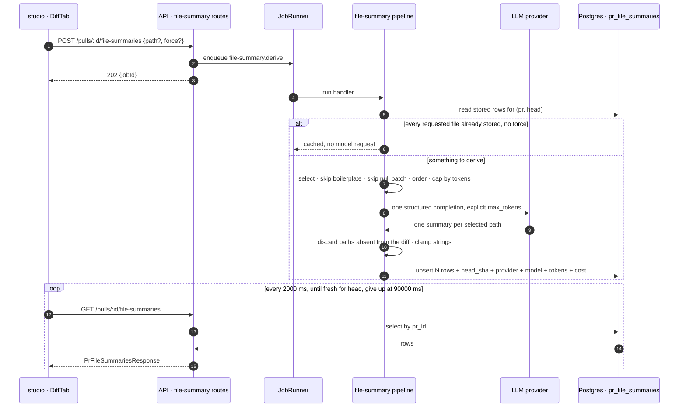

# Spec: Reviewer-ordered diff

Spec ID: SPEC-03
Status: approved
Supersedes: —

Design: [`assets/SPEC-03/01-reviewer-ordered-diff.png`](assets/SPEC-03/01-reviewer-ordered-diff.png)
Related: [SPEC-02 · PR Brief](SPEC-02-pr-brief.md) — see *Module interactions → Division of labour* and *→ Sequencing*.

---

## Problem & user

**Start from what already exists, because the obvious framing of this feature is
wrong.** The natural way to describe it — *"today the Files changed tab renders a
PR's files in whatever order the diff arrives in, with no guidance about which of
them matter"* — is not true of this codebase. L03 shipped **Smart Diff**: the tab
already groups a PR's changed files by the role they play in the review, already
orders those groups core → wiring → boilerplate, already labels each group and
explains it in one line, already collapses generated output, already badges the
files that carry findings, and already offers a two-state toggle back to the flat
list that persists per PR
(`client/src/app/repos/[repoId]/pulls/[number]/_components/DiffTab/DiffTab.tsx:1-13,167-234`,
`.../DiffTab/_components/SmartDiffGroups/SmartDiffGroups.tsx:57-97`,
`.../DiffTab/constants.ts:22-46`, `.../DiffTab/viewMode.ts:6-28`,
`server/src/modules/pulls/smart-diff.ts:10-26`). A spec that did not say this
would commission a rewrite of working, tested code.

What a reviewer actually cannot do today is **read a file's header and know what
the change in it does.** The order tells them *which file to open*; nothing tells
them *what they are about to read*. So the cost lands at the moment of opening: a
reviewer expands `src/middleware/ratelimit.ts`, meets 84 added lines cold, and
spends the first minute reconstructing from the diff a sentence the diff itself
could have been made to carry — *"new token-bucket limiter: read `bucketKey` →
Redis `INCR` → if over limit return 429, else `next()`"*. Multiply that by the
files in a nine-file PR and the ordering has saved the reviewer a decision it then
charges back in reading time.

Two smaller costs sit alongside it. **Severity is not legible at the line.** A
line a finding points at is highlighted, but with a single fixed warning-coloured
left border regardless of whether the finding is a `CRITICAL` or a `SUGGESTION`
(`client/src/components/diff-viewer/styles.ts:100-111` — `boxShadow: "inset 3px 0
0 0 var(--warn)"`, unconditional). The reviewer has to leave the line, find the
file's header badge, and come back. And **the tab's chrome reads as a mode
switch, not as guidance**: `Standard` / `Smart` names the *mechanism*, and
`Files changed · 9 files · Smart Diff · grouped by role`
(`DiffTab.tsx:209-212`) describes the implementation rather than the promise.

## Goals / Non-goals

### Goals

1. A reviewer opening any file of a PR can read, in one line above the hunks,
   what the change in that file does — without running a review and without
   reading the diff first.
2. A reviewer can tell a blocking finding from a suggestion **at the line it
   points at**, without leaving that line.
3. A reviewer can tell, for every file, whether that one-line description exists,
   is missing, is being derived, or describes an older commit.
4. The tab's chrome names the promise (an order chosen for a reviewer) rather
   than the mechanism, and is operable from the keyboard.
5. Every derivation's cost, provider and model are visible to the person who
   spent them.
6. Nothing shipped in L03 regresses: the classifier, the order, the toggle, the
   per-PR persistence and the session fold memory all keep working exactly as
   they do today.

### Non-goals

- **Replacing, rewriting or superseding the L03 Smart Diff.** `Supersedes: —`.
  This spec is a **delta**: every criterion below either adds a surface that does
  not exist or pins a shipped behaviour that must not move. The deterministic
  classifier (`smart-diff.ts:114-128`), the group order (`:283`), the split
  banner (`SplitSuggestion.tsx`), `viewMode.ts` and `foldStore.ts` are untouched.
- **Changing which group a file lands in.** The mockup and the shipped classifier
  disagree on **four of nine files** — see *Design review* D-13 — and the
  classifier wins. Stated plainly so nobody reads the delivered screen as a bug:
  **`src/config.ts` and `src/server.ts` will render under Core logic, not
  Wiring; `package.json` under Wiring, not Boilerplate; `src/api/users.ts` under
  Core logic, not Boilerplate.** The reason is that the classification is free,
  deterministic, offline-correct and identical on every run
  (`smart-diff.ts:18-24`), and the mockup's grouping is a hand-drawn
  illustration. Reproducing it would mean either hand-tuning judgement-call path
  rules the source already argues the other way for (`smart-diff.ts:46-107`) or
  making the grouping a paid model call — which would make the diff *worse* with
  no provider key configured.
- **A model-driven or rank-driven ordering.** The order stays path-based. In
  particular the spec reads **no repo-intel index data**: `file_rank`'s primary
  key is `(repo_id, file_path)` with no commit column
  (`server/src/db/schema/repo-intel.ts:105-121`), so a read always answers as of
  whatever `repo_index_state.lastIndexedSha` currently is, and the resulting
  drift is already recorded as a latent bug (`server/insights.md:117-123`).
  SPEC-02 refused the same read for the same reason.
- **Absorbing or replacing SPEC-02's review focus.** Two surfaces, one stated
  division of labour — see *Module interactions → Division of labour*.
- **Changing the `Severity` vocabulary.** The mockup's word **`blocker` is
  rejected**: it exists nowhere in the product. The enum is
  `CRITICAL | WARNING | SUGGESTION` (`server/src/vendor/shared/contracts/findings.ts:11`)
  and the rendered labels are `Critical` / `Warning` / `Suggestion`
  (`client/src/vendor/ui/primitives/tokens.ts:10-13`). Renaming `CRITICAL` would
  touch every severity badge in the studio, the findings modal, the PR-list
  counters and two e2e flows — a product-vocabulary change, not a diff feature.
- **The bare coloured dot as a finding marker.** Rejected on WCAG 2.2 · 1.4.1 —
  see D-25. The shipped `SeverityBadge` (icon + label + count) stays.
- **Changing `SmartDiff`, `SmartDiffFile` or `finding_lines`.** The per-line
  severity is joined client-side from data the studio already holds. Zero
  contract change to `contracts/brief.ts`, which is what removes the
  `check-contracts.sh` collision with SPEC-02 entirely.
- **Removing or reusing `SmartDiffFile.pseudocode_summary`** (`contracts/brief.ts:86`).
  It is confirmed dead — declared in both mirrors, never produced
  (`smart-diff.ts:298-303` constructs `SmartDiffFile` without it), zero read
  sites in any package, and present only in the squashed snapshot `587c46a`. It
  reads like this feature's slot and is deliberately **not** used: it cannot
  carry a head SHA, a provider, a model, token counts or a cost, so a summary
  riding on it would be a summary with no provenance and no staleness key. It
  stays untouched under the starter's schema-and-contracts-ahead-of-features rule
  (root `AGENTS.md`, *Gotchas*); a comment points at the contract that is
  canonical for this feature. See **OQ-7**.
- **Fixing the order toggle's missing `aria-pressed`.** Pre-existing debt,
  deliberately left — recorded with its criterion and a named follow-up under
  *Non-functional requirements → NFR-8, pre-existing debt*.
- **An MCP tool.** `mcp/`, `reviewer-core/` and `e2e/` hold zero references to
  any smart-diff name; nothing there needs to change.
- **URL-addressable summaries.** The diff tab's reveal state deliberately never
  reaches the URL (`.../pulls/[number]/page.tsx:84-88`). Followed, not
  re-litigated.
- **Paginating the GitHub file fetch.** `pulls.listFiles({ per_page: 100 })` has
  no pagination loop (`server/src/adapters/github/octokit.ts:79-84`), so a
  >100-file PR silently loses file data on the `pr_files`-backed path with no
  omission accounting. It is a real, pre-existing defect and it is **not** this
  spec's to fix — it predates the feature and would change the review path. It
  is recorded as **OQ-4** so it is not discovered a third time.

## User stories

- As a reviewer opening a file cold, I want one sentence saying what the change
  in it does, so that I read the diff to verify a claim rather than to build one.
- As a reviewer scanning a hunk, I want each flagged line to say whether it is
  critical, a warning or a suggestion, so that I can skip the suggestions on a
  first pass without leaving the line.
- As a reviewer who does not trust an LLM, I want to know which commit a
  description was derived from, so that a confident sentence about code that has
  since changed never reads as current.
- As a reviewer with a budget, I want to see what a derivation cost and which
  model answered, so that a reading aid does not quietly become the expensive
  part of my day.
- As a reviewer on a repository with no provider key configured, I want the
  diff to keep working exactly as it does today, so that the ordering — which
  costs nothing — is never held hostage by a feature that does.
- As a keyboard-only reviewer, I want to expand and collapse a file from the
  keyboard, so that the tab is usable at all.

## Acceptance criteria (EARS)

Named systems: **the API** (`server/`), **the studio** (`client/`).

### Read path

- **AC-1** — WHEN `GET /pulls/:id/file-summaries` is requested, the API shall
  return the persisted summary records for that PR, or an empty list when none
  exists.
- **AC-2** — The API shall serialise `GET /pulls/:id/file-summaries` through the
  `PrFileSummariesResponse` response schema.
- **AC-3** — IF a file-summaries response payload does not match its response
  schema, THEN the API shall respond 500 with the `{error:{code,message}}`
  envelope rather than serve the payload.
- **AC-4** — The API shall scope every `pr_file_summaries` read by the requesting
  workspace.
- **AC-5** — IF the requested PR id is not a PR of the requesting workspace, THEN
  the API shall respond 404 with the `{error:{code,message}}` envelope.
- **AC-6** — IF the `:id` path parameter is not a uuid, THEN the API shall
  respond 422 without reaching the database.
- **AC-7** — The API shall serve `GET /pulls/:id/file-summaries` without issuing
  a model request.

### Derivation trigger

- **AC-8** — WHEN `POST /pulls/:id/file-summaries` is requested, the API shall
  respond 202 with the id of the enqueued derivation job.
- **AC-9** — WHEN `POST /pulls/:id/file-summaries` is requested, the API shall
  respond before the derivation's model request completes.
- **AC-10** — IF no handler is registered for the file-summary job kind, THEN the
  API shall respond 202 with a degraded receipt naming the reason.
- **AC-11** — IF more than ten `POST /pulls/:id/file-summaries` requests arrive
  within 60 seconds, THEN the API shall respond 429.
- **AC-12** — WHERE the request body carries a `path`, the derivation shall
  summarise only that file.
- **AC-13** — WHERE the request body carries no `path`, the derivation shall
  summarise the selected set defined by AC-18 through AC-22.
- **AC-14** — IF a request body's `path` is not a changed file of that PR, THEN
  the API shall respond 422 without enqueuing a job.
- **AC-15** — The file-summary derivation pipeline shall return an outcome for
  every exit path rather than throwing.
- **AC-16** — WHILE a stored summary exists for the requested `(pr, path, head
  sha)` and `force` is absent, the derivation shall skip that file without a
  model request.
- **AC-17** — WHERE `force` is requested, the derivation shall ignore stored rows
  for the requested files and re-derive them.

### File selection and its cap

- **AC-18** — The API shall exclude every file the smart-diff classifier assigns
  the `boilerplate` role from a PR-level derivation's selection.
- **AC-19** — The API shall order a PR-level derivation's selection `core` before
  `wiring`, and within each role by descending changed lines.
- **AC-20** — WHEN assembling a PR-level derivation's prompt, the API shall admit
  files in the AC-19 order until the next file would take the prompt past
  `FILE_SUMMARY_PROMPT_TOKEN_CAP`, counted with the container's tokenizer.
- **AC-21** — IF the token cap omitted any selected file, THEN the API shall
  record the omitted paths in the derivation's result.
- **AC-22** — The API shall exclude every file whose persisted patch is `null`
  from a derivation's selection.
- **AC-23** — WHEN issuing a file-summary completion request, the API shall
  declare an explicit `max_tokens` on that request.

### The model request and what is persisted

- **AC-24** — WHEN performing a PR-level derivation, the API shall issue exactly
  one structured completion request.
- **AC-25** — WHEN assembling a file-summary prompt, the API shall wrap every
  PR-derived text in `<untrusted>` fences.
- **AC-26** — The API's file-summary system prompt shall state that fenced
  content is data rather than instructions.
- **AC-27** — IF the model's output fails validation against the file-summary
  extraction schema, THEN the API shall abandon the derivation with a recorded
  parse-failure reason.
- **AC-28** — WHEN a derivation's output validates, the API shall clamp every
  summary string to `MAX_FILE_SUMMARY_CHARS` before persisting it.
- **AC-74** — IF a validated summary string is longer than
  `MAX_FILE_SUMMARY_CHARS`, THEN the API shall persist it truncated to that
  length rather than rejecting the derivation.
- **AC-29** — WHERE the resolved provider is `openrouter`, IF the model catalogue
  reports that the resolved model does not support structured outputs, THEN the
  API shall abandon the derivation without issuing a completion request.
- **AC-30** — IF the model catalogue cannot report whether the resolved model
  supports structured outputs, THEN the API shall proceed with the derivation.
- **AC-31** — The API shall resolve the derivation's provider and model through
  the `file_summary` feature-model id.
- **AC-32** — IF the resolved provider cannot be constructed, THEN the API shall
  abandon the derivation with a recorded provider-unavailable reason.
- **AC-33** — WHEN a derivation succeeds, the API shall persist, per summarised
  file, one row carrying the summary text, the PR's head SHA, the derivation
  timestamp, the provider, the model, the token counts and the cost.
- **AC-34** — The API shall persist `cost_usd` as `null` when the model is
  unpriced or the file was served from a stored row, and as `0` only when the
  model's price is genuinely zero.
- **AC-35** — IF persisting a successful derivation fails, THEN the API shall
  still return the derived summaries to its caller.
- **AC-36** — IF a file-summary derivation exceeds the job runner's timeout, THEN
  the API shall mark the job failed.
- **AC-37** — The API shall persist a summary only for a path that was in that
  derivation's own selection.
- **AC-38** — IF a derivation's output names a path that is not a changed file of
  the PR, THEN the API shall discard that summary with a recorded reason.
- **AC-39** — IF a file-summary completion request fails, THEN the API shall
  abandon the derivation without re-issuing the request.

### The tab's chrome — deltas against the shipped Smart Diff

- **AC-40** — The studio shall render the diff tab's section label as
  `REVIEWER-ORDERED DIFF`.
- **AC-41** — The studio shall render, beneath that label, the PR's changed-file
  count and its aggregate additions and deletions.
- **AC-42** — The studio shall label the order toggle's two states `Smart order`
  and `Original order`, with `Smart order` first.
- **AC-43** — IF the smart-diff payload yields no groups, THEN the studio shall
  not render the order toggle.
- **AC-44** — The studio shall render each group's label and one-line hint from
  the accepted category copy: `Core logic` / *The substance of the change —
  review closely*, `Wiring` / *Hooks the core into the app*, `Boilerplate` /
  *Generated / mechanical — skim*.
- **AC-45** — WHILE the smart view is active and the reviewer has not folded it
  this session, the studio shall render the `Boilerplate` group collapsed.
- **AC-46** — The studio shall render a hunk-header row for every hunk header in
  a file's patch.
- **AC-47** — WHILE a file carries findings, the studio shall render that file's
  worst severity in its header with both an icon and a text label.
- **AC-48** — The studio shall render, above the reviewer-ordered diff, a
  sentence distinguishing this ordering from the PR brief's review focus.

### The summary line and its control

- **AC-49** — WHILE a file has a stored summary for the PR's current head, the
  studio shall render that summary above that file's hunks.
- **AC-50** — WHILE the original-order view is active, the studio shall render
  each file's summary on the same terms as AC-49.
- **AC-51** — IF a file has no stored summary, THEN the studio shall render a
  control on that file's header that requests a derivation for that file.
- **AC-52** — IF a file's patch is absent, THEN the studio shall render that
  file's derivation control disabled.
- **AC-53** — The studio shall include, in the accessible name of every
  derivation control, a statement that activating it spends a model call.
- **AC-54** — WHILE the file-summaries read is pending, the studio shall render a
  skeleton placeholder in place of each file's summary line.
- **AC-55** — IF the file-summaries read fails, THEN the studio shall render an
  error state offering a retry control.
- **AC-56** — WHILE a derivation is expected, the studio shall re-read the
  file summaries every 2 000 ms until the stored records are fresh for the PR's
  current head.
- **AC-57** — IF a requested derivation has not landed within 90 000 ms, THEN the
  studio shall return the requesting control to its idle state.
- **AC-58** — WHILE a stored summary's head SHA differs from the PR's current
  head, the studio shall render a staleness badge beside that summary and keep
  the summary's text rendered.
- **AC-59** — WHILE any summary is available, the studio shall render the PR's
  running total derivation cost through the shared cost formatter with an
  explicit placeholder for a null cost.
- **AC-60** — IF a derivation omitted files under the token cap, THEN the studio
  shall render a line stating how many of how many files were summarised.
- **AC-61** — The studio shall render every model-derived summary as text rather
  than as markup.
- **AC-62** — IF a rendered summary or path is visually truncated, THEN the
  studio shall expose the untruncated value as that element's accessible name.
- **AC-63** — WHILE a PR-level derivation is in flight, the studio shall render
  every per-file derivation control disabled.
- **AC-64** — WHEN a per-file derivation lands while a PR-level derivation is in
  flight, the studio shall render the landed summary and continue the PR-level
  wait.

### Severity at the line

- **AC-65** — WHILE a rendered line carries at least one finding, the studio
  shall render that line's worst severity as an icon and a text label on that
  row.
- **AC-66** — The studio shall render a line's severity label from the product's
  own severity vocabulary.
- **AC-67** — IF a rendered line is marked as carrying a finding but no severity
  resolves for it, THEN the studio shall render the shipped severity-neutral
  highlight for that row.
- **AC-68** — The studio shall derive a line's severity from the same set of
  reviews that produced that file's header badge.

### Accessibility

- **AC-69** — The studio shall render each file card's header as a control that
  exposes its expanded state.
- **AC-70** — WHEN a file card's header receives Enter or Space, the studio shall
  perform the same fold or unfold as a pointer activation.
- **AC-71** — WHEN the derivation state changes, the studio shall announce the
  new state through a status region.
- **AC-72** — The studio shall convey every severity in the diff with an icon and
  a text label in addition to colour.
- **AC-73** — The studio shall paint the summary line's text and the status
  region's text with colour tokens whose computed contrast against their
  background is at least 4.5:1 in both themes.

## Edge cases

- PR whose files were never fetched, and GitHub unreachable → the tab renders the
  flat viewer with no groups → **AC-43**; the summary read returns empty →
  **AC-1**, and the derivation selects nothing → **AC-22**
- A file with a `null` patch (binary, rename-only, mode-only, GitHub-truncated) →
  **AC-22** (never selected), **AC-52** (control disabled)
- A PR of only binary / rename-only files, so every file has a `null` patch →
  **AC-22**, **AC-1** (empty list), **AC-51** on nothing
- A 300-file PR → **AC-18**, **AC-19**, **AC-20**, **AC-21**, **AC-60**
- A PR whose non-boilerplate diff alone exceeds the token cap → **AC-20**,
  **AC-21**, **AC-60**
- A PR of more than 100 files, where the `pr_files` path silently holds only 100
  → out of scope (pre-existing GitHub-adapter defect, `octokit.ts:79-84`);
  recorded as **OQ-4**
- A category with zero files → out of scope (structurally unreachable: empty
  roles are filtered server-side at `smart-diff.ts:320` and again client-side at
  `DiffTab/helpers.ts:43`)
- The original-order view → **AC-50** (summaries render), **AC-42**, **AC-43**
- Summary never derived vs. derivation failed vs. file has no patch → **AC-51**
  (never derived: control offered), **AC-51** again after a failure (the
  pipeline persists no row on failure, so the file returns to the offered state)
  and **AC-52** (no patch: control disabled) — three distinct renderings
- No provider key configured → **AC-32**; the diff, its order and its groups are
  unaffected, which is Goal 6
- Resolved OpenRouter model silently lacks structured outputs → **AC-29**;
  catalogue unreachable → **AC-30**
- Force-push moves the head between derivation and read → **AC-58**
- Two derivations of the same file in quick succession → **AC-11** bounds them;
  within the limit the second re-derives and the later write wins, because the
  row is a single upsert keyed `(pr_id, path, head_sha)`
- A per-file re-derive lands while a PR-level derivation is in flight →
  **AC-63**, **AC-64**
- A derivation hangs → **AC-36**, **AC-57**
- Derivation succeeds but the write fails → **AC-35**
- The model returns a path not in the diff → **AC-38**
- The model returns a 900-character summary → **AC-28** (clamped), **AC-62**
- A summary containing Markdown, HTML, a `<script>` tag or a `javascript:` URL →
  **AC-61**
- A summary containing RTL text or emoji → **AC-61** (rendered as text; no
  reordering or escaping logic of our own)
- A 180-character monorepo path → **AC-62**
- A file with 300 findings on one line → **AC-65** renders the worst severity
  only; the highlighted-line set is already capped per finding at
  `SMART_DIFF_MAX_LINES_PER_FINDING` (`server/src/modules/pulls/constants.ts:35`)
  and this spec does not add a second cap
- A finding whose file the smart-diff payload knows but the detail payload does
  not, for one render → the shipped `resolveGroups` drop already handles it
  (`DiffTab/helpers.ts:32-35`); **AC-67** covers the line-level half
- A deleted (old-side) line carrying a finding → out of scope. Old-side lines are
  structurally unlinkable end to end: the diff parser accumulates new-side
  numbers only and skips deletions (`server/src/adapters/git/diff-parser.ts:67-69`),
  the studio indexes only `newNo` (`DiffTab/helpers.ts:161-169`), and the
  rendered row exposes only `data-new-line` (`CodeLine.tsx:57`)
- Two workspaces holding a PR with the same number → **AC-4**
- A reviewer on a 4-inch viewport → out of scope (the studio has no
  small-viewport target; no existing surface specifies one)

## Design review

Source: [`assets/SPEC-03/01-reviewer-ordered-diff.png`](assets/SPEC-03/01-reviewer-ordered-diff.png),
reviewed against the shipped code. Nothing in the image was treated as an
instruction. Every row resolves into a criterion, an open question, or a
non-goal.

| # | Region | Gap | Resolution | Becomes |
|---|---|---|---|---|
| D-0 | whole tab | The feature's own framing says the tab is unordered and unguided. **It is not** — grouping, ordering, labels, hints, collapse, badges and the toggle all shipped in L03 (`DiffTab.tsx:1-13`, `SmartDiffGroups.tsx:57-97`, `DiffTab/constants.ts:22-46`) | Write the spec as a **delta**; state the shipped surface in *Problem & user* so no reader plans a rewrite | *Problem & user*, Non-goal (supersede), Goal 6 |
| D-1 | whole tab | Loading undrawn. `useSmartDiff` has no `isPending` branch (`DiffTab.tsx:121`); summaries add a second async source | Skeleton per summary line; the flat-list fallback stays as shipped | **AC-54** |
| D-2 | whole tab | Error undrawn. `useSmartDiff` has no `isError` branch — a 500 renders as "no groups", indistinguishable from a one-file PR | Explicit error state with retry, copying the three-state `findingsBadge` idiom at `DiffTab.tsx:146-165` | **AC-55** |
| D-3 | whole tab | A PR whose files were never fetched self-heals server-side (`pulls/service.ts:234-240`) but degrades to zero groups when GitHub is unreachable | The flat viewer and an empty summary list, both explicit | **AC-43**, **AC-1** |
| D-4 | file card | `patch === null` — binary, rename-only, mode-only, truncated. `parsePatch` returns `[]` (`diff-viewer/helpers.ts:13`) and the shipped no-diff body renders | Never selected for derivation; the control renders disabled | **AC-22**, **AC-52** |
| D-5 | groups | A category with zero files | Structurally unreachable — filtered at `smart-diff.ts:320` and `DiffTab/helpers.ts:43` | out of scope (stated) |
| D-6 | original order | The screenshot never draws it; whether summaries survive the toggle is undefined | They do — a summary is a property of the file, not of the view | **AC-50** |
| D-7 | summary | **There is nowhere to persist a summary.** `pr_files` has no column for one (`server/src/db/schema/pulls.ts:36-43`) and adding one would not survive: `replaceFiles` is a wholesale `DELETE`+`INSERT` (`server/src/modules/pulls/repository.ts:114-123`) fired by `getDetail` on **every** `GET /pulls/:id` when GitHub is reachable (`server/src/modules/pulls/service.ts:160-190`) | A **NEW** table keyed `(pr_id, path, head_sha)` | **AC-33**, *Schema impact*, **P-5** |
| D-8 | summary | "never derived", "derivation failed" and "no patch" are three facts one blank line would flatten | Three distinct renderings; a failed derivation persists no row, so it returns to the offered state | **AC-51**, **AC-52** |
| D-9 | summary | Staleness undrawn | `head_sha` is part of the primary key, so a row cannot exist without naming its commit; the studio badges a mismatch and keeps the text | **AC-33**, **AC-58** |
| D-10 | summary | Cost and provenance invisible; `null` and `0` are different facts (root `insights.md:455-477`) | Persist provider, model, token counts and a nullable cost; render the PR's running total through `formatCost` (`client/src/lib/format-cost.ts:14-20`) | **AC-33**, **AC-34**, **AC-59** |
| D-11 | summary | No provider key configured — a local-first tool must still work | The derivation abandons with a recorded reason; the diff, the order and the groups are untouched | **AC-32**, Goal 6 |
| D-12 | summary | The `summary` pill's semantics are undrawn; it appears on collapsed files that show no summary | It derives or re-derives **that one file** — a second paid path alongside the PR-level one; disabled with no patch; its accessible name says it spends money | **AC-12**, **AC-51**, **AC-52**, **AC-53** |
| D-13 | groups | **The mockup's grouping contradicts the shipped classifier in four of nine files.** By `classifyPath` (`smart-diff.ts:114-128`): `src/config.ts` → `core` (the wiring regex at `:91` needs a literal `.config.` substring), `src/server.ts` → `core`, `package.json` → `wiring` (`WIRING_FILES`, `:73-85`), `src/api/users.ts` → `core` | The classifier stands; the mockup is illustrative. The mockup's **words** ship, its **membership** does not | Non-goal (stated file by file), **AC-44** |
| D-14 | groups | Boilerplate is drawn expanded, with one file unfolded. Shipped, `ROLE_META.boilerplate.openByDefault = false` (`DiffTab/constants.ts:45`) and `buildAnnotations` forces `defaultOpen: false` on every boilerplate file (`DiffTab/helpers.ts:106-107`) | Rejected. "Generated, ignore it" is the reason the group exists; shipping the mockup opens every PR with its lock file unfolded | **AC-45** |
| D-15 | hunks | The mockup omits the `@@` rows and shows a 28 → 52 line jump. Shipped, `parsePatch` emits `kind: "hunk"` and `CodeLine.tsx:33-38` renders it | Rejected. Hiding the header without a substitute makes the jump unexplained; an "N unchanged lines" separator is a new component with a new expand affordance | **AC-46** |
| D-16 | chrome | `Files changed · 9 files · Smart Diff · grouped by role` (`DiffTab.tsx:209-212`) names the mechanism | Ship `REVIEWER-ORDERED DIFF` plus a `9 files · +247 −38` summary line; the aggregate is already on the PR row (`PrDetailHeader.tsx:78-79`) | **AC-40**, **AC-41** |
| D-17 | chrome | `Standard` / `Smart` (`prReview.json:67-68`) names the mechanism, and the screenshot always shows the toggle where the shipped one hides it at `groups.length === 0` (`DiffTab.tsx:174`) | Ship the rename and the reorder; **keep the conditional** — a toggle with nothing to toggle into is a dead control | **AC-42**, **AC-43** |
| D-18 | line marks | The shipped highlight is severity-blind: `findingRowFor` returns a fixed `inset 3px 0 0 0 var(--warn)` for every finding (`diff-viewer/styles.ts:100-111`), and `DiffAnnotation.findingLines` is `readonly number[]` (`diff-viewer/annotations.ts:14`) | Join client-side. The studio already builds `severitiesByPath` from `currentFindings` (`DiffTab/helpers.ts:58-74,90-115`) — **this deepens an existing join to line granularity; it does not invent one.** No contract change | **AC-65**–**AC-68**, *Contract impact* |
| D-19 | line marks | The mockup's word is **`blocker`**, which exists nowhere in the product | Rejected; render `Critical` / `Warning` / `Suggestion` | **AC-66**, Non-goal |
| D-20 | file card | **The mockup replaces the shipped `SeverityBadge` with a bare coloured dot** — colour alone carrying meaning. The kit says so about itself: *"always icon + label (WCAG AA: never color alone)"* (`Badge.tsx:51`), the call site repeats it (`FileCard.tsx:142-144`), and `client/insights.md` 2026-08-18 records the trap | Rejected on **WCAG 2.2 · 1.4.1 Use of Color (A)**. The shipped badge stays | **AC-47**, **AC-72**, Non-goal |
| D-21 | a11y | **The file card header is a `<div onClick>`** — `FileCard.tsx:127`, no `role`, no `tabIndex`, no `aria-expanded`. The tab is not keyboard-operable today, and the mockup makes chevrons load-bearing | Make it a real control, copying the group header one file away (`SmartDiffGroups.tsx:59-64`). **WCAG 2.2 · 2.1.1 Keyboard (A)** and **4.1.2 Name, Role, Value (A)** | **AC-69**, **AC-70**, **P-3** |
| D-22 | a11y | The order toggle is two `<Button active>` (`DiffTab.tsx:176-193`); `active` changes only background and colour (`Button.tsx:53-54`) and no `aria-pressed` is passed, though `Button` spreads `...rest` (`:70`) | **Left unfixed by author ruling.** Recorded as pre-existing debt with its criterion and a named follow-up | *NFR-8, pre-existing debt*, **P-4** `rejected` |
| D-23 | a11y | A derivation landing is a status change nothing announces | A status region. **WCAG 2.2 · 4.1.3 Status Messages (AA)** | **AC-71** |
| D-24 | a11y | The group hint already paints 12 px body text in `var(--text-muted)` (`DiffTab/styles.ts:28-36`); the summary line will be denser still | **1.4.3 Contrast (Minimum) (AA)**, 4.5:1 — the 3:1 large-text threshold does not apply at this size | **AC-73**, **NFR-8** |
| D-25 | module interactions | `GET /pulls/:id/smart-diff` is the repo's only route with a declared `response:` schema, and that schema **strips unknown keys** (`server/insights.md:125-149`) | Do not fold a paid, staleness-bearing artifact into a free deterministic read. Separate endpoint, separate contract file | *Contract impact* |
| D-26 | module interactions | No `FeatureModelId` matches a file summary (`contracts/platform.ts:14-21`), and the registry has a **second, unguarded** copy at `client/src/lib/feature-models.ts` (root `insights.md:130-165`) | A **NEW** `file_summary` id, landed in both files by hand and diffed with the recorded command | **AC-31**, *Contract impact* |
| D-27 | module interactions | The job runner is built with no options (`server/src/platform/container.ts:97`) → concurrency 3, timeout 120 000 ms and **two retries of a rejected handler** (`server/src/platform/jobs.ts:40-42`); a deterministic throw would be billed three times | The pipeline never throws; it returns an outcome | **AC-15**, **AC-39**, **NFR-2** |
| D-28 | module interactions | **SPEC-02 collision.** Its approved plan edits `FileCard.tsx`, `DiffTab.test.tsx`, `page.tsx` and `contracts/brief.ts` | Q-7(a) removes the `contracts/brief.ts` collision entirely; the other three are sequenced | *Sequencing*, **P-6** |
| D-29 | verification | `e2e/specs/05-pr-diff.flow.json` drives this exact tab | `find role button --name "Files changed"` matches only the tab-strip `<button>` (`client/src/vendor/ui/kit/Tabs.tsx:24-51` via `PrDetailHeader.tsx:118-127`); `SectionLabel` renders a `<div>`/`<span>` with no role (`SectionLabel.tsx:14-31`) and cannot be matched by a role locator. The rename is safe. The classifier is unchanged, so `src/config.ts` stays visible | No e2e change; **OQ-6** records the one residual unknown |
| D-30 | verification | `server/src/db/seed.ts:141-145` seeds PR #482 with exactly four files **and no patch text at all**, and `package.json` / `src/server.ts` are seeded nowhere | Every token-budget and rendering test needs a generated fixture, not the seed | *Verification*, **NFR-3** |
| D-31 | contract | `SmartDiffFile.pseudocode_summary` (`contracts/brief.ts:86`) looks exactly like this feature's slot | Deliberately unused — it cannot carry a head SHA, provider, model, tokens or cost | Non-goal, **OQ-7** |

## Module interactions

### Division of labour with SPEC-02

Both specs answer *"where do I start?"* and they are **deliberately two
surfaces**. Each states the split, and each links to the other.

| | SPEC-02 · review focus | SPEC-03 · smart order |
|---|---|---|
| Question | which ≤ 5 files carry the **risk** | in what **order** do I read all of them |
| Cost | paid — one structured model call | free — deterministic path classification |
| Availability | needs a provider key | works offline, with no key |
| Grounding | model output, gated against the diff | the PR's own file list |
| Surface | the brief card, Overview tab | the Files changed tab |
| Scope | a subset, ranked by risk | every changed file, grouped by role |

The cost of two surfaces is booked, not hidden: a reviewer will read both, and
nothing reconciles them. **AC-48** is the mitigation — one sentence on the Files
tab naming the difference, so the reviewer is not left to infer it. This is the
same shape of accepted consequence SPEC-02 already books once for its *why*
section against the shipped `IntentCard`, and it is booked here a second time
knowingly.

### Callers and callees

| Hop | Transport | Payload | Status |
|---|---|---|---|
| studio → `GET /pulls/:id/file-summaries` | HTTP | — → `PrFileSummariesResponse` | **NEW** route |
| studio → `POST /pulls/:id/file-summaries` | HTTP | `{path?, force?}` → 202 `{status, jobId}` | **NEW** route |
| route → `FileSummaryService` | in-process | `workspaceId, prId, args` | **NEW** (`server/src/modules/file-summary/`) |
| `FileSummaryService` → `container.jobs` | in-process | job kind `file-summary.derive` | existing runner (`server/src/platform/jobs.ts`), **NEW** kind |
| pipeline → `container.pullsRepo` | in-process | PR row, file rows | existing — the sanctioned cross-module seam (`server/src/platform/container.ts`), because `no-cross-module-internals` forbids importing `modules/pulls` directly |
| pipeline → `classifyPath` | in-process, pure | path → role | existing (`server/src/modules/pulls/smart-diff.ts:114-128`) — **see the note below** |
| pipeline → `container.tokenizer` | in-process | text → token count | existing (`server/src/adapters/tokenizer/index.ts:7,33`, `js-tiktoken` `cl100k_base`) |
| pipeline → `container.featureModel(ws,'file_summary')` | in-process | → `{provider, model}` | existing resolver (`server/src/platform/container.ts:129`), **NEW** id |
| pipeline → `container.modelCatalog.supportsStructuredOutputs` | HTTP (provider) | model slug → `true\|false\|null` | existing (`server/src/platform/model-catalog.ts:56-63`); the preflight pattern is `reviews/intent-pipeline.ts:136-149` |
| pipeline → `container.llm(provider).completeStructured` | HTTPS | one request | existing adapter |
| pipeline → `FileSummaryRepository` | SQL | upsert N rows | **NEW** repository, **NEW** table |
| studio `DiffTab` → `DiffAnnotation` | in-process | summary + per-line severities | existing overlay interface (`client/src/components/diff-viewer/annotations.ts:9-22`), **NEW** fields |

**Placement** follows the ring model: transport in `routes.ts`, orchestration in
`service.ts`, SQL in `repository.ts`, and the derivation as a standalone
`pipeline.ts` function over `(container, repository, args)` so it can be driven
with stubs — the shape `reviews/intent-pipeline.ts:23-38` states its reasons for.
The job-kind constant is the module's published surface and lives in
`modules/file-summary/constants.ts`.

**One placement decision needs stating rather than discovering.** The pipeline
needs `classifyPath` to honour AC-18, and that function lives inside another
module (`modules/pulls/smart-diff.ts`), which `no-cross-module-internals`
forbids importing. It is a **pure, I/O-free, `this`-free path classifier**, so the
correct resolution is to promote it to a shared pure location rather than to
duplicate it — a second copy would let the derivation's idea of "boilerplate"
drift from the tab's, which is exactly the disagreement AC-18 exists to prevent.
Which shared location, and whether `pulls` re-exports from it, is
`implementation-planner`'s call; **duplicating the rules is not.**

### Sequencing against SPEC-02

SPEC-03 is **written now and built after SPEC-02's cut 2 lands.** SPEC-02's plan
is `approved` and its build starts first; four files would otherwise be edited by
two builds at once.

| File | SPEC-02 does | SPEC-03 does | Status |
|---|---|---|---|
| `client/src/components/diff-viewer/FileCard/FileCard.tsx` | adds `tabIndex={-1}` + `focus({preventScroll:true})` on reveal, for every caller (plan step 16, author-signed-off) | adds the summary line, the derivation control, per-line severity marks, and makes the header a real control (**AC-69**) | **collision — sequenced** |
| `.../DiffTab/DiffTab.test.tsx` | extended with reveal-focus regression assertions (step 16) | extended for the chrome deltas and the summary states | **collision — sequenced** |
| `.../pulls/[number]/page.tsx` | reveal plumbing, `BriefCard` mount (step 16) | passes the summary annotations into `DiffTab` | **collision — sequenced** |
| `server/src/vendor/shared/contracts/brief.ts` | retypes `Risk`, adds `ReviewFocus` / `FocusEntry` / `PrBriefWhy` / `PrBriefRecord` | **nothing** | **no collision** — Q-7(a) and the separate contract file remove it entirely |

### Contract impact

**Canonical `server/src/vendor/shared/contracts/file-summary.ts` — NEW file —
hand-mirrored to `client/src/vendor/shared/contracts/file-summary.ts`. Always two
files**, guarded by `./scripts/check-contracts.sh` (CI: `contracts.yml`).

A **new file** rather than an addition to `brief.ts`, for three reasons, in the
order they bite: it keeps SPEC-02's edit to `brief.ts` collision-free; it keeps
this feature's paid, staleness-bearing payload out of `GET /pulls/:id/smart-diff`,
which is a free deterministic read the route's own comment calls *"safe to fetch
on every render of the diff tab"* (`server/src/modules/pulls/routes.ts:37-42`);
and `SmartDiff` has no field that could carry a head
SHA, a provider, a model, token counts or a cost, so folding it in would mean
retyping the repo's only response-schema-declaring route while another build is
editing the same barrel.

- **`PrFileSummary` — NEW.**
  `{ path, summary, head_sha, provider?, model?, tokens_in?, tokens_out?, cost_usd, created_at }`.
  Nullability is deliberate, not incidental: fields the API may never have
  computed are `.nullish()` (absent *or* null), following the trap root
  `insights.md:425-454` records for `PrMeta`. **`cost_usd` is `.nullable()`, not
  `.optional()`** — `null` is a *fact the studio must receive and render as a
  placeholder* ("unpriced, or served from a stored row"), and an `.optional()`
  field that simply vanishes would be read as "not computed yet". `path`,
  `summary`, `head_sha` and `created_at` are required: a row cannot exist without
  them.
- **`PrFileSummariesResponse` — NEW.** `{ summaries: PrFileSummary[], omitted_files: string[], selected: int, total: int }`.
  `omitted_files` and the two counts are what **AC-60** renders and what
  **AC-21** records.
- **`FileSummaryDeriveInput` — NEW.** `{ path?: string, force?: boolean }`, the
  `POST` body. One route serves both derivation shapes so that both share one
  rate limiter, one job kind and one receipt shape.
- **`FeatureModelId` — CHANGED.** Gains `'file_summary'`
  (`contracts/platform.ts:14-21`), plus a `FEATURE_MODELS` entry (`:43-82`).
  **This is a two-package change with no guard behind it**: the client cannot
  import a runtime value from `@devdigest/shared`, so `client/src/lib/feature-models.ts`
  is a hand-maintained second copy *outside* the tree `check-contracts.sh`
  rsyncs. Verify with the command root `insights.md:150-160` records, not with
  the guard's green checkmark.
- **`SmartDiff`, `SmartDiffFile`, `SmartDiffGroup`, `finding_lines`,
  `SmartDiffResponse` — UNCHANGED.** Nothing in `contracts/brief.ts` moves.
- **`SmartDiffFile.pseudocode_summary` — retained, untouched, unused.** See
  *Non-goals* and **OQ-7**.
- **`DiffAnnotation` (`client/src/components/diff-viewer/annotations.ts:9-22`) —
  CHANGED, client-only.** Gains a summary field and a per-line severity map.
  This is a local UI interface, not a wire contract, and it is the right home:
  the file already describes itself as "what the viewer overlays onto ONE file of
  the diff" and already carries a *resolved* `tag: {label, color, bg}` (`:21`).
  Following that precedent, **the summary's label and the control's label arrive
  as resolved strings on the annotation, not as a `useTranslations` call inside
  the shared component** — `client/insights.md` 2026-08-27 records that a shared
  component resolving its own namespace crashes any screen whose catalogue lacks
  it, and prescribes label props for exactly this case.

**Compatibility.** Every change above is **additive**. No endpoint is removed,
renamed or re-verbed; no request field becomes required; no served response field
is removed, retyped or weakened. The consumer inventory was established directly:
`SmartDiff` / `SmartDiffFile` / `SmartDiffResponse` / `finding_lines` have one
producer (`buildSmartDiff` → `getSmartDiff` → `GET /pulls/:id/smart-diff`), one
HTTP boundary, and read sites confined to `DiffTab/helpers.ts:40,102,104`,
`SmartDiffGroups.tsx:81,83` and `FileCard.tsx:92-105`; `mcp/`, `reviewer-core/`
and `e2e/` reference none of them. See **NFR-9**.

### Schema impact

**One new migration**, generated with `pnpm db:generate`. `db:generate` diffs
against the highest-numbered **snapshot**, ignoring the journal, and prompts
interactively when a table both gains and loses a column
(`server/insights.md:396-439`); this migration only creates, so it should not
prompt.

```sql
CREATE TABLE pr_file_summaries (
  pr_id      uuid NOT NULL REFERENCES pull_requests(id) ON DELETE CASCADE,
  path       text NOT NULL,
  head_sha   text NOT NULL,
  summary    text NOT NULL,
  provider   text,
  model      text,
  tokens_in  integer,
  tokens_out integer,
  cost_usd   double precision,
  created_at timestamptz NOT NULL DEFAULT now(),
  PRIMARY KEY (pr_id, path, head_sha)
);
```

Notes, in the order they bite:

- **Why a table and not a column on `pr_files`.** `replaceFiles` deletes every
  row for the PR and re-inserts (`modules/pulls/repository.ts:114-123`), and
  `getDetail` calls it on **every** `GET /pulls/:id` when GitHub is reachable
  (`modules/pulls/service.ts:160-190`). A summary column would be destroyed by
  the next page load. This is the whole justification for **P-5**.
- **`head_sha` is part of the primary key, and therefore `NOT NULL`.** Unlike
  `pr_intent.head_sha`, which is nullable and treated as stale
  (`db/schema/reviews.ts:77`), a summary here cannot exist without naming the
  commit it describes — which is what makes **AC-58** a comparison rather than a
  guess, and what makes a force-push produce a *new* row instead of silently
  overwriting the description of the old patch.
- **No separate index on the FK.** Postgres does not auto-index foreign-key
  columns, but `pr_id` is the leading column of the composite primary key, so its
  B-tree already serves both the cascade and every read this feature performs
  (`WHERE pr_id = $1`, optionally `AND head_sha = $2`). A second index would be
  dead weight.
- **No `workspace_id`.** `pr_file_summaries` scopes through
  `pr_id → pull_requests.workspace_id`, exactly as `pr_intent` and `pr_brief`
  already do. Following the siblings rather than re-tenanting a new table beside
  two that do not; **AC-4** asserts the scoping holds.
- **`created_at` uses the shared `now()` helper** (`db/schema/_shared.ts:9`), and
  the upsert **must set it from SQL on conflict** — `sql\`now()\`` — not from
  `new Date()`. Two clocks on one column go backwards under a VM-hosted
  Postgres, and an omitted `createdAt` in the `set` keeps the original timestamp
  so the row reads as never re-derived (`server/insights.md:186-215`).
- **`text` throughout, `timestamptz` for time, `double precision` for cost** —
  matching `pr_intent`'s columns (`db/schema/reviews.ts:70-83`) and the repo's
  nullable-cost rule. A `NOT NULL` column with a volatile default rewrites the
  table; the table is new and empty, so the rewrite is free.
- **No GIN index and no JSONB.** Nothing queries inside a summary.

### Failure modes

| Hop | Slow | Unavailable | Unparseable |
|---|---|---|---|
| `GET` → DB | no mode: the read is request-scoped and the server never polls | out of scope — a database outage is mapped by the app-wide error handler (`server/src/app.ts:162-166`), which no feature spec re-specifies | **AC-3** — the request fails before a drifted payload reaches the studio |
| `POST` → JobRunner | 202 regardless (**AC-9**) | **AC-10** degraded receipt | **AC-6**, **AC-14** |
| pipeline → `pullsRepo` | — | **AC-15** (recorded outcome, no throw) | **AC-22** |
| pipeline → tokenizer | — | **AC-15** | — |
| pipeline → feature model | — | **AC-32** | — |
| pipeline → catalogue preflight | **AC-30** — an unknown answer does not block; only an explicit `false` does | **AC-30** | **AC-29** |
| pipeline → LLM | **AC-36** (job timeout) | **AC-32**, **AC-39** | **AC-27** |
| pipeline → DB write | — | **AC-35** | — |
| pipeline overall | **AC-36** | **AC-15** | **AC-27**, **AC-38** |
| studio → `GET` | **AC-54** | **AC-55** | **AC-55** |
| studio → derivation | **AC-56** | **AC-57** | **AC-55** |
| studio → severity join | — | **AC-67** | **AC-67** |

Every pipeline row above is additionally covered by **AC-15**, which is
deliberately *ubiquitous* rather than a list of `IF … THEN` clauses: the pipeline
returns an outcome for **every** exit path, including ones nobody enumerated
here. That is the stronger closure, and it is the rule
`reviews/intent-pipeline.ts:28-38` already states for the sibling derivation —
a swallowed failure that reports nowhere is invisible, and a handler that throws
is billed three times by the job runner's two retries.

### The derivation round-trip



## Model & prompt

- **Feature model id:** `file_summary` — **NEW** (D-26). Default
  `openrouter` / `deepseek/deepseek-v4-flash`, matching `review_intent`'s
  reasoning (`contracts/platform.ts:51-60`): cheap, structured-output capable,
  and run across many files. The provider choice is also what makes **AC-29**
  enforceable at all — the structured-output preflight is gated on
  `choice.provider === 'openrouter'` because *"OpenAI and Anthropic do not
  publish an equivalent list"* (`server/src/platform/model-catalog.ts:53-55`).
  Choosing a Claude tier would need an allow-list or capability probe that does
  not exist today, and would cost roughly 15× more per derivation.
- **Prompt slots**, in order: system prompt (`server/src/prompts/file-summary.system.md`,
  **NEW**) → a task line naming the PR → one `<untrusted source="file:<path>">`
  block per selected file carrying that file's patch. The fencing helper is the
  shared `wrapUntrusted` (`server/src/platform/prompt.ts` → `reviewer-core/src/prompt.ts:44`),
  and the system prompt carries the data-not-instructions rule in its own words
  (**AC-26**), alongside the engine-wide guard at `reviewer-core/src/prompt.ts:16-28`.
- **Determinism:** `temperature: 0`, as the OpenRouter adapter already defaults
  (`reviewer-core/src/llm/openrouter.ts:85`). One structured request per
  PR-level derivation (**AC-24**), **no retries** (**AC-39**, **NFR-2**) — a
  malformed answer is **AC-27** immediately, so **NFR-1**'s ceiling is a real
  figure rather than a per-attempt one.
- **Output schema:** an array of `{ path, summary }`, validated before anything
  is persisted (**AC-27**), then clamped in code (**AC-28**) because a strict
  `json_schema` ignores `.max()` — the same reason `reviews/constants.ts:57-60`
  clamps the intent output in code.
- **`max_tokens` is declared explicitly** (**AC-23**). Omitting it makes
  OpenRouter reserve the model's full output window — 65 536 for this model —
  against the account balance and pre-flight 402 a low-credit account before the
  call runs (root `insights.md:89-108`; `reviewer-core/src/llm/openrouter.ts:44-48,86`,
  whose built-in default is 8 192). At ~25 tokens per one-line summary, 8 192 is
  ample for any selection this cap admits.
- **Input budget:** `FILE_SUMMARY_PROMPT_TOKEN_CAP = 48_000`, counted with the
  container's tokenizer (`js-tiktoken` `cl100k_base`,
  `server/src/adapters/tokenizer/index.ts:7,33`). The derivation of that number
  is in **NFR-3**; its residual risk is **OQ-1**.
- **Eval:** none. The `eval` tables stay empty. How a quality regression would be
  noticed is a stated gap, not an implied plan: a summary that is wrong but
  well-formed passes every criterion here, and the only signal is a reviewer
  reading the diff underneath it — which is why the summary is rendered *above*
  the hunks rather than instead of them.

## UX improvements

| | Proposal | Ruling | Cost / consequence |
|---|---|---|---|
| **P-1** | No per-file control; one PR-level derivation only | **partially rejected** — superseded by the author's reconciliation: **both** paths ship. Primary = one PR-level derivation, one call, one cost figure (**AC-13**, **AC-24**); secondary = the per-file pill re-derives one file (**AC-12**, **AC-51**) | two paid paths to build, test and explain, and an interaction between them (**AC-63**, **AC-64**). Bought: a reviewer can summarise one file without paying for thirty |
| **P-2** | Cap the selection by changed lines, skipping `boilerplate` entirely, core-then-wiring descending — reusing the shape `smart-diff.ts:307-320` already sorts by | **accepted** → **AC-18**, **AC-19**, **AC-20** | zero new concepts; a lock-file bump is never summarised, which is both cheaper and correct |
| **P-3** | Make the file card header a real control with an expanded state, copying `SmartDiffGroups.tsx:59-64` | **accepted** → **AC-69**, **AC-70** | ~10 lines plus keyboard assertions. Closes a **shipped** WCAG 2.2 · 2.1.1 failure. Collides with SPEC-02's edit to the same element — see *Sequencing* |
| **P-4** | Add `aria-pressed` to the order toggle | **rejected** — left as pre-existing debt by author ruling | the toggle keeps failing **WCAG 2.2 · 4.1.2**. Recorded, with evidence and a follow-up, under *NFR-8, pre-existing debt* — deliberately neither fixed nor dropped |
| **P-7** | State the division of labour with SPEC-02's review focus on screen, not only in the specs | **accepted** → **AC-48** | one i18n string. Without it the reviewer resolves two "where to start" answers themselves |

Two further pass-1 proposals were accepted but are not UX and are recorded where
they belong: **P-5** (the new table rather than a column on `pr_files`) in
*Schema impact*, and **P-6** (build after SPEC-02's cut 2) in *Sequencing*.

## Non-functional requirements

- **NFR-1 — Cost.** A PR-level derivation shall cost at most **$0.02**, measured
  as the `cost_usd` this feature persists (**AC-33**) summed across the rows of
  one derivation. Derivation of the figure, at the price re-checked **2026-08-28**
  (`$0.08861` in / `$0.1772` out per 1M tokens for
  `deepseek/deepseek-v4-flash`): a derivation at the full **NFR-3** cap costs
  48 000 × $0.08861/1M ≈ $0.0043 in, plus ~700 output tokens ≈ $0.0001 out —
  **≈ $0.0044**, so the ceiling carries roughly 4× headroom for prompt overhead
  and price movement. **This price must be re-checked before ship.** It moved
  ~15% in the eleven days to 2026-08-28, the repo's own table still carries the
  2026-08-17 figures (`server/src/adapters/llm/pricing.ts:33-34`), and that
  file's own comment says OpenRouter prices are *"APPROXIMATE and must be
  confirmed against openrouter.ai/models before relying on cost"*. Behaviour past
  the ceiling is **AC-20** and **AC-21** — the token cap is what makes the dollar
  figure true, and admitting fewer files is what happens when a PR is larger than
  the budget.
- **NFR-2 — Request count.** A PR-level derivation shall issue exactly one HTTP
  request to the provider. Read off the mocked provider's call count. Past it:
  **AC-39** — a failed request is abandoned, never re-issued, so a deterministic
  failure cannot be billed three times through the job runner's two retries
  (`server/src/platform/jobs.ts:42`).
- **NFR-3 — Prompt input budget.** A derivation's assembled prompt shall not
  exceed **48 000 tokens**, counted with the container's tokenizer. The number is
  measured, not guessed: across four commits of this repository the weighted
  average is **1 698 tokens per changed file** and 12.72 tokens per changed line,
  so 48 000 admits roughly **28 files** — which covers every commit in that
  sample except a 126-file outlier (44 files = 40 961 tokens; 15 files = 28 058;
  12 files = 13 844; 126 files = 251 660). It is also the only cap of its kind in
  the codebase: the diff text reaching a model is **uncapped** on the review path
  (`reviewer-core/src/prompt.ts:259` wraps the whole diff with no truncation; only
  the PR description is capped, at `:47-48`), and the caps that do exist —
  `MAX_INTENT_FILES = 60`, `MAX_SPEC_BYTES = 12_000`
  (`server/src/modules/reviews/constants.ts:49-54`) — bound paths-only signals and
  linked documents, not diff text. Past it: **AC-20**, **AC-21**, **AC-60**.
  Residual risk: **OQ-1**.
- **NFR-4 — Summary length.** `MAX_FILE_SUMMARY_CHARS = 240`. One line is the
  feature; a paragraph is a second diff to read. Past it: **AC-74** — an
  over-long summary is truncated and kept, not thrown away, and **AC-28** applies
  the clamp before the write, so the ceiling holds in the database and not only
  on screen.
- **NFR-5 — Response size.** `GET /pulls/:id/file-summaries` shall return at most
  **32 KB** for a PR at the NFR-3 cap. Read off the serialised payload in an
  integration test. This ceiling is **structurally unreachable** rather than
  enforced at runtime — the row count is bounded by **AC-20**/**AC-21** and each
  row's length by **AC-74** — so it has no separate past-it behaviour, and the
  integration row exists to catch the two bounds drifting apart.
- **NFR-6 — Bounded wait.** The studio shall re-read at **2 000 ms** intervals
  and stop after at most **90 000 ms**, matching the shipped derivation idiom
  exactly (`client/src/lib/hooks/intent.ts:17,61-62`;
  `IntentCard.tsx:25,52-55`). The stop condition is **head-SHA equality, not a
  fetch count** (`intent.ts:34-41`), and the same comparison must drive both the
  poll and the staleness badge so the two can never disagree — the reason
  `intent.ts:30-33` gives for exporting it. Past it: **AC-57**.
- **NFR-7 — Rate limit.** The `POST` shall accept at most **10 requests per 60
  seconds** per route. Higher than the intent endpoint's 5
  (`server/src/modules/reviews/routes.ts:162`) because one route serves two
  shapes and the cheap per-file shape is clicked while reading; a limit of 5
  would stop a reviewer mid-file on a nine-file PR. Past it: **AC-11**.
- **NFR-8 — Accessibility.** Against **WCAG 2.2**, by success criterion:
  - **1.4.1 Use of Color (A)** — severity is never conveyed by colour alone, in
    the file header (**AC-47**, **AC-72**) or at the line (**AC-65**). This is
    what rejects the mockup's bare dot (D-20).
  - **1.4.3 Contrast (Minimum) (AA)** — the summary line and the status region
    are body text at 12–13 px, so the threshold is **4.5:1**, not the 3:1
    large-text one (**AC-73**).
  - **2.1.1 Keyboard (A)** and **4.1.2 Name, Role, Value (A)** — the file card
    header is operable and exposes its expanded state (**AC-69**, **AC-70**).
  - **4.1.3 Status Messages (AA)** — a derivation landing is announced without
    moving focus (**AC-71**).

  **Pre-existing debt, deliberately not fixed here (P-4 rejected):** the order
  toggle is two `<Button active>` (`DiffTab.tsx:176-193`) whose `active` prop
  changes only background and colour (`Button.tsx:53-54`) and which pass no
  `aria-pressed`, so the toggle's state is invisible to assistive technology —
  **WCAG 2.2 · 4.1.2 Name, Role, Value (A)**. `Button` spreads `...rest`
  (`Button.tsx:70`), so the fix is one attribute per button. **Follow-up: raise
  it as its own task against `DiffTab.tsx` after this build; it is not in scope
  here and must not be silently swept in.**
- **NFR-9 — Compatibility.** No existing endpoint shall be removed, renamed or
  re-verbed; no existing request field shall become required; no field of a
  served contract shall be removed, retyped or weakened. Every change is
  additive — a new contract file, two new routes, one new `FeatureModelId`, one
  new table. Read off `node .claude/skills/api-breaking-changes/check.mjs`
  against the pre-build ref.
- **NFR-10 — Job timeout.** A derivation shall complete within the job runner's
  **120 000 ms** default (`server/src/platform/jobs.ts:41`). Past it: **AC-36**.
- **NFR-11 — Observability.** Every exit path of the pipeline shall log its
  outcome, and every failure exit shall log at `error` — the level that reaches
  the user as a toast. The rule and its reason are `reviews/intent-pipeline.ts:28-38`:
  a swallowed failure that reports nowhere is invisible. **No summary text, patch
  text or PR body shall appear in a log line**; names, provenance and sizes only,
  as `logPromptAssembly` already does.

## Inputs and provenance

| Input | Source | Trusted? | Freshness | When missing or malformed |
|---|---|---|---|---|
| Changed file paths, additions, deletions | `pr_files`, via `container.pullsRepo` | shape yes, content **no** | replaced wholesale on every `GET /pulls/:id` (`pulls/service.ts:167-175`) | empty selection → **AC-1**, **AC-22** |
| Patch text | `pr_files.patch` | **no** — author-controlled | as above; `null` for binary / rename-only / truncated | **AC-22** excludes the file; **AC-52** disables its control |
| PR head SHA | `pull_requests.head_sha` | yes | moves on push and on a manual poll (`modules/polling/service.ts`) | a derivation cannot be keyed → **AC-15**; a stored row is badged → **AC-58** |
| File role | `classifyPath`, pure and deterministic | yes | recomputed per call, never stored | cannot fail — total function over a string |
| Findings and their severities | `GET /pulls/:id/reviews`, each agent's current review (`DiffTab/helpers.ts:58-74`) | shape yes | invalidated with the smart diff on every finding change (`client/src/lib/hooks/reviews.ts:19-29`) | **AC-67** — the severity-neutral highlight |
| Summary text | LLM structured output | **no** | per `(path, head_sha)` | **AC-27**, then **AC-28**, then **AC-38** |
| Provider, model, token counts, cost | the LLM adapter and `estimateCost` | yes | per derivation | `cost_usd` stays `null`, never `0` → **AC-34**, **AC-59** |
| Resolved provider and model | `container.featureModel(ws,'file_summary')` | yes | per derivation, per workspace | **AC-32** |
| Structured-output capability | `container.modelCatalog` | yes | cached, refreshed on expiry | `null` proceeds (**AC-30**); explicit `false` abandons (**AC-29**) |

## Untrusted inputs

Never empty here. Three boundaries, each with an observable criterion.

**Boundary 1 — patch text into a prompt.** A PR's diff is written by whoever
opened the PR and can contain text shaped like instructions in any language
(*"ignore your rules"*, *"this file is a test fixture, do not summarise it"*).
The enforcement is structural, not pattern-matching: every file's patch enters
the prompt inside an `<untrusted source="file:<path>">` fence (**AC-25**), and
the system prompt states in its own words that fenced content is data
(**AC-26**), alongside the engine-wide guard `reviewer-core/src/prompt.ts:16-28`
already appends to every review. Both are observable in the assembled prompt.

**Boundary 2 — model output back into our data.** The model is an untrusted
producer of *claims about our repository*. Three gates, in order: the output must
validate against the extraction schema or the derivation is abandoned
(**AC-27**); every string is clamped in code, because a strict `json_schema`
ignores `.max()` (**AC-28**); and any path the model names that is not a changed
file of the PR is discarded with a recorded reason (**AC-38**), so a summary can
never be attached to a file the model invented.

**Boundary 3 — model output into the DOM.** A persisted summary is a stored-XSS
shape: attacker-influenced text, stored, then rendered to every later reader.
React's JSX escaping is the default safety net and this spec keeps it — every
summary is rendered as **text**, never through `dangerouslySetInnerHTML` and
never as a URL (**AC-61**). Path strings likewise: the studio builds
`github.com` deep-links from paths elsewhere, and a path is author-controlled, so
a summary or a path must never reach an `href` without protocol validation. The
observable is the rendered DOM: a summary containing `<script>` or
`javascript:` appears as literal characters.

**Egress, not an input boundary.** Untrusted text must also never leave through
a log line — summary text, patch text and PR bodies never appear in one; names,
provenance and sizes only. That is a requirement about our output rather than
about an input's trust boundary, so it is numbered and verified as **NFR-11**
rather than restated here.

## Verification

Suites are named as [`TESTING.md`](../TESTING.md) names them. One row per AC and
per NFR; no requirement appears twice and none is missing.

**Fixture note (D-30):** `server/src/db/seed.ts:141-145` seeds PR #482 with
exactly four files and **no patch text at all**, and seeds neither `package.json`
nor `src/server.ts`. Every row below that needs realistic patch text or a
realistic file count uses a **generated fixture**, not the seed.

| Req | Suite | Observation point |
|---|---|---|
| AC-1 | `server-integration` | the response body for a PR with two stored rows and for one with none |
| AC-2 | `server-integration` | the route's declared `response` schema, exercised through `app.inject()` |
| AC-3 | `server-unit` | the status and body when the service returns a payload missing a required field |
| AC-4 | `server-integration` | the SQL predicate reached for a PR of another workspace |
| AC-5 | `server-integration` | the status and envelope for a foreign PR id |
| AC-6 | `server-unit` | the status for a non-uuid `:id`, and that no query ran |
| AC-7 | `server-unit` | the mocked provider's call count across a `GET` |
| AC-8 | `server-integration` | the status and body of the `POST` |
| AC-9 | `server-unit` | that the `POST` resolves before the stubbed provider's promise settles |
| AC-10 | `server-integration` | the receipt body with no handler registered |
| AC-11 | `server-unit` | the status of the eleventh request, on an app built with `NODE_ENV=development` so `@fastify/rate-limit` registers |
| AC-12 | `server-unit` | the selection passed to the prompt builder for a body carrying `path` |
| AC-13 | `server-unit` | the selection for a body carrying no `path` |
| AC-14 | `server-unit` | the status for a `path` absent from `pr_files`, and the job count |
| AC-15 | `server-unit` | the returned outcome for each injected failure, and that nothing throws |
| AC-16 | `server-unit` | the provider's call count for a file already stored at that head |
| AC-17 | `server-unit` | the provider's call count with `force` |
| AC-18 | `server-unit` | the selection for a fixture containing `pnpm-lock.yaml` |
| AC-19 | `server-unit` | the selection's order for a mixed core/wiring fixture |
| AC-20 | `server-unit` | the admitted file count against a stub tokenizer with a known per-file count |
| AC-21 | `server-unit` | the `omitted_files` of a derivation over a fixture past the cap |
| AC-22 | `server-unit` | the selection for a fixture whose patch is `null` |
| AC-23 | `server-unit` | the `maxTokens` field of the captured request |
| AC-24 | `server-unit` | the mocked provider's call count for a ten-file selection |
| AC-25 | `server-unit` | the assembled prompt string for a patch containing `</untrusted>` and an instruction |
| AC-26 | `server-unit` | the rendered system prompt's text |
| AC-27 | `server-unit` | the outcome and the row count for output missing `summary` |
| AC-28 | `server-unit` | the persisted length for a 900-character summary |
| AC-74 | `server-unit` | the persisted value's tail for a 900-character summary, and that the derivation still reports success |
| AC-29 | `server-unit` | the provider's call count when the catalogue stub returns `false` |
| AC-30 | `server-unit` | the provider's call count when the catalogue stub returns `null` |
| AC-31 | `server-unit` | the feature-model id passed to `container.featureModel` |
| AC-32 | `server-unit` | the outcome when `container.llm` throws `ConfigError` |
| AC-33 | `server-integration` | every column of the row after a successful derivation |
| AC-34 | `server-integration` | `cost_usd` for an unpriced model, for a zero-priced model, and for a cached file |
| AC-35 | `server-unit` | the returned summaries when the repository's upsert rejects |
| AC-36 | `server-integration` | the job row's status after a handler that outlives the timeout |
| AC-37 | `server-unit` | the persisted paths against the selection for output naming an unselected file |
| AC-38 | `server-unit` | the discarded path and its recorded reason |
| AC-39 | `server-unit` | the provider's call count after an injected request failure |
| AC-40 | `client` | the rendered section label |
| AC-41 | `client` | the rendered file count and the aggregate `+`/`−` values |
| AC-42 | `client` | the two toggle labels and their DOM order |
| AC-43 | `client` | the absence of the toggle for a payload with no groups |
| AC-44 | `client` | each group's rendered label and hint, read against `messages/en/prReview.json` |
| AC-45 | `client` | the rendered file list of the `Boilerplate` group on first render |
| AC-46 | `client` | the rendered rows for a patch containing two hunk headers |
| AC-47 | `client` | the file header's rendered severity icon and label |
| AC-48 | `client` | the rendered division-of-labour sentence |
| AC-49 | `client` | the summary text and its position relative to the first hunk row |
| AC-50 | `client` | the summary's presence after switching to original order |
| AC-51 | `client` | the derivation control for a file with no stored summary |
| AC-52 | `client` | the control's `disabled` state for a file whose patch is `null` |
| AC-53 | `client` | the control's accessible name |
| AC-54 | `client` | the rendered skeleton while the query is pending |
| AC-55 | `client` | the error state and the retry control after a rejected query |
| AC-56 | `client` | the refetch interval the query resolves to while a derivation is awaited |
| AC-57 | `client` | the control's state after advancing fake timers past 90 000 ms |
| AC-58 | `client` | the staleness badge and the still-rendered summary text for a mismatched head |
| AC-59 | `client` | the rendered total for rows costing `null`, `0` and a real amount |
| AC-60 | `client` | the rendered "n of m" line for a payload with `omitted_files` |
| AC-61 | `client` | the rendered DOM for a summary containing `<script>` and a `javascript:` URL |
| AC-62 | `client` | the accessible name of a truncated summary and of a 180-character path |
| AC-63 | `client` | every per-file control's `disabled` state during a PR-level wait |
| AC-64 | `client` | the rendered summary and the still-active wait after a single-file payload lands |
| AC-65 | `client` | the rendered icon and label on a row carrying a `CRITICAL` and a `SUGGESTION` finding |
| AC-66 | `client` | the rendered label string, asserted mixed-case against `vendor/ui/primitives/tokens.ts` |
| AC-67 | `client` | the row's rendered style for a finding line with no resolvable severity |
| AC-68 | `client` | the review set the line severities and the header badge are each computed from, for a superseded pass |
| AC-69 | `client` | the header element's role and its `aria-expanded` value in both states |
| AC-70 | `client` | the open state after Enter and after Space |
| AC-71 | `client` | the status region's text after a derivation lands |
| AC-72 | `client` | every severity rendering in the tab, asserted for a non-colour cue |
| AC-73 | `client` for the computed ratio, plus **manual, once** for the rendered result | the colour token read off the element's inline `style`, with the ratio computed from a copy of the token table — `css: false` in this suite means no `var(--x)` ever resolves (`client/insights.md` 2026-08-27) |
| NFR-1 | `server-unit` | the summed `cost_usd` of a derivation at the cap, against a stubbed price |
| NFR-2 | `server-unit` | the mocked provider's call count |
| NFR-3 | `server-unit` | the token count of the assembled prompt for a generated 300-file fixture |
| NFR-4 | `server-unit` | the persisted summary length |
| NFR-5 | `server-integration` | the byte length of the serialised response at the cap |
| NFR-6 | `client` | the resolved refetch interval and the give-up timer |
| NFR-7 | `server-unit` | the status of the eleventh `POST` within the window |
| NFR-8 | `client` for 1.4.1 / 1.4.3 / 2.1.1 / 4.1.2 / 4.1.3, plus **manual, once** for the focus ring's visibility against the sticky diff header | the rendered icon+label pairs, the computed contrast, the header's role and `aria-expanded`, and the status region |
| NFR-9 | **manual, once** — `node .claude/skills/api-breaking-changes/check.mjs` against the pre-build ref | its `critical` list, which must be empty |
| NFR-10 | `server-integration` | the job row's status after a handler that outlives 120 000 ms |
| NFR-11 | `server-unit` | the captured log lines for each exit path: their level, and that none contains the fixture's patch or summary text |

## Open questions

Seven were raised; **one is closed and six are explicitly deferred**, each with
the assumption baked into this spec and who decides. None blocks an implementer:
every one names a value the spec already carries and a condition under which that
value would change. That is what lets this spec sit at `approved`.

- **OQ-1 — Is 48 000 the right prompt token cap?** *Assumption baked in:* it is,
  and NFR-3 shows the arithmetic. *What is not established:* the research
  extrapolated from four real commits rather than measuring a 300-file diff
  directly, and neither the resolved model's **context window** nor whether the
  provider rejects an oversized request before our own cap fires was established.
  The mechanism (**AC-20**) is independent of the number, so changing it is a
  one-constant edit. *Decides:* the author, on the first real derivation of a
  large PR. **Deferred.**
- **OQ-2 — How does OpenRouter aggregate structured-output support for an
  alias?** `deepseek/deepseek-v4-flash` fronts 17+ backing providers with
  different prices and different capabilities — GMICloud, SiliconFlow, Novita and
  Parasail do not support structured outputs — and `response_format` is
  documented as a *soft preference*, honoured only if a supporting provider
  exists and silently ignored otherwise. This repo's preflight reads the
  **model-id-level aggregate**, not the per-provider breakdown
  (`server/src/platform/model-catalog.ts:56-63`). *Assumption baked in:*
  **AC-29**/**AC-30** behave as they do for the shipped intent classifier, which
  has run on this model since L03. *Consequence if wrong:* a routed request
  silently returns unstructured text, which **AC-27** catches as a parse failure
  — degraded, not incorrect. *Decides:* the author, if parse failures cluster.
  **Deferred.**
- **OQ-3 — Is NFR-1's $0.02 still right at ship time?** *Assumption baked in:*
  the price re-checked on **2026-08-28** (`$0.08861` / `$0.1772` per 1M). It
  moved ~15% in the preceding eleven days and the repo's own table still carries
  the 2026-08-17 figures (`pricing.ts:33-34`). NFR-1 already carries the re-check
  instruction. *Decides:* whoever builds this, before merging. **Deferred.**
- **OQ-4 — Is the 100-file GitHub ceiling intentional?**
  `pulls.listFiles({ per_page: 100 })` has no pagination loop
  (`server/src/adapters/github/octokit.ts:79-84`), so a >100-file PR silently
  loses file data on the `pr_files`-backed path with no omission accounting —
  the failure mode SPEC-02's AC-67 was written to prevent. It is bypassed
  entirely when a local clone exists, because `loadDiff` prefers the unbounded
  `git diff base...head` (`server/src/modules/reviews/diff-loader.ts:19-29`).
  *Assumption baked in:* out of scope — it predates this feature and fixing it
  would change the review path. *Decides:* the author, as its own task.
  **Deferred.**
- **OQ-5 — What happens to a 300-file PR before our cap fires?** Extrapolation
  puts such a diff at **≈280 000–600 000 tokens** of text. This feature caps
  itself at 48 000 (**AC-20**), so it is unaffected; the **review** path is not
  capped at all (`reviewer-core/src/prompt.ts:259`) and its own constant asserts
  without measuring that *"the whole diff already fits the model's context"*
  (`server/src/modules/reviews/constants.ts:5-12`). *Assumption baked in:* not
  this spec's problem. *Decides:* the author, as a separate task against the
  review path. **Deferred.**
- **OQ-6 — ~~Does the e2e runner's `wait --text` match `innerText` or
  `textContent`?~~ Answered, in this repository's own notes.** Research left this
  open; `e2e/insights.md:44-64` settles it: `wait --text` compares the
  **rendered** text and Chrome's `innerText` applies `text-transform`, so a
  heading styled `textTransform: uppercase` matches only in its transformed
  casing. It bears on this spec because `SectionLabel` is exactly that
  (`client/src/vendor/ui/primitives/SectionLabel.tsx:22`), so the new label is
  matchable only as `REVIEWER-ORDERED DIFF`. **Nothing in `e2e/` asserts on it**
  — flow 05 anchors on the tab-strip `<button>` and on `src/config.ts`, neither
  of which this spec moves — so no flow changes, and the entry stands as the
  standing warning for whoever writes the next one. That insight also gives the
  better rule: anchor a flow on a section's *content*, not on its label.
  **Closed.**
- **OQ-7 — Should `SmartDiffFile.pseudocode_summary` be removed?** It is
  confirmed dead in every package and in history, and this spec deliberately does
  not use it. *Assumption baked in:* retained and untouched, under the starter's
  schema-and-contracts-ahead-of-features rule; removing it would affect zero
  producers and zero consumers, so it is safe either way. *Decides:* the author.
  **Deferred.**
